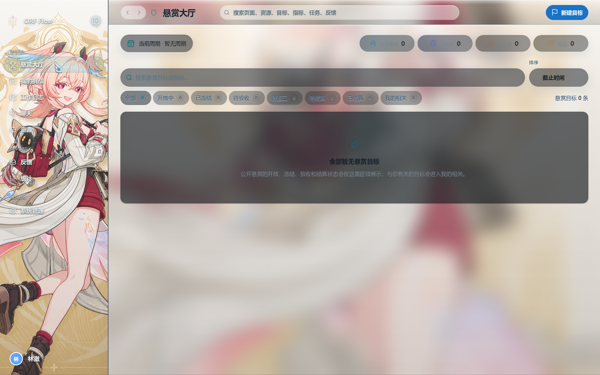

<p align="center">
  
</p>

<h1 align="center">ORF</h1>

<p align="center">
  <strong>把目标、结果和反馈放进同一个执行闭环。</strong><br />
  从悬赏目标到执行、证据、讨论、验收和结算，一个工作台完成。
</p>

<p align="center">
  <a href="https://github.com/xueyu888/ORF/releases/latest"></a>
  
  
</p>

<p align="center">
  <a href="https://orf-xueyu.duckdns.org:8443">打开 Web 版</a>
  ·
  <a href="https://github.com/xueyu888/ORF/releases/latest">下载客户端</a>
  ·
  <a href="./docs/README.md">阅读文档</a>
  ·
  <a href="https://github.com/xueyu888/ORF/issues">提交问题</a>
</p>

<p align="center">
  <picture>
    <source media="(prefers-color-scheme: dark)" srcset="./docs/assets/readme/bounty-hall-dark.png" />
    
  </picture>
</p>

ORF 是一个面向团队的目标执行与协作工作台。它不止记录“要做什么”，还把目标拆解、执行过程、结果证据和持续反馈连接起来，让团队能看见工作为什么发生、结果如何验证、方向何时需要调整。

> ORF is an Objective–Results–Feedback workspace for teams that want goals, execution evidence, conversations, and feedback to live in one system. It ships for Web, Windows, and Android.

## 为什么是 ORF

很多项目管理工具善于收集任务，却很难回答三个更重要的问题：

- 这些任务究竟在推动哪个目标？
- 结果是否真的产生了价值，证据在哪里？
- 执行出现偏差后，反馈如何改变下一步行动？

ORF 用一条可运行的业务链回答它们：

```text
悬赏目标 → 结果指标 → 申请挑战 / 征召 → 执行与协作
        → 提交战利品 → 验收 → 匿名互评 → 积分结算
                    ↖ 持续反馈与方向校正 ↙
```

| Objective | Results | Feedback |
| --- | --- | --- |
| 定义真正要改变的结果，并公开悬赏 | 用可量化指标、任务和证据推进目标 | 在执行中暴露偏差，调整状态、负责人和行动 |

它不是换了术语的任务看板：目标、聊天、反馈、工作日志、资源和结算共享同一套业务上下文，讨论不会脱离执行，结果也不会只停留在汇报里。

## 核心体验

| 能力 | ORF 中的体验 |
| --- | --- |
| 🏆 **悬赏大厅** | 公开目标、指标、难度、周期和进展，让成员申请挑战或由管理员征召。 |
| 🎯 **我的挑战** | 在同一棵执行树中管理目标、任务、子任务、证据和验收状态。 |
| 📝 **工作日志** | 将日常进展关联到目标与任务，保留可追踪的执行上下文。 |
| 💬 **原生聊天** | 普通频道、私信、话题、提及、反应、附件、资源和系统通知统一在聊天中阅读。 |
| 🧭 **反馈闭环** | 反馈拥有状态、处理人、分类、影响和跟进时间线；处理动作直接发生在回复流程中。 |
| 🗂️ **团队资源** | 文件、预览、版本、回收站和工作上下文关联统一进入资源工作台。 |
| 📊 **统计与结算** | 目标结算、积分流水和排行榜基于后端事实生成，不用手工拼表。 |
| 🎨 **个性化外观** | 亮色、暗色与自定义背景协同工作；侧边栏、顶栏和工作区可独立配置。 |

## 不只是目标管理

- **从目标到证据**：目标以结果指标定义验收口径，任务只表示执行过程，战利品负责证明结果。
- **反馈真的改变执行**：状态与处理人可以在跟进评论时一起更新，避免反馈中心沦为孤立工单箱。
- **沟通留在业务上下文里**：反馈、工作日志、工程动态和系统通知以原生消息或引用进入聊天，并能定位原对象。
- **结果可以被结算**：目标验收后按贡献比例分配积分，排行榜来自真实积分流水。
- **同一产品跨端使用**：Web、Windows 11 桌面端与 Android 端复用同一业务事实和权限模型。

ORF 背后的完整方法见 [ORF.md](./ORF.md)，业务状态流和积分口径见 [设计原则](./docs/design/%E8%AE%BE%E8%AE%A1%E5%8E%9F%E5%88%99.md)。

## 直接体验

- [打开 ORF Web 版](https://orf-xueyu.duckdns.org:8443)
- [下载最新 Windows 11 安装包或 Android APK](https://github.com/xueyu888/ORF/releases/latest)
- [查看版本历史](https://github.com/xueyu888/ORF/releases)

当前版本处于 `0.1.x` 持续迭代阶段。界面、接口和自部署流程仍可能演进，升级前请阅读对应版本说明。

## 自部署

### 环境要求

- Node.js `>= 22.12.0`
- npm `>= 10.8.0`
- PostgreSQL
- Ory Kratos
- S3 兼容对象存储（推荐 MinIO）
- Docker（本地运行 Ory / MinIO 时需要）

### 获取源码

```bash
git clone https://github.com/xueyu888/ORF.git
cd ORF
npm ci
npm run cli:link
cp .env.example .env
```

在 `.env` 中配置 PostgreSQL、Ory 和对象存储后，初始化数据库并启动开发运行时：

```bash
node scripts/verify-db.mjs
npm run db:migrate
orf up --dev
```

启动完成后访问 `http://127.0.0.1:5173`。运行状态和日志可以通过以下命令检查：

```bash
orf status --dev
orf logs --dev backend
orf logs --dev frontend
```

完整环境变量、服务边界和运行方式见 [环境设计](./docs/project/environment.md)。生产环境请使用独立配置、持久数据目录和构建产物，不要把开发运行时直接当作生产部署。

## 技术栈

| 层 | 实现 |
| --- | --- |
| Web | React 19、TypeScript、Vite 8、Tailwind CSS 4 |
| API | Fastify 5、Zod |
| 数据 | PostgreSQL、Drizzle ORM |
| 身份与文件 | Ory Kratos、S3 / MinIO |
| 桌面端 | Electron |
| Android | Capacitor |
| 验证 | Node.js Test Runner、Playwright |

前端只通过同源 `/api` 访问服务端，桌面端、Web 和移动端共享业务契约。系统设计强调显式状态、单一事实源和模块边界，不在页面组件里复制业务状态机。

## 仓库结构

```text
src/        Web 前端、状态模型和功能模块
server/     API、数据库访问和系统集成
modules/    自我完备的业务模块
packages/   跨模块共享契约与基础能力
clients/    Windows 桌面客户端
android/    Android 客户端工程
docs/       产品、前端、后端、规则与部署文档
```

从 [文档目录](./docs/README.md) 可以按产品、前端、后端、规则、设计和项目运行六个维度进入。视觉系统见 [ORF 前端视觉系统](./docs/design/ORF%20%E5%89%8D%E7%AB%AF%E8%A7%86%E8%A7%89%E7%B3%BB%E7%BB%9F.md)。

## 开发与验证

```bash
npm run build
npm test
```

完整数据化端到端验证：

```bash
npx playwright install chromium
npm run testd
```

## 参与项目

如果你正在寻找一种比“任务堆积”更重视结果与反馈的协作方式，欢迎：

- 在 [Issues](https://github.com/xueyu888/ORF/issues) 中报告问题或描述真实使用场景。
- 提交改动前先阅读 [文档目录](./docs/README.md)，确认对应业务契约和模块边界。
- 在 Pull Request 中说明目标、预期结果、影响范围和验证方式。

ORF 仍很年轻。真实团队场景、可复现问题和具体改进建议，比泛泛的功能清单更有价值。
