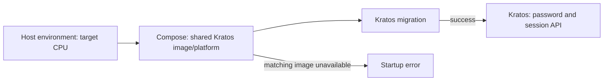

# Current Host Compiled Runtime

This directory switches the current public ORF application from the repository
development watcher and `dist` directory to one compiled, immutable release
managed by the current-host production runtime. User systemd is preferred when
available; WSL hosts without a user systemd bus use the detached production
backend fallback. It does not perform database migration; local Windows
PostgreSQL to WSL PostgreSQL migration belongs to `deploy/local-wsl-postgres`.

## Ownership

- Application releases: `~/.local/share/orf-production/releases/<release-id>`.
- Active release: atomic `releases/current` symlink.
- Previous healthy release: `releases/previous` symlink.
- Public Web: `public-gateway` bind-mounts `releases/current/web`; it is
  recreated after each release switch because Docker resolves the symlink when
  the container is created.
- Runtime Node binary: `~/.local/share/orf-production/node` symlink to the
  validated Node executable present at install time.
- Runtime environment: `~/.config/orf/orf.env`, copied with mode `600` from the
  current host environment. Relative settings and client-update data paths are
  resolved to their existing absolute paths so activation does not create a
  second data source.
- GitHub polling cursor: `~/.local/share/orf-production/data/github-sync-state.json`;
  installation migrates the previous `.artifacts` cursor once and the immutable
  release never writes into its own directory.
- Logs: user journal for `orf-backend-production.service` when user systemd is
  available. If `orf up` has to use the detached-process fallback because the
  WSL user bus is unavailable, logs are written to
  `~/.local/share/orf-production/data/backend-production.manual.log`.
  Production does not append to the unbounded repository `.orf/logs/backend.log`.
- Shutdown first closes registered SSE streams and then waits for ordinary
  requests; systemd keeps a 15-second upper bound before forced termination.

## Authentication Container Platform

Database addresses are scoped to the calling process. On the current WSL
mirrored host, keep the native backend's `DATABASE_URL` and Ory's host-side
`ORY_DATABASE_PROBE_URL` on `127.0.0.1:5432`, and explicitly set
`ORY_DATABASE_URL` to the container-accessible address of that same database.
Keep these settings in both the source environment and `~/.config/orf/orf.env`
so reinstalling the runtime preserves the distinction. See the canonical
[local and container database access rules](../../docs/project/public-ip-infra.md)
for the network boundary and TLS requirements.

`docker-compose.ory.yml` owns the shared Kratos image and platform for both the
migration job and authentication server. It explicitly uses
`DOCKER_DEFAULT_PLATFORM`, defaulting to `linux/amd64`. Set this variable to the
host's native Linux platform in `~/.config/orf/orf.env`; native ARM hosts use
`linux/arm64`. Keep the same setting in the source environment when reinstalling
the current-host runtime.

An ARM release build can replace a shared local image tag. The explicit Compose
platform makes a mismatched cached image ineligible: Compose pulls the requested
platform or reports an error instead of silently running it through emulation.
After recovery, verify the actual container image architecture, `/health/ready`,
the backend's `/health/auth`, and a password login through the public application.



## Install And Activate

```bash
deploy/current-host/install-runtime.sh
npm run build:release -- --allow-dirty --release-id local-validation
deploy/current-host/activate-release.sh .artifacts/releases/orf-local-validation-dirty.tar.gz
```

Formal production releases must be built from a clean committed worktree. The
dirty flag is permitted only for a local validation artifact before commit.

The first activation stops the legacy detached backend, activates the compiled
release, switches the Web gateway to the release's `web` directory, checks both
backend and gateway health, and automatically restores the legacy runtime if
the compiled service cannot become healthy. Subsequent activations use the
immutable current/previous pointers and restore both backend and Web to the
same previous release if either health check fails. Activation must never stop
after only moving `releases/current`: if user systemd is unavailable, the script
restarts the backend through the same detached production fallback used by
`orf restart backend`, then verifies the backend process is running from the
resolved current release directory.

## Manual Rollback And Logs

```bash
deploy/current-host/rollback-release.sh
deploy/current-host/logs.sh 200
orf logs backend
```

Database migrations are forward-only. Application rollback never attempts to
reverse a migration. Settings, client-update assets, and GitHub polling state
remain outside immutable releases in their configured persistent directories.
