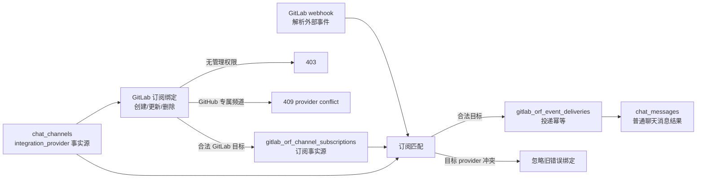

# GitLab ORF 聊天集成 - 后端

## 目标

GitLab 工程动态进入 ORF 原生频道消息流。普通公开或私有频道、以及 `integration_provider = 'gitlab'` 的 GitLab 专属频道可以订阅 GitLab group 或某个 project 的消息；`integration_provider = 'github'` 的 GitHub 专属频道不能绑定 GitLab 订阅。GitLab webhook 只负责事件入口，不负责创建频道。

状态链：

1. GitLab group、project 和 webhook payload 是外部事实源。
2. `chat_channels.integration_provider` 是频道专属集成归属事实源；`NULL` 表示普通频道，`github` 和 `gitlab` 表示专属集成频道。
3. `gitlab_orf_channel_subscriptions` 是 GitLab 事件到 ORF 频道的唯一订阅事实源。
4. `gitlab_orf_event_deliveries` 是每个频道的 GitLab 事件投递和去重事实源。
5. 投递结果是普通 `chat_messages`，由现有聊天系统负责频道可见性、未读、实时事件和推送副作用。

绑定状态链：

1. 频道创建或集成启动时写入 `chat_channels.integration_provider`；频道名、显示名和图标只是展示派生，不定义业务归属。
2. GitLab 订阅创建前，后端读取目标频道并校验 `integration_provider IS NULL OR integration_provider = 'gitlab'`。
3. 订阅创建、启用和事件类型更新只允许频道管理员执行；普通可读用户只能读取已有订阅。
4. GitLab webhook 匹配订阅后，再次校验目标频道仍允许 GitLab 投递；旧数据中若存在指向 GitHub 专属频道的 GitLab 订阅，该订阅不会产生聊天消息。
5. 删除订阅和停用旧订阅只要求频道管理权限，允许管理员清理历史错误配置。

必须保持的不变量：

1. 专属集成频道只能接收自身 provider 的自动投递；GitHub 专属频道不接收 GitLab 事件，GitLab 专属频道不接收 GitHub 事件。
2. 普通频道可以作为人工选择的集成汇聚频道，但绑定事实仍只来自订阅表。
3. `chat_messages` 不是集成绑定事实源，不能通过历史消息反推频道订阅或 provider 归属。
4. GitLab webhook、GitHub 同步和聊天投递账本互不拥有对方的事件语义；它们只通过明确的频道绑定结果组合。

Push 展示契约：

1. GitLab webhook 的 commits 在适配边界归一为“最新提交在前”，聊天格式化层只消费归一后的顺序。
2. 正文先展示推送人、提交总数、项目和分支或标签，再展示最新 5 条提交；截断必须发生在顺序归一之后。
3. 推送人、可定位的提交作者、项目名和短 SHA 都是可点击链接，并使用聊天统一的高识别度链接色；每条提交其余部分只保留单行标题，其余提交由数量提示和 compare 链接承接。
4. GitLab 与 GitHub push 共用 `git-push-chat-message.ts` 的展示规则，机器人名称和时间仍由普通聊天消息头负责。

## 边界

GitLab push、tag、merge request、issue、pipeline 是频道消息，不写入 `notification_events` / `notification_receipts`。

订阅读取要求用户能看到目标频道。订阅创建、启用、停用、删除和事件类型更新要求用户具备频道管理能力：全局频道管理权限、全局成员管理权限，或当前频道成员角色为 `owner` / `admin`。

直接消息和系统频道不参与 GitLab 订阅。GitHub 专属频道也不参与 GitLab 订阅；后端在创建、启用和投递匹配阶段都必须拒绝或忽略跨 provider 绑定。

GitLab 工程动态只进入 ORF 原生聊天链路，不维护外部聊天兼容链路。

## 数据模型

| 表 | 职责 |
| --- | --- |
| `gitlab_orf_channel_subscriptions` | 频道订阅事实源；一条记录表示某个频道订阅整个 group 或单个 project 的一组事件类型。 |
| `gitlab_orf_event_deliveries` | 记录 GitLab 事件在某个频道内的 reserve、delivered、failed、ignored 状态。唯一去重边界是 `(team_id, chat_channel_id, external_event_key)`。 |
| `chat_channels` | ORF 原生聊天频道事实源；`integration_provider` 表示专属集成频道归属。 |
| `chat_messages` | ORF 原生聊天消息事实源。 |

事件 key 优先使用 GitLab `X-Gitlab-Event-UUID`。没有该 header 时，由 project id、事件类型、ref、对象属性和 SHA 生成稳定摘要。

## 配置

| 变量 | 说明 |
| --- | --- |
| `GITLAB_ORF_CHAT_ENABLED` | 是否启用 GitLab -> ORF 聊天集成。 |
| `GITLAB_URL` | GitLab 站点地址。 |
| `GITLAB_ORF_CHAT_GROUP` | 要覆盖的 GitLab group，默认 `develop`。 |
| `GITLAB_ORF_CHAT_HOOK_MODE` | Hook 收敛模式：`group`、`project`、`both`，默认 `group`。Group hooks 需要 GitLab Premium/Ultimate，并要求调用者是管理员或 group Owner。 |
| `GITLAB_ORF_CHAT_RECONCILE_INTERVAL_SECONDS` | hook 收敛间隔，默认 60 秒。 |
| `GITLAB_ORF_CHAT_ACCESS_TOKEN` | GitLab API token，用于列出 group projects 并维护 group/project webhooks。 |
| `GITLAB_ORF_CHAT_WEBHOOK_URL` | ORF 入站 webhook URL，例如 `https://orf.example.com/webhooks/gitlab/orf-chat`。 |
| `GITLAB_ORF_CHAT_WEBHOOK_SECRET` | 兼容旧 GitLab token 校验，ORF 校验 `X-Gitlab-Token`。 |
| `GITLAB_ORF_CHAT_SIGNING_TOKEN` | GitLab Standard Webhooks signing token，ORF 校验 `webhook-id`、`webhook-timestamp`、`webhook-signature`。 |
| `GITLAB_ORF_CHAT_WEBHOOK_MAX_BODY_BYTES` | 入站 webhook 最大 body，默认 1 MiB。 |
| `GITLAB_ORF_CHAT_BOT_NAME` | ORF 聊天消息作者名称，默认 `GitLab`。 |
| `GITLAB_ORF_CHAT_BOT_EMAIL` | ORF 内部 bot 用户 email，默认 `gitlab@orf.local`。 |

## 运行方式

后端启动时随 optional integrations 注册：

- 如果启用了 `GITLAB_ORF_CHAT_ENABLED` 且配置了 secret 或 signing token，注册 `/webhooks/gitlab/orf-chat`。
- 如果同时配置了 `GITLAB_URL`、`GITLAB_ORF_CHAT_ACCESS_TOKEN`、`GITLAB_ORF_CHAT_WEBHOOK_URL` 和任一 webhook 验证 token，启动后立即收敛一次，并按间隔继续收敛。

也可以手动执行一次：

```bash
npm run gitlab:orf-chat:reconcile
```

管理员可以在 `系统管理 -> 系统设置 -> GitLab 聊天订阅` 查看配置、订阅总览和手动触发 hook 收敛。每个频道自己的订阅入口在频道信息面板中。

## 收敛规则

`GITLAB_ORF_CHAT_HOOK_MODE=group` 时，收敛 group webhook：

1. 读取 `GITLAB_ORF_CHAT_GROUP` 的 hooks。
2. 确保存在指向 `GITLAB_ORF_CHAT_WEBHOOK_URL` 的 group hook。
3. webhook 事件开启 push、tag push、merge request、issue、pipeline。

`project` 或 `both` 模式会额外列出 group 下所有项目，并确保每个 project webhook 指向同一个 ORF webhook URL。

收敛只维护 GitLab webhook，不创建 ORF 频道，不写订阅。订阅事实只来自 ORF 频道订阅 API。

## 管理接口

| 接口 | 职责 |
| --- | --- |
| `GET /api/settings/gitlab-orf-chat` | 返回配置状态、GitLab project 列表、当前订阅和可订阅频道。 |
| `POST /api/settings/gitlab-orf-chat/reconcile` | 管理员手动触发一次 GitLab hook 收敛。 |
| `GET /api/chat/channels/:channelId/gitlab-subscriptions` | 可读用户返回当前频道的 GitLab 订阅数据和可选 project。 |
| `POST /api/chat/channels/:channelId/gitlab-subscriptions` | 频道管理员为当前频道新增 group 或 project 订阅；跨 provider 目标返回 409。 |
| `PATCH /api/chat/channels/:channelId/gitlab-subscriptions/:subscriptionId` | 频道管理员启用、停用或更新事件类型；跨 provider 目标只允许停用。 |
| `DELETE /api/chat/channels/:channelId/gitlab-subscriptions/:subscriptionId` | 频道管理员删除订阅；允许删除历史错误绑定。 |

## 失败和重试

事件按匹配到的订阅逐个进入 `gitlab_orf_event_deliveries` 的 `reserved` 状态，再调用现有聊天发送路径。

- 发送成功后状态变为 `delivered`，并记录 `chat_message_id`。
- 发送失败后状态变为 `failed`，同一个频道内同一个事件再次进入时允许重试。
- `reserved` 超过 10 分钟也允许重新 reserve，避免进程中断留下永久占用。
- 同一个 GitLab 事件可以投递到多个频道；重复判定只在频道内生效。
- 如果匹配到的订阅目标频道已经不再允许 GitLab 投递，该订阅在匹配阶段被过滤，不进入 reserve。

## 模块结构


