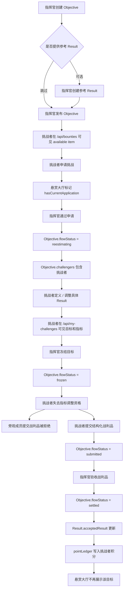
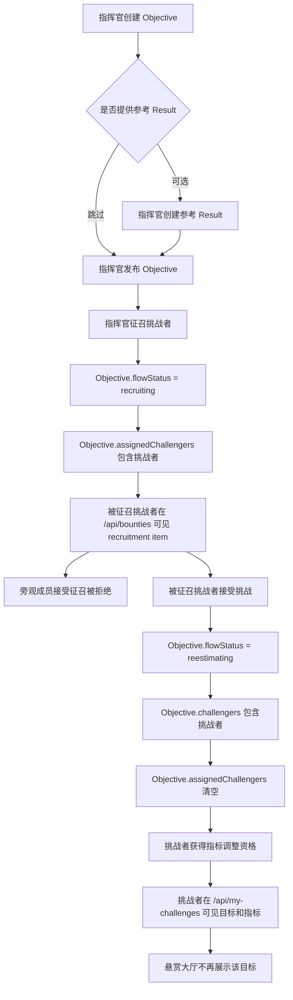

# ORF 后端流程测试

## 目标

本文档说明 `tests/orfBackendFlow.test.ts` 的测试思路，用于验证真实数据库中的 ORF 后端业务流程是否能跑通。

测试覆盖后端 repository 层和数据库写入，不覆盖 HTTP 路由、Ory 登录、Cookie 鉴权或前端 UI。HTTP 层权限如果和 repository 层能力不一致，需要单独补 API 测试。

`reestimating` 是当前代码里的既有状态枚举。作为英文不算最自然，业务含义是“重估 / 指标校准阶段”；测试继续使用该枚举，避免把命名迁移和流程测试混在一起。

## 测试范围

| 测试 | 入口 | 覆盖流程 |
| --- | --- | --- |
| 目标无指标可见性 | `published objective without concrete results is visible in the bounty hall` | 指挥官只发布 Objective，不预先定义具体 Result，挑战者仍应在悬赏大厅看到该目标 |
| 申请到结算 | `commander and challenger can complete the application-to-settlement ORF backend flow` | 指挥官发布悬赏，挑战者申请，指挥官通过，挑战者在重估期定义 / 调整指标，冻结，提交战利品，验收结算 |
| 征召到接受 | `commander recruitment appears as a recruitment item and the recruited challenger can accept it` | 指挥官征召，挑战者看到征召项，接受后进入我的挑战，并获得重估期指标调整资格 |

测试直接调用 `server/repositories/orfRepository.ts` 的公开函数。

## 角色边界

| 角色 | 测试身份 | 用途 |
| --- | --- | --- |
| 指挥官 | `commander` | 必须创建 Objective、发布、审核申请、征召、冻结、验收；可以提供参考 Result，但不强制定义具体指标 |
| 挑战者 | `challenger` | 查看悬赏、申请、接受征召、在 `reestimating` 定义 / 调整具体 Result、查看我的挑战、提交战利品 |
| 旁观成员 | `observer` | 验证未被授权成员不能接受征召或提交战利品 |

每个测试创建独立的 `team`、`users` 和 `team_members`，ID 使用 `test-orf-flow-*` 前缀。测试结束后删除该前缀下的测试数据。

## 指标规则

| 阶段 | 指标规则 |
| --- | --- |
| `candidate` / `open` | Objective 是必填核心对象；指挥官可以创建参考指标，但悬赏大厅不应依赖已存在 Result |
| `applying` / `recruiting` | 成员还不是正式挑战者，不能获得指标调整资格 |
| `reestimating` | 申请被通过或征召被接受后，成员成为正式挑战者；挑战者可以定义 / 调整自己参与目标下的具体 Result |
| 重估截止前 | 指标必须在 `confirmationDueAt` 截止前校准完毕；当前 repository 测试只验证状态资格，截止时间需要 HTTP 或更细 repository 契约补齐 |
| `frozen` | 指标冻结，挑战者不能继续调整；如需调整，应由指挥官退回 `reestimating` 后再改 |
| `submitted` / `settled` | 进入提交或结算后，指标不再开放调整 |

## 申请流程图



## 征召流程图



## 关键断言

### 指挥官视角

| 阶段 | 断言 |
| --- | --- |
| 创建目标 | 返回目标存在，`flowStatus=candidate` |
| 可选参考指标 | 如果指挥官创建 Result，返回指标存在，不确定性分按难度计算 |
| 发布目标 | `publishObjective` 返回 `ok`，`flowStatus=open`；即使没有 Result，也应进入悬赏大厅 |
| 审核申请 | 申请状态变为 `approved`，目标进入 `reestimating` |
| 冻结目标 | `flowStatus=frozen`，挑战者指标调整资格变为 `false` |
| 验收战利品 | `flowStatus=settled`，`acceptedResult=completed`，写入基础分和结算分 |
| 积分流水 | `pointLedger` 写入挑战者、用户 ID、积分和结算原因 |

### 挑战者视角

| 阶段 | 断言 |
| --- | --- |
| 悬赏大厅 | 发布后目标出现在 `availableItems`，不依赖指挥官是否已定义具体 Result |
| 申请挑战 | 申请后目标 `flowStatus=applying`，当前用户标记 `hasCurrentApplication=true` |
| 进入挑战前 | `canEditObjectiveResultsDuringReestimate` 返回 `false` |
| 进入挑战 | 申请通过或接受征召后，`/api/my-challenges` 返回该目标；指标可以在此阶段由挑战者补充 |
| 编辑资格 | `canEditObjectiveResultsDuringReestimate` 只对 `reestimating` 下的正式挑战者返回 `true` |
| 冻结后 | `canEditObjectiveResultsDuringReestimate` 返回 `false` |
| 提交战利品 | 非挑战者返回 `forbidden`，挑战者提交返回 `ok` |
| 结算后 | 目标不再出现在悬赏大厅 |

## 当前测试缺口

- `createResult` repository 函数没有 actor 参数，因此 repository 测试无法直接证明“非挑战者不能伪造 `memberProposed` 指标”。
- `/api/results` 的创建权限、`confirmationDueAt` 截止时间校验，应补 HTTP/API 层测试。
- 如果 `published objective without concrete results is visible in the bounty hall` 失败，说明当前后端仍把 Result 当成悬赏大厅展示的前置条件。

## 修改测试时机

当以下业务规则变化时，应同步修改 `tests/orfBackendFlow.test.ts`：

- `Objective.flowStatus` 状态流转变化。
- 悬赏大厅展示条件变化。
- 我的挑战过滤条件变化。
- 指挥官是否必须提供参考指标的规则变化。
- 挑战者在重估期定义 / 调整指标的权限规则变化。
- 重估截止时间、冻结、退回重估的规则变化。
- 战利品提交权限变化。
- 验收结算积分计算变化。

## 验证命令

```bash
npx tsx --test tests/orfBackendFlow.test.ts
npm test
```

如果测试失败，应优先按失败阶段判断是状态流转、权限、列表过滤、指标规则、战利品提交还是积分结算的问题。
