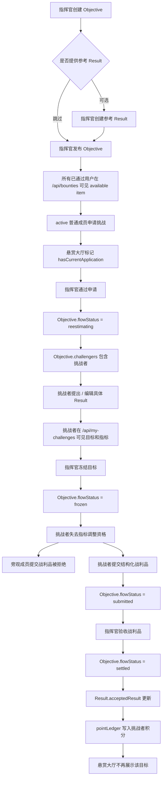

# ORF 后端流程测试

## 目标

本文档说明 `tests/orfBackendFlow.test.ts` 的测试思路，用于验证真实数据库中的 ORF 后端业务流程是否能跑通。

测试覆盖后端 repository 层、数据库写入，以及少量 Fastify `inject` API 权限测试。API 测试使用轻量 Ory `whoami` mock，只验证后端路由权限，不覆盖真实 Ory 服务、浏览器 Cookie 流程或前端 UI。

`reestimating` 是当前代码里的既有状态枚举。作为英文不算最自然，业务含义是“重估 / 指标校准阶段”；测试继续使用该枚举，避免把命名迁移和流程测试混在一起。

## 测试范围

| 测试 | 入口 | 覆盖流程 |
| --- | --- | --- |
| 目标无指标可见性 | `published objective without concrete results is visible in the bounty hall` | 指挥官发布 Objective 时可以预定义 Result，也可以暂不定义；即使没有 Result，所有已通过用户仍应在悬赏大厅看到该目标，只有 active 普通成员申请能写入 |
| 征召无指标可见性 | `recruited objective without concrete results is visible as a recruitment item` | 指挥官发布 Objective 时可以预定义 Result，也可以暂不定义；即使没有 Result，征召中目标仍在大厅可见，只有被征召普通成员接受能写入 |
| 申请到结算 | `commander and challenger can complete the application-to-settlement ORF backend flow` | 指挥官发布悬赏，挑战者申请，指挥官通过，挑战者在重估期提出 / 编辑指标，冻结，提交战利品，验收结算 |
| 消息接口 | `notification API scopes messages to the current recipient and supports read state` | 申请挑战生成指挥官消息；当前用户只能读取和标记自己的消息 |
| 征召到接受 | `commander recruitment appears as a recruitment item and the recruited challenger can accept it` | 指挥官征召，挑战者看到征召项，接受后进入我的挑战，并获得重估期指标调整资格 |
| API 创建指标权限 | `member-proposed result creation requires the API actor to be a challenger inside the reestimate window` | `POST /api/results` 只允许正式挑战者在未过期重估期创建 `memberProposed` 指标 |
| API 编辑指标权限 | `challenger result edits through the API close after reestimate expiry and freeze` | `PATCH /api/results/:resultId` 只允许正式挑战者在未过期重估期编辑指标标题，过期或冻结后拒绝 |
| API 创建任务归属 | `API task creation is owned by the objective and does not require a result` | `POST /api/tasks` 基于 `linkedObjectiveId` 创建任务，不要求 `linkedResultId`；候选目标和无指标目标也能维护目标行动项 |
| API 任务共同维护权限 | `objective challengers share task and subtask maintenance` | 任务和子任务写入权限来自父级 Objective 参与关系；同一目标正式挑战者可以共同新增、编辑、勾选、移动和删除，旁观成员拒绝，指挥官按管理员权限通过 |
| API 输入归一化 | `API work item creation trims labels and prevents blank persisted titles` | 指标、任务、子任务创建接口会 trim 用户输入，拒绝空白必填标题，非法日期和非 active 成员执行人返回 400，空执行人回落为当前用户 |
| API stage 兼容保护 | `API objective stage updates cannot violate lifecycle compatibility` | 旧 stage 接口不能把重估目标标成冻结阶段，也不能把冻结后目标改回重估阶段 |
| 发布前征召保护 | `recruitment is only allowed after an objective is published` | `candidate` 目标不能被征召，必须先发布 |
| 冻结后旧申请保护 | `approving stale pending applications cannot mutate a frozen objective` / `rejecting stale pending applications cannot reopen a frozen objective` | 冻结后不能通过或拒绝旧申请来改写目标状态 |
| 已接受后旧申请保护 | `rejecting remaining pending applications keeps an accepted objective in reestimate` | 目标已有挑战者后，继续拒绝剩余 pending application 不能把目标退回悬赏大厅 |
| 冻结后旧征召保护 | `accepting stale recruitment cannot reopen a frozen objective` | 冻结后旧 assigned recruitment 不能再被接受并改写目标状态 |
| 征召拒绝禁用 | `recruitment decline is not an available API action` | 当前不开放成员拒绝征召接口，旧拒绝路径不能改写待征召成员 |
| 冻结前指标保护 | `freezing after reestimate requires at least one concrete result` | 没有具体 Result 的目标不能冻结，避免后续无法提交战利品 |
| 申请与接受守卫 | `challenge application duplicate and closed-state guards are enforced` / `challenge acceptance guards duplicate, due-date, unauthorized, and closed states` | 重复申请、已接受、非法接受、截止时间过近、已关闭状态都应被保护 |
| 冻结/退回保护 | `freeze rejects invalid source states and reopen requests stay disabled` | 只有 `reestimating` 且已有 Result 可冻结；当前不开放退回重估 |
| 战利品与验收异常 | `loot submission rejects incomplete or out-of-state payloads` / `review rejects invalid state and missing loot` | 提交和验收的非法状态、漏 claim、外部 Result、缺失 loot 均应拒绝 |
| 多挑战者结算 | `settlement normalizes multi-challenger contribution ratios and supports overdelivery` | 多挑战者贡献比例来自匿名互评并归一化，超预期完成按 1.5 倍结算 |
| API 流程权限 | `API flow commands enforce commander-only permissions and challenge list scope` | 发布、征召、审核、冻结、验收、全量挑战视图权限 |
| API 跨作用域写保护 | `API mutations enforce runtime scope boundaries even for administrators` | 管理员不能通过其他底层作用域的目标、指标、评论或反馈 ID 改写数据 |
| API 指标管理权限 | `API result management routes keep privileged operations behind role permissions` | `managerDefined` 创建、confidence、update-proposal、排序、删除等高权限指标操作 |

测试直接调用 `server/repositories/orfRepository.ts` 的公开函数。

## 角色边界

| 角色 | 测试身份 | 用途 |
| --- | --- | --- |
| 指挥官 | `commander` | 必须创建 Objective、发布、审核申请、征召、冻结、验收；可以预定义 Result，也可以选择不定义；必须看到完整悬赏大厅界面，但申请或接受挑战不能写入 |
| 挑战者 | `challenger` | 查看悬赏、申请、接受征召、在 `reestimating` 提出 / 编辑具体 Result、查看我的挑战、提交战利品、参与匿名互评 |
| 旁观成员 | `observer` | 验证未被授权成员不能接受征召或提交战利品 |

每个测试创建独立的底层存储 scope、`users` 和成员关系，ID 使用 `test-orf-flow-*` 前缀。测试结束后删除该前缀下的测试数据。

## 指标规则

| 阶段 | 指标规则 |
| --- | --- |
| `candidate` / `open` | Objective 是必填核心对象；指挥官可以创建参考指标，但悬赏大厅不应依赖已存在 Result |
| `applying` / `recruiting` | 成员还不是正式挑战者，不能提出或编辑指标 |
| `reestimating` | 申请被通过或征召被接受后，成员成为正式挑战者；挑战者可以提出 / 编辑自己参与目标下的具体 Result |
| 重估截止前 | 指标必须在 `confirmationDueAt` 截止前校准完毕；API 创建和编辑测试会验证过期后返回 `403` |
| `frozen` | 指标冻结，指挥官和挑战者都不能继续编辑；当前不提供退回重估，`confirmationDueAt` 到期后也不续期 |
| `submitted` / `settled` | 进入提交或结算后，指标不再开放提出或编辑 |

## 任务规则

| 阶段 | 任务规则 |
| --- | --- |
| `candidate` / `reestimating` / `frozen` | 任务归属于目标，用于候选规划、执行协作和过程记录 |
| 目标参与关系 | 同一目标正式挑战者可以共同维护目标下任务和子任务；`assignee` 只是执行提示，`tasks.createdBy` / `updatedBy` 只做审计，不作为维护授权边界 |
| `submitted` / `settled` | 任务只保留查看和历史记录，不再新增或修改 |
| 任意阶段 | 任务和子任务完成状态不自动推导目标进度、指标验收、战利品状态或积分结算 |
| 删除指标 | 不删除目标下任务，只删除指标自身及其指标级数据 |
| 删除目标 | 删除目标下指标、任务、子任务、评论和结算相关记录 |

## 申请流程图



## 征召流程图


## 规则清单

| Rule | 规则 | 覆盖测试 |
| --- | --- | --- |
| ORF-BE-R001 | Objective 是悬赏流程的必填核心对象，指挥官必须先创建 Objective。 | 申请到结算、征召到接受 |
| ORF-BE-R002 | 指挥官发布 Objective 时，Result 是可选参考指标，不是发布和展示的前置条件。 | 目标无指标可见性、征召无指标可见性 |
| ORF-BE-R003 | 无 Result 的 `open` Objective 仍应出现在所有已通过用户的 `availableItems` 中，`results=[]`、`result=null`、`uncertaintyPoints=0`；只有 active 普通成员能申请。 | 目标无指标可见性 |
| ORF-BE-R003A | `GET /api/bounties` 不能因为当前用户是指挥官 / 管理员而返回空列表；角色只限制申请和接受 mutation 是否写入，不限制大厅发现数据或前端操作区展示。 | API 流程权限、目标无指标可见性 |
| ORF-BE-R004 | 无 Result 的 `recruiting` Objective 仍应出现在悬赏大厅；被征召 active 普通成员接受能写入，指挥官 / 管理员触发接受必须被拒绝。 | 征召无指标可见性 |
| ORF-BE-R005 | 成员申请后仅进入 `applying`，在指挥官批准前不是正式挑战者，不能提出或编辑指标。 | 申请到结算 |
| ORF-BE-R006 | 指挥官批准申请后，申请状态变为 `approved`，成员进入 `challengers`，Objective 进入 `reestimating`，并生成 `confirmationDueAt`。 | 申请到结算、API 创建指标权限、API 编辑指标权限 |
| ORF-BE-R007 | 被征召成员接受挑战后，Objective 进入 `reestimating`，成员进入 `challengers`，并从 `assignedChallengers` 移除。 | 征召到接受 |
| ORF-BE-R008 | `POST /api/results` 创建 `memberProposed` 指标时，当前 API 用户必须是该 Objective 的正式挑战者。 | API 创建指标权限 |
| ORF-BE-R009 | `POST /api/results` 创建 `memberProposed` 指标时，后端必须把 `definer` 固定为当前 API 用户，不能接受请求体伪造的提出人。 | API 创建指标权限 |
| ORF-BE-R010 | 旁观成员即使传 `source=memberProposed`，也不能给别人的 `reestimating` Objective 创建指标。 | API 创建指标权限 |
| ORF-BE-R011 | `confirmationDueAt` 过期后，挑战者不能继续创建 `memberProposed` 指标。 | API 创建指标权限 |
| ORF-BE-R012 | `PATCH /api/results/:resultId` 在申请通过前拒绝挑战者编辑。 | API 编辑指标权限 |
| ORF-BE-R013 | `PATCH /api/results/:resultId` 在未过期 `reestimating` 阶段允许正式挑战者编辑。 | API 编辑指标权限 |
| ORF-BE-R014 | `PATCH /api/results/:resultId` 在 `confirmationDueAt` 过期后拒绝挑战者编辑。 | API 编辑指标权限 |
| ORF-BE-R015 | Objective 冻结后，挑战者不能继续创建或编辑指标。 | 申请到结算、API 编辑指标权限 |
| ORF-BE-R016 | 非挑战者不能提交战利品。 | 申请到结算 |
| ORF-BE-R017 | 挑战者提交战利品后，Objective 进入 `submitted`，我的挑战能看到该战利品。 | 申请到结算 |
| ORF-BE-R018 | 指挥官按每个指标验收战利品后，Objective 进入 `settled`，Result 的 `acceptedResult` 更新，积分流水按匿名互评贡献结果写入挑战者。 | 申请到结算 |
| ORF-BE-R019 | `settled` Objective 不再出现在悬赏大厅的 `availableItems` 或 `recruitmentItems`。 | 申请到结算 |
| ORF-BE-R020 | API 注入测试必须关闭可选外部集成，避免流程测试触发 GitHub / Mattermost 网络请求。 | API 创建指标权限、API 编辑指标权限 |
| ORF-BE-R021 | 指挥官只能征召已发布目标，`candidate` 目标不能直接进入 `recruiting`。 | 发布前征召保护 |
| ORF-BE-R022 | 目标冻结后，旧 pending application 不能再被批准，也不能把 `frozen` 改回 `reestimating`。 | 冻结后旧申请保护 |
| ORF-BE-R023 | 目标冻结后，旧 pending application 不能再被拒绝；目标已有挑战者后，拒绝剩余 pending application 也不能把 `reestimating` 改回 `open/applying/recruiting`。 | 冻结后旧申请保护、已接受后旧申请保护 |
| ORF-BE-R024 | 当前不开放成员拒绝征召；被征召成员只能接受，异议由线下找指挥官处理。 | 征召拒绝禁用 |
| ORF-BE-R025 | 旧拒绝征召 API 不应存在，也不能从 `assignedChallengers` 移除成员。 | 征召拒绝禁用 |
| ORF-BE-R026 | 当前不开放从 `frozen` 退回 `reestimating`；退回请求应被拒绝，`confirmationDueAt` 不续期。 | 冻结/退回保护 |
| ORF-BE-R027 | `reestimating` 目标冻结前必须至少有一个具体 Result。 | 冻结前指标保护 |
| ORF-BE-R028 | 同一成员重复申请同一目标应返回 `alreadyApplied`；已成为挑战者后再次申请应返回 `alreadyAccepted`。 | 申请与接受守卫 |
| ORF-BE-R029 | `reestimating/frozen/submitted/settled/closed` 等非悬赏大厅状态不接受新的挑战申请。 | 申请与接受守卫 |
| ORF-BE-R030 | 未被征召成员不能接受挑战；重复接受应返回 `alreadyAccepted`；目标截止时间过近应返回 `invalidDueDate`；冻结或终态目标应返回 `closed`。 | 申请与接受守卫、冻结后旧征召保护 |
| ORF-BE-R031 | 只有 `reestimating` 可冻结；冻结后不允许退回重估。 | 冻结/退回保护 |
| ORF-BE-R032 | 战利品只能在 `frozen` 提交；空 body、漏 claim、claim 其他目标 Result 都应拒绝。 | 战利品与验收异常 |
| ORF-BE-R033 | 只有 `submitted` 目标可验收；指定不存在的 loot 应返回 `notFound`。 | 战利品与验收异常 |
| ORF-BE-R034 | 多挑战者结算时，贡献比例来自目标挑战者匿名互评；无缺评和分歧时直接使用汇总比例，缺评或分歧时由指挥官处理后再结算。 | 多挑战者结算 |
| ORF-BE-R035 | `overdelivered` 目标结果按 1.5 倍目标基础分结算。 | 多挑战者结算 |
| ORF-BE-R036 | 发布、征召、申请审核、冻结、验收均应保持指挥官权限边界。 | API 流程权限 |
| ORF-BE-R037 | `/api/my-challenges?scope=all` 只能由指挥官读取。 | API 流程权限 |
| ORF-BE-R038 | 成员不能创建 `managerDefined` 指标；confidence、update-proposal、排序、删除等指标管理路由必须走角色权限。 | API 指标管理权限 |
| ORF-BE-R039 | 指标标题、指标名称、任务标题等必填文本必须在 trim 后非空；选填空白文本不能写入数据库，任务日期必须是合法 `YYYY-MM-DD`；行动项执行人必须是当前作用域 active 成员，空执行人回落为当前用户。 | API 输入归一化 |
| ORF-BE-R039A | 候选目标允许指挥官创建目标级行动项；任务仍以 `linkedObjectiveId` 为归属事实源，不依赖指标存在。 | API 创建任务归属 |
| ORF-BE-R039B | 任务和子任务维护权限来自 `Objective.challengers`；同一目标正式挑战者可以共同新增、编辑、勾选、移动和删除目标下任务和子任务，旁观成员返回 403，指挥官/管理员可维护任意目标任务；`assignee` 与 `tasks.createdBy` 不作为维护授权边界。 | API 任务共同维护权限 |
| ORF-BE-R040 | `Objective.stage` 是兼容字段，旧接口不能写入与 `flowStatus` 冲突的阶段；生命周期状态只能由 ORF 流程接口推进。 | API stage 兼容保护 |
| ORF-BE-R041 | 指标更新提案携带的 `feedbackId` 必须和当前指标同默认作用域、同指标；任务创建携带的 `feedbackOriginId` 必须和当前目标同默认作用域、同目标。合法指标或任务请求不能连带改写或挂接其他作用域数据。 | API 跨作用域写保护 |
| ORF-BE-R042 | 目标结算写入 `pointLedger.userId` 时，只能在目标所属默认作用域内解析挑战者；其他作用域同名用户不能抢占积分流水身份。 | 积分流水作用域边界 |
| ORF-BE-R043 | 用户管理创建和编辑成员时，当前默认作用域内的显示名必须大小写不敏感唯一；不能制造会混淆挑战者身份的同名成员。 | 用户身份唯一性 |
| ORF-BE-R044 | 已经被 ORF 业务记录引用的成员不能改名；否则会切断 `Objective.challengers`、互评和积分流水等按成员名关联的数据。 | 用户身份引用保护 |
| ORF-BE-R045 | 已经被 ORF 业务记录引用的成员不能删除默认作用域成员关系；必须用停用保留历史身份并阻止继续访问。 | 用户身份引用保护 |
| ORF-BE-R046 | 即使当前默认作用域成员关系缺失，仍被 ORF 历史记录引用的姓名也不能被新成员占用，避免新身份继承旧挑战。 | 用户身份引用保护 |
| ORF-BE-R047 | `POST /api/users` 对已有邮箱的 upsert 不能绕过成员改名引用保护；它必须和 `PATCH /api/users/:userId` 使用同一身份规则。 | 用户身份引用保护 |
| ORF-BE-R048 | 征召 API 只能写入当前默认作用域内 `active` 成员；停用、待审核、拒绝或不存在的姓名必须被拒绝，不能进入 `assignedChallengers`。 | 征召成员边界 |
| ORF-BE-R049 | 反馈创建只能把 `owner` 指向当前默认作用域内 `active` 成员；停用、待审核、拒绝或不存在的姓名不能成为可处理人。 | 反馈处理人边界 |
| ORF-BE-R050 | 行动项并发创建必须生成不重复的 `ORF-*` ID；不能只依赖毫秒级时间戳或短伪随机数作为主键。 | API 输入归一化 |
| ORF-BE-R051 | 密码登录不能把首次进入 ORF 的 Ory identity 自动审批为 `active`，也不能用 Ory traits 覆盖已存在 ORF 用户的显示名。 | 用户身份引用保护 |
| ORF-BE-R052 | 评论线程标题必须由后端根据真实目标、指标、任务或子任务解析；客户端提交的 `targetTitle` 不能伪造评论归属。 | 评论数据一致性 |
| ORF-BE-R053 | 评论回复只能引用同一线程内真实存在的消息，`replyToAuthor` 必须由后端按真实作者回填。 | 评论数据一致性 |
| ORF-BE-R054 | 删除被回复的评论消息后，保留下来的消息不能继续引用已删除的 `replyToMessageId`。 | 评论数据一致性 |
| ORF-BE-R055 | 多名成员并发申请同一目标时，`challengeApplications` 必须保留所有申请，不能发生 JSON 数组读改写覆盖。 | 申请并发一致性 |
| ORF-BE-R056 | 并发审批申请、征召和接受征召时，目标上的挑战者、待征召成员和申请记录必须保留所有成员状态变化。 | 挑战生命周期并发一致性 |
| ORF-BE-R057 | 并发新增指标、任务和子任务时，兄弟项 `sortOrder` 必须连续且不重复；指标和任务的父级都是目标，子任务父级是任务。 | 执行协作排序一致性 |
| ORF-BE-R058 | 并发新增同一目标下的评论时，只能复用同一个 open thread，并且保留每条根评论消息。 | 评论线程并发一致性 |
| ORF-BE-R059 | 登录、注册、创建成员和编辑成员 API 必须在后端请求边界裁剪邮箱首尾空白并统一小写；注册姓名和成员姓名也必须裁剪后再校验和写入。 | API 输入归一化 |
| ORF-BE-R060 | 最近在线只写 `lastOnlineAt`；登录、注册和 `/api/users/me/activity` 使用服务端时间更新，并且同一用户 60 秒内重复上报不能反复写库。 | 用户在线状态 |
| ORF-BE-R061 | Ory session 必须优先按 `users.ory_identity_id` 映射 ORF 用户；只有未绑定预批准成员和历史数据可以按邮箱回退并完成绑定。 | 用户身份绑定 |
| ORF-BE-R062 | 已绑定 Ory identity 的 ORF 用户不能通过用户管理接口修改邮箱；未绑定预批准成员仍可按现有唯一性规则编辑邮箱。 | 用户身份绑定 |
| ORF-BE-R063 | 申请挑战、征召和提交战利品必须生成接收人系统消息；消息按当前用户和默认作用域隔离，不能读取或标记他人消息。 | 消息接口、申请到结算、征召到接受 |

## 关键断言

### 指挥官视角

| 阶段 | 断言 |
| --- | --- |
| 创建目标 | 返回目标存在，`flowStatus=candidate` |
| 可选参考指标 | 如果指挥官创建 Result，返回指标存在，不确定性分按难度计算 |
| 发布目标 | `publishObjective` 返回 `ok`，`flowStatus=open`；即使没有 Result，也应进入悬赏大厅 |
| 悬赏大厅动作阻断 | 发布后目标出现在指挥官读取的 `availableItems`，界面可完整展示申请 / 接受入口，但指挥官触发申请或接受挑战必须被拒绝 |
| 审核申请 | 申请状态变为 `approved`，目标进入 `reestimating` |
| 冻结目标 | 已有 Result 的 `reestimating` 目标可进入 `flowStatus=frozen`，挑战者指标调整资格变为 `false` |
| 验收战利品 | 每个指标写入验收结论，目标结果由指标结论汇总，`flowStatus=settled`，写入基础分和结算分 |
| 积分流水 | `pointLedger` 写入挑战者、默认作用域内用户 ID、积分和结算原因 |

### 挑战者视角

| 阶段 | 断言 |
| --- | --- |
| 悬赏大厅 | 发布后目标出现在 `availableItems`，不依赖指挥官是否已定义具体 Result |
| 申请挑战 | 申请后目标 `flowStatus=applying`，当前用户标记 `hasCurrentApplication=true` |
| 进入挑战前 | `canEditObjectiveResultsDuringReestimate` 返回 `false` |
| 进入挑战 | 申请通过或接受征召后，`/api/my-challenges` 返回该目标；指标可以在此阶段由挑战者提出或编辑 |
| 编辑资格 | `canEditObjectiveResultsDuringReestimate` 只对 `reestimating` 下的正式挑战者返回 `true` |
| 重估截止后 | `confirmationDueAt` 过期后不能继续创建或编辑指标，且不通过退回重估续期 |
| 冻结后 | `canEditObjectiveResultsDuringReestimate` 返回 `false` |
| 提交战利品 | 非挑战者返回 `forbidden`，挑战者提交返回 `ok` |
| 结算后 | 目标不再出现在悬赏大厅 |

## 当前测试缺口

- 本文件用 Fastify `inject` 验证 API 权限，但不覆盖真实 Ory 服务、真实浏览器 Cookie、前端页面按钮显隐和端到端交互。
- 当前 `PATCH /api/results/:resultId` 只覆盖标题编辑；如果后续增加指标口径、基线、目标值等编辑路由，需要追加同样的重估窗口测试。
- 当前测试覆盖单默认作用域业务口径，并用多个底层存储 scope 验证越权保护；如果后续支持多团队产品能力，需要追加团队切换和多团队可见性用例。

## 回归保护项

以下测试用于锁住高风险和中风险流程边界：

- `candidate` 目标不能直接征召，必须先发布。
- 冻结后旧 pending application 不能再被批准或拒绝，避免改写 `frozen` 状态。
- 已进入 `reestimating` 的目标拒绝剩余 pending application 时，不能回到悬赏大厅状态。
- 冻结后旧 assigned recruitment 不能再接受，避免改写 `frozen` 状态。
- 当前不开放成员拒绝征召；旧拒绝路径不能改写 `assignedChallengers`。
- 当前不开放退回重估；重估截止后不续期，冻结后也不返回 `reestimating`。
- `reestimating` 目标至少有一个具体 Result 后才能冻结。

## 修改测试时机

当以下业务规则变化时，应同步修改 `tests/orfBackendFlow.test.ts`：

- `Objective.flowStatus` 状态流转变化。
- 悬赏大厅展示条件变化。
- 我的挑战过滤条件变化。
- 指挥官是否必须提供参考指标的规则变化。
- 挑战者在重估期提出 / 编辑指标的权限规则变化。
- 任务是否继续只归属于目标，以及任务创建 / 排序 API 是否重新引入指标关系。
- 重估截止时间和冻结规则变化。
- 战利品提交权限变化。
- 验收结算积分计算变化。

## 验证命令

```bash
npx tsx --test tests/orfBackendFlow.test.ts
npm test
```

如果测试失败，应优先按失败阶段判断是状态流转、权限、列表过滤、指标规则、战利品提交还是积分结算的问题。
