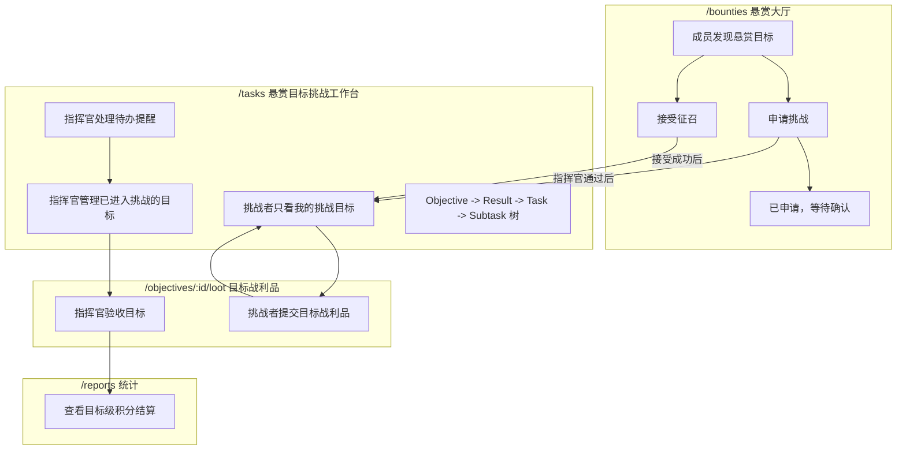
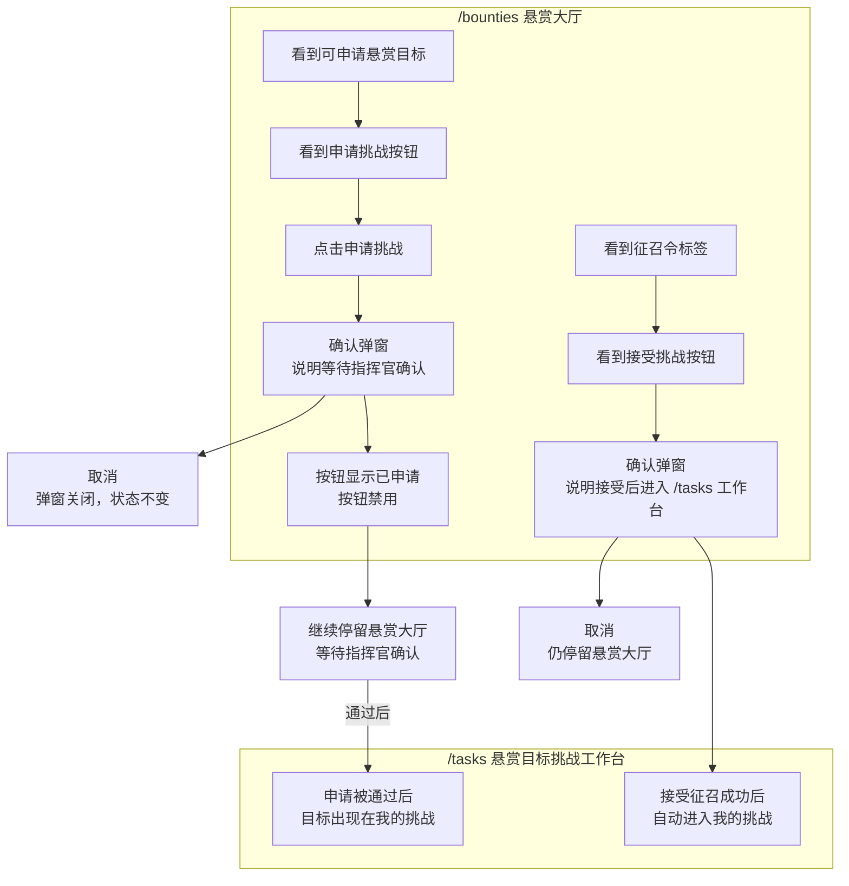
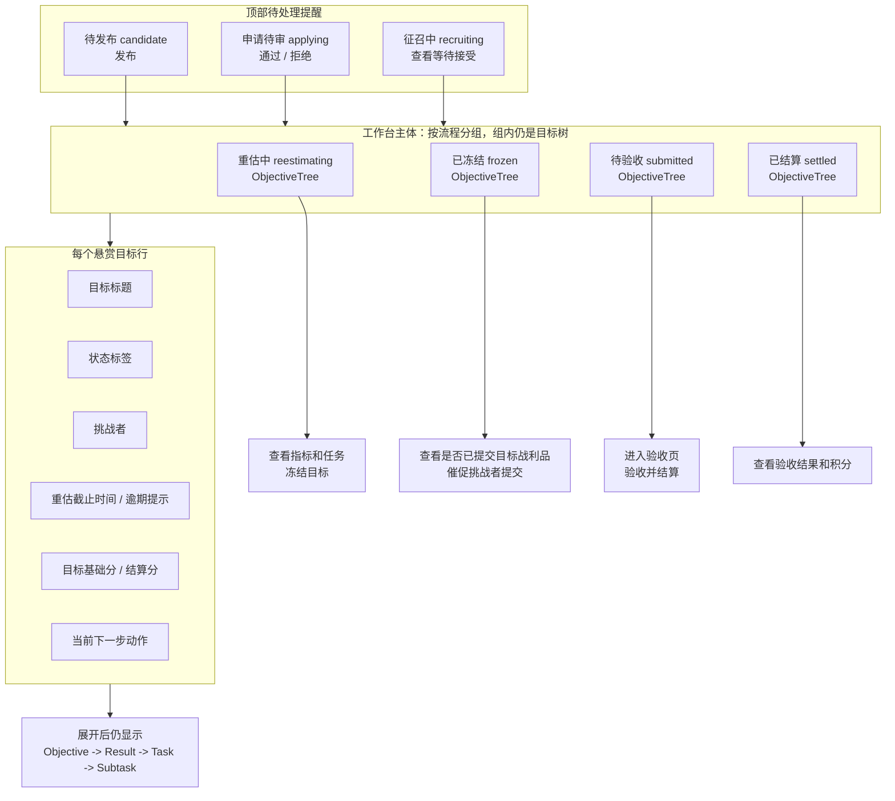
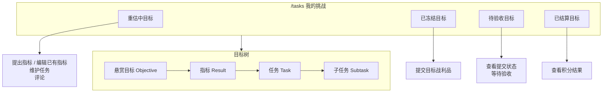
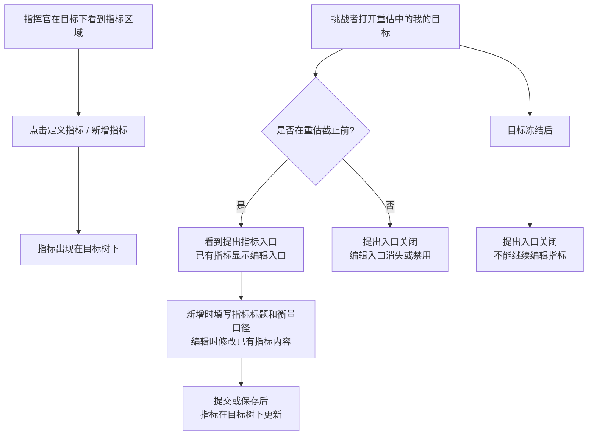
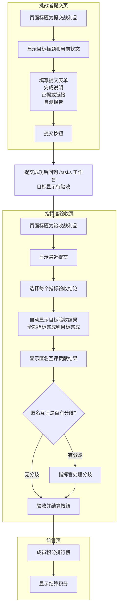

# ORF 前端流程测试

## 目标

本文档说明 ORF 前端流程测试的分层和规则清单。目标是让前端测试达到后端流程测试同等级别：不仅验证页面能渲染，还要验证用户实际看到的状态、按钮、权限边界和 API 刷新契约。

前端测试不替代后端状态机测试。后端负责证明数据流转合法；前端负责证明合法状态在界面上被正确展示，非法入口不暴露，API 失败或未刷新前不产生虚假状态。

## 测试分层

| 层级 | 文件 | 覆盖重点 |
| --- | --- | --- |
| Model 单测 | `tests/challengeModel.test.ts` | 挑战树构建、状态文案、状态色、拖拽权限、评论映射等纯前端规则 |
| API 优先契约 | `e2e/state-source/api-first-state.spec.ts` | 页面必须以 API 返回为准，不能回退到旧 localStorage 或乐观写入 |
| 悬赏大厅 E2E | `e2e/bounties/bounty-hall-skin.spec.ts` / `e2e/challenges/orf-frontend-flow.spec.ts` | 悬赏大厅列表、征召置顶、申请后刷新和禁用重复申请 |
| 挑战工作台 E2E | `e2e/challenges/orf-frontend-flow.spec.ts` | `/tasks` 悬赏目标挑战工作台中的流程按钮、审核条、范围过滤、目标树和冻结后入口 |
| 评论 E2E | `e2e/comments/comment-persistence.spec.ts` | 评论提交后在当前页面保持可见 |

## 角色视角

| 角色 | 前端必须验证 |
| --- | --- |
| 指挥官 | 在 `/tasks` 悬赏目标挑战工作台看到全部正式挑战目标，并看到候选发布、申请审核、征召等待等轻量待办提醒；不能看到退回重估入口 |
| 挑战者 | 在 `/tasks` 只看到自己已经正式参与的悬赏目标；接受征召或申请通过后进入重估；重估截止前可提出指标、编辑已有指标；冻结后可提交目标战利品；不能看到指挥官流程按钮 |
| 旁观成员 | 在 `/bounties` 悬赏大厅能申请公开悬赏目标；申请成功后需要刷新为已申请并禁用重复申请；申请未通过前不进入 `/tasks` |

## 前端流程框图

读图方式：

- 主图只写用户界面能看到的页面、状态文案、按钮、弹窗、跳转和提示。
- 技术契约单独放在“技术契约补充”里，说明 API、刷新和禁止乐观更新的要求。
- 测试优先断言用户可见结果；只有当用户界面不足以表达规则时，才补充 API payload 或请求次数断言。
- 术语固定：`Objective` 是“悬赏目标”，`Result` 只叫“指标”。不要把指标叫成悬赏。

### 页面边界总览



页面边界：

| 页面 | 定位 | 主体内容 | 不应该承担 |
| --- | --- | --- | --- |
| `/bounties` | 悬赏大厅 | `open/applying/recruiting` 悬赏目标，申请挑战，接受征召，已申请状态 | 不编辑目标、不编辑指标、不维护任务、不提交战利品 |
| `/tasks` | 悬赏目标挑战工作台 | 已进入挑战流程的目标；指挥官看到全局工作台，挑战者只看自己的目标；主体仍是 `Objective -> Result -> Task -> Subtask` 树 | 不替代悬赏大厅，不把未通过申请当成“我的挑战” |
| `/objectives/:id/loot` | 目标战利品页 | 挑战者提交目标战利品；指挥官验收目标 | 不编辑指标，不管理申请 |
| `/reports` | 结算结果页 | 目标级积分流水和排行榜 | 不承载流程操作 |

### 悬赏大厅 UI 流程



悬赏大厅断言重点：

- `open` 悬赏目标显示“申请挑战”。
- 已申请但未通过时，成员只在悬赏大厅看到“已申请 / 等待确认”，不进入 `/tasks`。
- `recruiting` 且当前成员被征召时，显示“征召令”和“接受挑战”。
- 悬赏大厅不出现指标编辑、任务树、目标战利品提交入口。

### 悬赏目标挑战工作台：指挥官视角



指挥官视角断言重点：

- `/tasks` 可以提醒 `candidate/applying/recruiting`，但这些是待处理提醒，不是工作台主体。
- 工作台主体是 `reestimating/frozen/submitted/settled`。
- 不能把 `/bounties` 的完整大厅功能搬进 `/tasks`。
- `frozen` 阶段表达为“查看目标是否已提交战利品 / 催促挑战者提交”，不写成“谁还没提交”。
- 每个目标行必须能看到目标基础分和目标结算分。

### 悬赏目标挑战工作台：挑战者视角



挑战者视角断言重点：

- `/tasks` 只展示当前用户已经正式参与的悬赏目标。
- “已申请但待确认”不进入 `/tasks`，只在 `/bounties` 显示。
- 挑战者不看到发布、审核、冻结、验收等指挥官动作。
- 挑战者在 `reestimating` 提出指标、编辑指标并维护任务；在 `frozen` 提交目标战利品；在 `submitted` 查看等待验收；在 `settled` 查看积分结果。

### 指标 UI 流程



指标断言重点：

- 目标才叫“悬赏目标”，`Result` 统一叫“指标”。
- 指挥官动作可以叫“定义指标 / 新增指标”。
- 挑战者动作分为“提出指标”和“编辑指标”：提出是新增指标，编辑是修改已有指标。
- 重估截止后或目标冻结后，不能编辑指标；前端应隐藏或禁用编辑入口。
- 不再使用“新增悬赏”“新增悬赏指标”“提交悬赏指标”这类文案。
- 技术层面新增指标时仍用 `source=memberProposed` 区分挑战者提出的指标；编辑已有指标应走保存 / 更新流程，不能误走指挥官定义指标流程。

### 目标战利品提交与验收 UI 流程



目标战利品断言重点：

- 战利品是目标级 `objectiveLoot`，不是每个挑战者强制单独提交一份。
- `frozen` 目标允许目标挑战者提交目标战利品。
- `submitted` 目标允许指挥官验收每个指标；目标验收结果由指标结论汇总，不单独选择目标结论。
- 挑战者贡献来自匿名互评结果，不由指挥官填写贡献权重；指挥官只处理互评分歧。
- 结算结果是目标级积分结算，写入排行榜。

### 失败和异常 UI 流程


### 技术契约补充

| 用户动作 | 主要 UI 断言 | 技术契约 |
| --- | --- | --- |
| 指挥官点击发布 | 目标从“候选中”变成“可申请”，发布按钮消失；成员能在悬赏大厅看到申请入口 | 调用发布 mutation；成功后必须刷新业务数据；页面只能按刷新数据展示 |
| 成员申请挑战 | 弹窗说明等待确认；成功后按钮变“已申请”且禁用 | 调用申请 mutation；成功后刷新悬赏大厅数据；失败时不能显示已申请 |
| 成员接受征召 | 成功后跳转 `/tasks` 工作台，目标显示“重估中”，当前用户成为挑战者 | 调用接受 mutation；成功后刷新悬赏大厅和我的挑战数据 |
| 指挥官通过申请 | 申请审核条消失，目标显示“重估中”，冻结按钮出现 | 调用通过申请 mutation；成功后刷新 `/tasks` 工作台数据 |
| 指挥官拒绝申请 | 被拒绝申请人从审核条消失；已接受挑战者不能被误退回悬赏大厅状态 | 调用拒绝申请 mutation；成功后按刷新数据展示 |
| 挑战者提出或编辑指标 | 重估截止前显示“提出指标”入口，已有指标显示编辑入口；提交或保存后目标树更新 | 创建 Result 时必须是 `source=memberProposed`；编辑已有 Result 时走更新流程；只允许正式挑战者在重估截止前提交或保存 |
| 指挥官冻结 | 目标显示“已冻结”，冻结按钮消失，不出现退回重估入口 | 调用冻结 mutation；成功后刷新 `/tasks` 工作台数据；失败时保持“重估中” |
| 挑战者提交战利品 | 成功后回到 `/tasks` 工作台，目标显示“待验收”，提交入口消失 | 调用提交战利品 mutation；成功后刷新 `/tasks` 工作台数据 |
| 指挥官验收结算 | 选择每个指标验收结论；目标结果由指标结论汇总；使用匿名互评贡献结果，有分歧时先处理分歧；成功后跳转统计页，排行榜显示积分变化 | 调用验收 mutation；成功后刷新 point ledger 和统计页数据 |
| 任意 mutation 失败 | 原页面、原状态、原按钮保持可见，显示错误提示 | 禁止乐观更新；失败后不能本地伪造新状态 |

## 覆盖状态

| 状态 | 含义 |
| --- | --- |
| 已覆盖 | 已有自动化测试，当前除已标注 bug 外应保持通过 |
| 已暴露 | 已有自动化测试，当前会失败，用于提醒需要改前端实现 |
| 待补 | 已明确规则和目标测试名，但本轮还未落成自动化测试 |

当前规则总账：

- 已覆盖：19 条，`ORF-FE-R001`、`ORF-FE-R002`、`ORF-FE-R004` 到 `ORF-FE-R019`，以及 `ORF-FE-R021`。
- 已暴露：1 条，`ORF-FE-R020`。
- 待补：39 条，`ORF-FE-R022` 到 `ORF-FE-R060`。

## 已覆盖规则

| Rule | 规则 | 覆盖测试 |
| --- | --- | --- |
| ORF-FE-R001 | 目标树必须保留无 Result 的 Objective，不能因为悬赏目标尚未定义指标而从 `/tasks` 工作台消失。 | `buildChallengeTree keeps resultless ORF objectives visible` |
| ORF-FE-R002 | 前端状态文案必须和 `Objective.flowStatus` 对齐：候选、申请、征召、重估、冻结、待验收、已结算。 | `bounty and objective statuses follow the ORF frontend flow` |
| ORF-FE-R004 | 指挥官在 `/tasks` 工作台只能看到当前状态允许的流程按钮：`candidate` 提醒中可发布，`reestimating` 主体中可冻结。 | `commander challenge page exposes only valid ORF flow actions` |
| ORF-FE-R005 | `applying` 目标有 pending application 时，指挥官能看到申请审核条和通过 / 拒绝按钮。 | `commander challenge page exposes only valid ORF flow actions` |
| ORF-FE-R006 | `frozen` 目标不展示退回重估入口。 | `commander challenge page exposes only valid ORF flow actions` / `member challenge page stays scoped to own challenges and hides commander flow actions` |
| ORF-FE-R007 | 成员在 `/tasks` 工作台默认只展示自己正式参与的悬赏目标，不展示其他挑战者的目标，也不展示仅已申请待确认的目标。 | `member challenge page stays scoped to own challenges and hides commander flow actions` |
| ORF-FE-R008 | 成员在 `/tasks` 工作台不展示发布、冻结、申请审核等指挥官流程按钮。 | `member challenge page stays scoped to own challenges and hides commander flow actions` |
| ORF-FE-R009 | 成员只在自己的 `frozen` 悬赏目标上看到提交目标战利品入口，`reestimating` 目标不显示提交入口。 | `member challenge page stays scoped to own challenges and hides commander flow actions` |
| ORF-FE-R010 | 悬赏大厅申请挑战后，前端必须等待 API 成功和刷新数据，再显示已申请状态并禁用重复申请。 | `bounty hall apply action waits for API success and refreshed bounty data` |
| ORF-FE-R011 | 任务状态等业务写操作失败时，前端不能乐观改状态；成功后必须以刷新数据为准。 | `keeps task status unchanged until the API write succeeds and refreshed data arrives` |
| ORF-FE-R012 | API 获取业务数据失败时，页面不能展示 bundled seed 或 legacy localStorage 里的旧业务数据。 | `does not show bundled business data when task data API fails` / `ignores stale business data in legacy localStorage` |
| ORF-FE-R013 | 成员在悬赏大厅接受征召后，必须等待 API 成功和刷新数据，再跳转到 `/tasks` 工作台并显示目标进入 `reestimating`。 | `bounty hall recruitment accept moves the member into reestimate after refreshed data` |
| ORF-FE-R014 | 指挥官通过挑战申请后，申请条必须消失，目标必须按刷新数据显示 `reestimating`，并出现冻结入口。 | `commander approval moves applying objective into reestimate from refreshed data` |
| ORF-FE-R015 | 指挥官拒绝剩余 pending application 时，只清掉被拒绝申请；如果目标已有已接受挑战者，前端不能把目标误显示回可申请状态。 | `commander rejection clears pending application without reopening accepted challenges` |
| ORF-FE-R016 | 指挥官冻结重估目标后，必须等待刷新数据再显示 `frozen`；冻结后不能再出现冻结或退回重估入口。 | `commander freeze waits for refreshed frozen data and removes reopen affordances` |
| ORF-FE-R017 | 冻结 API 失败时，前端必须保持 `reestimating` 和冻结按钮，并展示后端错误，不能乐观显示已冻结。 | `commander freeze failure keeps reestimate state from refreshed API data` |
| ORF-FE-R018 | 成员只能在自己的 `frozen` 目标提交战利品；提交成功刷新后回到 `/tasks` 工作台，目标显示待验收，并移除重复提交入口。 | `member can submit loot only after frozen objective and returns to challenges after refresh` |
| ORF-FE-R019 | 指挥官验收已提交战利品后，必须等待刷新数据再跳转统计页，并能看到结算积分进入排行榜。 | `commander reviews submitted loot and sees settled points after refreshed data` |
| ORF-FE-R021 | 指挥官发布候选目标后，必须等待刷新数据再显示 `open/可申请`，并且成员能在悬赏大厅看到该目标和申请入口。 | `commander publishes a candidate objective and the bounty hall exposes it after refresh` |

## 已暴露规则

| Rule | 规则 | 覆盖测试 | 当前结果 |
| --- | --- | --- | --- |
| ORF-FE-R020 | 成员在自己的 `reestimating` 目标且未过 `confirmationDueAt` 时，提出指标必须走 `memberProposed` 指标提交流程，编辑已有指标必须走保存 / 更新流程，不能误走指挥官定义指标流程。 | `member reestimate metric proposal uses the member-proposed interaction contract` | 失败 |

## 待补覆盖矩阵

| 分类 | 优先级 | 待补重点 |
| --- | --- | --- |
| 失败路径 | P0 | 所有 ORF mutation 失败时都不能乐观更新；必须显示错误并按刷新数据回落 |
| 权限边界 | P0 | 直接打开深链页面时也必须保持角色和挑战者边界，不只依赖按钮隐藏 |
| 时间边界 | P0 | 重估截止前、截止后、冻结后三个时间点的指标入口必须分明 |
| 表单交互 | P1 | 空内容、缺指标、缺 loot、取消弹窗、重复提交等人机交互必须可验证 |
| 多人挑战 | P1 | 多挑战者的我的挑战、提交、指标验收、匿名互评贡献结果、分歧处理、排行榜积分必须一致 |
| 深链路 | P1 | `/objectives/:id/loot`、Objective detail、Result detail 等入口必须和 `/tasks` 工作台规则一致 |
| UI 状态 | P1 | loading、empty、API error、processing disabled、toast 都要有可见断言 |
| 数据一致性 | P0 | mutation 成功但刷新返回旧数据时，页面必须相信刷新数据，不得自己制造成功状态 |
| 回归入口 | P2 | 其他页面复用的入口不能绕过 ORF 主流程规则 |
| 交互细节 | P2 | 弹窗关闭、重复点击、浏览器返回、toast 关闭等细节防回归 |

## 待补规则清单

| Rule | 分类 | 优先级 | 规则 | 目标测试 |
| --- | --- | --- | --- | --- |
| ORF-FE-R022 | 失败路径 | P0 | 发布候选目标失败时，`/tasks` 工作台仍显示 `candidate` 和发布按钮，并展示后端错误。 | `commander publish failure keeps candidate state` |
| ORF-FE-R023 | 失败路径 | P0 | 申请挑战失败时，悬赏大厅不能显示已申请，确认弹窗应保留或展示错误。 | `bounty hall apply failure keeps apply action available` |
| ORF-FE-R024 | 失败路径 | P0 | 接受征召失败时，成员不能跳转到 `/tasks` 工作台，征召令仍保持可接受状态。 | `recruitment accept failure keeps recruitment item visible` |
| ORF-FE-R025 | 失败路径 | P0 | 指挥官通过申请失败时，申请条不能消失，目标不能显示 `reestimating`。 | `application approval failure keeps pending review strip` |
| ORF-FE-R026 | 失败路径 | P0 | 指挥官拒绝申请失败时，pending application 不能从申请条里消失。 | `application rejection failure keeps pending applicant visible` |
| ORF-FE-R027 | 失败路径 | P0 | 提交战利品失败时，页面不能跳回 `/tasks` 工作台，目标不能显示待验收。 | `loot submit failure stays on form and keeps frozen state` |
| ORF-FE-R028 | 失败路径 | P0 | 验收结算失败时，页面不能跳到统计页，排行榜不能出现新积分。 | `loot review failure stays on review form without points` |
| ORF-FE-R029 | 失败路径 | P1 | 成员提出指标失败时，modal 或 toast 应明确失败，目标不能新增指标。 | `member proposed metric failure does not append result` |
| ORF-FE-R030 | 权限边界 | P0 | 非指挥官直接打开已提交目标的验收页时，不能看到验收按钮，提交应被禁用或提示无权限。 | `member direct review page cannot settle submitted loot` |
| ORF-FE-R031 | 权限边界 | P0 | 非挑战者直接打开冻结目标的战利品提交页时，提交按钮必须不可用。 | `observer direct loot page cannot submit frozen objective` |
| ORF-FE-R032 | 权限边界 | P0 | 成员即使构造全量挑战数据，也不能看到发布、审核、冻结、验收等指挥官入口。 | `member never sees commander flow actions with full data` |
| ORF-FE-R033 | 权限边界 | P0 | 指挥官可以进入验收，但不能以非挑战者身份提交战利品。 | `commander cannot submit loot unless also challenger` |
| ORF-FE-R034 | 权限边界 | P1 | 只有当前用户是目标挑战者时，`/tasks` 工作台和深链页才展示提交战利品入口。 | `loot entry is visible only to current challenger` |
| ORF-FE-R035 | 时间边界 | P0 | `confirmationDueAt` 之前，正式挑战者可打开提出指标入口，也可编辑已有指标；新增提交使用 `source=memberProposed`。 | `member can propose metric before reestimate deadline` |
| ORF-FE-R036 | 时间边界 | P0 | `confirmationDueAt` 之后，正式挑战者不能打开提出指标入口，已有指标也不能编辑，且不会发出新增或保存请求。 | `member cannot propose metric after reestimate deadline` |
| ORF-FE-R037 | 时间边界 | P0 | 目标冻结后，挑战者不能继续新增或编辑指标。 | `member cannot edit metrics after objective frozen` |
| ORF-FE-R038 | 时间边界 | P1 | `candidate/open/applying/recruiting` 阶段，成员没有提出指标入口，也不能编辑指标。 | `member metric proposal is limited to active reestimate` |
| ORF-FE-R039 | 表单交互 | P1 | 战利品完成说明为空时，前端应阻止提交并显示“请填写完成说明”。 | `loot form requires body before submit` |
| ORF-FE-R040 | 表单交互 | P1 | 冻结目标没有任何 Result 时，战利品页应阻止提交并提示没有可验收指标。 | `loot form rejects frozen objective without results` |
| ORF-FE-R041 | 表单交互 | P1 | 验收页没有 latest loot 时，指挥官不能提交验收。 | `review page rejects submitted objective without latest loot` |
| ORF-FE-R042 | 表单交互 | P1 | 申请和接受确认弹窗点击取消时，不应调用任何 mutation API。 | `challenge confirm cancel does not call mutation API` |
| ORF-FE-R043 | 表单交互 | P2 | 提出指标或编辑指标 modal 关闭后，不应留下半完成表单或误提交。 | `member proposed metric modal close does not mutate data` |
| ORF-FE-R044 | 多人挑战 | P1 | 多个挑战者的 `frozen` 目标，两个挑战者都能在自己的 `/tasks` 工作台看到提交入口。 | `multiple challengers see their own frozen loot entry` |
| ORF-FE-R045 | 多人挑战 | P1 | 多挑战者战利品提交后，指挥官验收页应展示匿名互评贡献结果，不应展示手填贡献权重输入。 | `review form uses peer review contribution results` |
| ORF-FE-R046 | 多人挑战 | P1 | 多挑战者结算后，排行榜应按匿名互评贡献结果显示多成员积分。 | `multi challenger settlement updates leaderboard by peer review ratios` |
| ORF-FE-R047 | 多人挑战 | P2 | 匿名互评贡献结果和分歧处理只应包含目标挑战者，不应出现旁观成员。 | `review peer contribution excludes non challengers` |
| ORF-FE-R048 | 深链路 | P1 | `/objectives/:id/loot` 对 `frozen` 且当前用户是挑战者时显示提交页。 | `loot deep link opens submit form for frozen challenger` |
| ORF-FE-R049 | 深链路 | P1 | `/objectives/:id/loot` 对 `submitted` 且当前用户是指挥官时显示验收页。 | `loot deep link opens review form for commander on submitted objective` |
| ORF-FE-R050 | 深链路 | P1 | `/objectives/:id/loot` 对不存在目标应回到 `/tasks` 工作台，不能空白或崩溃。 | `loot deep link redirects missing objective to challenges` |
| ORF-FE-R051 | 深链路 | P1 | Result detail 的“提交目标战利品”入口必须遵守目标状态和挑战者身份。 | `result detail loot entry follows objective flow permissions` |
| ORF-FE-R052 | 回归入口 | P2 | Objective detail 的“新增指标 / 定义指标”入口不能让成员绕过 `memberProposed` 重估规则。 | `objective detail metric entry follows reestimate proposal contract` |
| ORF-FE-R053 | UI 状态 | P1 | 悬赏大厅加载时显示 loading empty state，加载完成无数据时显示空态。 | `bounty hall renders loading and empty states` |
| ORF-FE-R054 | UI 状态 | P1 | 悬赏大厅 API 失败时，不展示 seed 或旧数据，并显示可理解空态。 | `bounty hall api failure does not show stale business data` |
| ORF-FE-R055 | UI 状态 | P1 | mutation 进行中按钮应 disabled 或显示处理中，避免重复点击。 | `challenge mutation button is disabled while processing` |
| ORF-FE-R056 | UI 状态 | P2 | 后端错误 toast 应可见，关闭后从页面移除。 | `business error toast can be dismissed` |
| ORF-FE-R057 | 数据一致性 | P0 | mutation 成功但刷新返回旧状态时，页面必须展示旧状态，不得乐观显示成功状态。 | `successful mutation still trusts stale refresh response` |
| ORF-FE-R058 | 数据一致性 | P0 | mutation 成功但刷新失败时，页面不能靠本地推断进入成功状态，应提示刷新失败或保留旧状态。 | `mutation success with refresh failure does not fabricate new state` |
| ORF-FE-R059 | 数据一致性 | P1 | 同一按钮连续点击不能产生重复申请、重复接受、重复提交或重复验收。 | `double click on ORF mutation does not duplicate requests` |
| ORF-FE-R060 | 交互细节 | P2 | 浏览器返回后，页面应从 API 数据恢复当前状态，不回到旧本地状态。 | `browser back after ORF mutation keeps refreshed API state` |

## 当前暴露的问题

- `member reestimate metric proposal uses the member-proposed interaction contract` 当前会失败：成员在重估阶段点击当前实现里的旧入口后，页面打开的是指挥官定义指标流程，不是挑战者的“提出指标 / 编辑指标”流程，因此不会按 `source=memberProposed` 提交新增指标，也不能明确验证已有指标编辑。
- 该问题属于前端交互入口未接到已有 `memberProposed` modal 契约；本轮只写测试，不修改开发代码。

## 测试数据原则

- E2E 测试使用 Playwright route mock API，避免依赖真实后端、真实 Ory、真实数据库。
- 用例内显式构造 Objective / Result，只保留当前断言需要的字段和状态。
- 页面断言优先基于用户可见文案、按钮和链接，少量使用稳定 class 定位目标面板。
- 每个测试开始清空 localStorage，避免 legacy 本地状态污染 API 优先契约。

## 修改测试时机

当以下前端规则变化时，应同步修改本文件和相关测试：

- `Objective.flowStatus` 文案或按钮显隐变化。
- 指挥官和成员的 `/tasks` 工作台权限边界变化。
- 接受征召、审批申请、拒绝申请、冻结、提交战利品、验收结算等流程入口变化。
- 成员重估阶段提出指标、编辑指标流程或 `source=memberProposed` 契约变化。
- 悬赏大厅申请 / 接受挑战后的刷新策略变化。
- API 失败时是否允许乐观更新的策略变化。
- 挑战树是否展示无 Result Objective 的规则变化。
- 深链页面、失败路径、表单校验、多人挑战或排行榜结算规则变化。

## 验证命令

```bash
npm test
npx playwright test e2e/challenges/orf-frontend-flow.spec.ts
npm run test:e2e
npm run build
```

在修复当前成员提出指标 / 编辑指标入口前，可以用下面命令验证其他 ORF 前端流程是否全绿：

```bash
npx playwright test e2e/challenges/orf-frontend-flow.spec.ts --grep-invert "member reestimate metric proposal"
```
