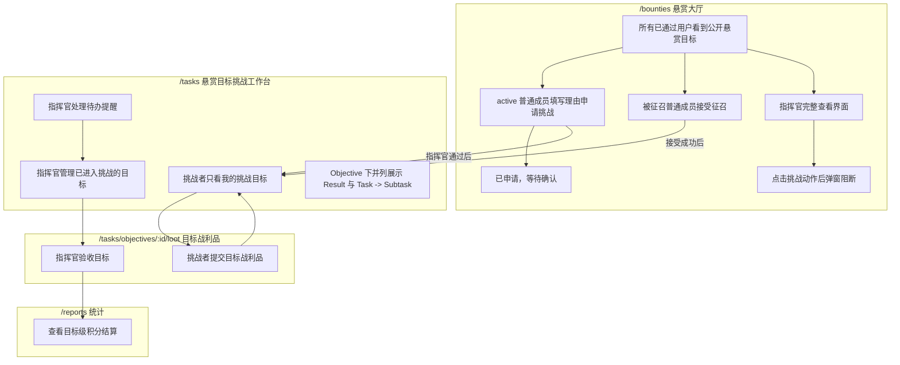
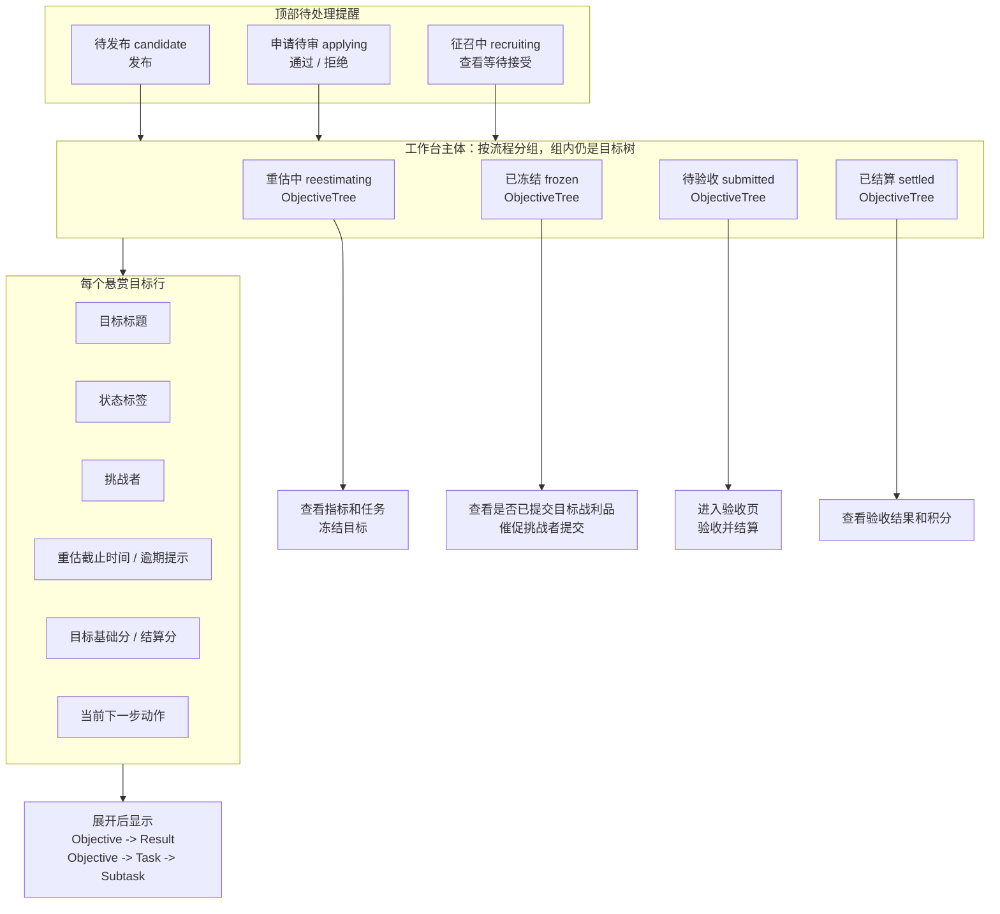
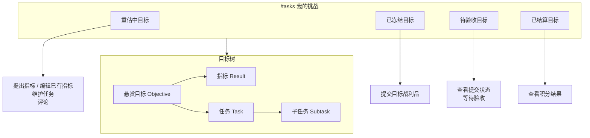
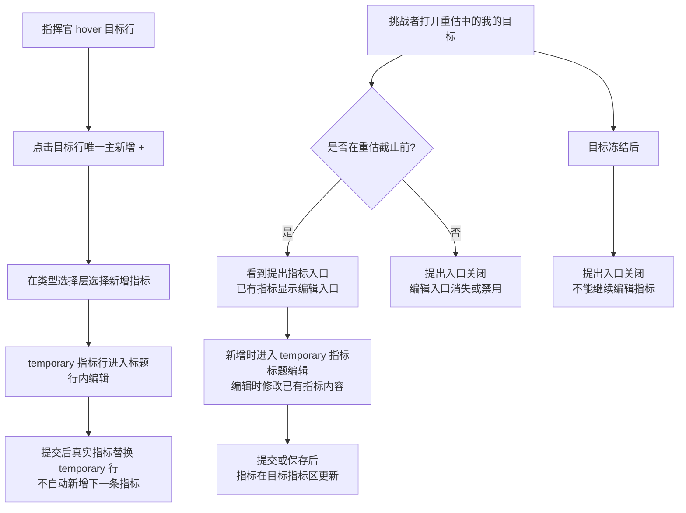
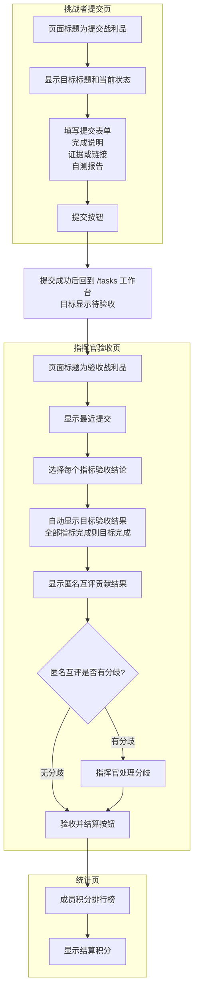
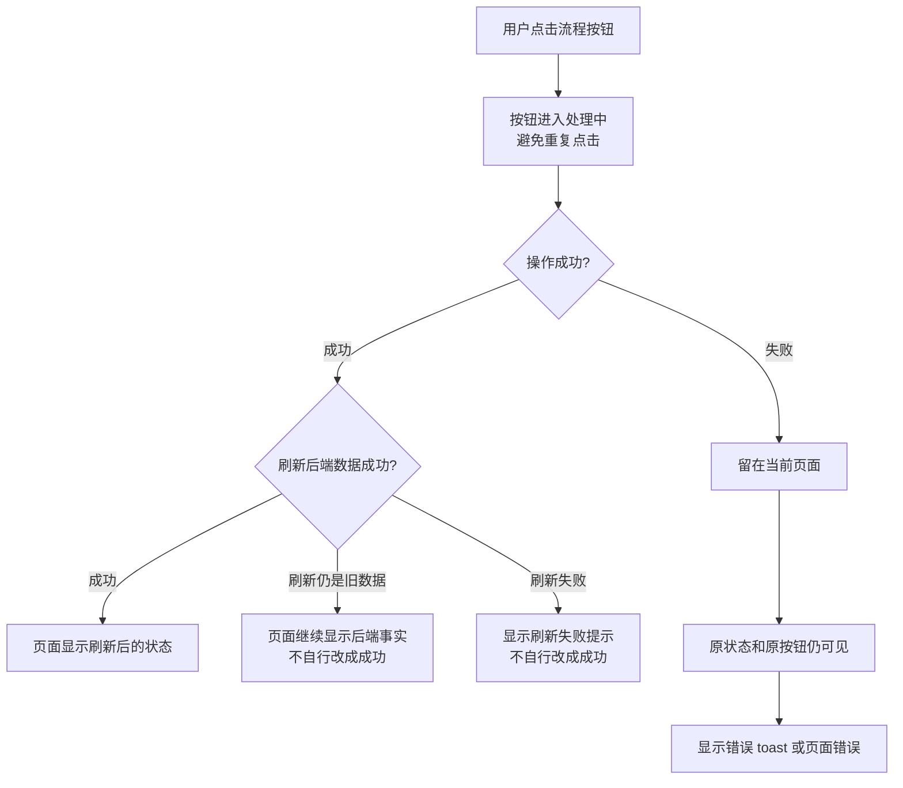

# ORF 前端流程测试

## 目标

本文档说明 ORF 前端流程测试的分层和规则清单。目标是让前端测试达到后端流程测试同等级别：不仅验证页面能渲染，还要验证用户实际看到的状态、按钮、权限边界和 API 刷新契约。

前端测试不替代后端状态机测试。后端负责证明数据流转合法；前端负责证明合法状态在界面上被正确展示，非法入口不暴露，API 失败或未刷新前不产生虚假状态。

## 测试分层

| 层级 | 文件 | 覆盖重点 |
| --- | --- | --- |
| Model 单测 | `tests/challengeModel.test.ts` / `tests/objectiveCreationSession.test.ts` | 挑战树构建、状态文案、状态色、拖拽权限、评论映射、目标创建 session 状态转换、任务完成状态覆盖层等纯前端规则 |
| API 优先契约 | `e2e/state-source/api-first-state.spec.ts` | 页面必须以 API 返回为准，不能回退到旧 localStorage 或伪造业务数据；创建目标时只能用 `POST /api/objectives` 成功返回的真实目标做页面级临时覆盖层，并且不能等待任务数据刷新后才显示 |
| 悬赏大厅 E2E | `e2e/bounties/bounty-hall-skin.spec.ts` / `e2e/challenges/orf-frontend-flow.spec.ts` | 悬赏大厅全员可见、指挥官完整界面但挑战动作阻断、征召置顶、申请理由必填、申请后刷新、通过后头像继续公开展示 |
| 挑战工作台 E2E | `e2e/challenges/orf-frontend-flow.spec.ts` | `/tasks` 悬赏目标挑战工作台中的流程按钮、审核条、范围过滤、目标树和冻结后入口 |
| 评论 E2E | `e2e/comments/comment-persistence.spec.ts` | 评论提交后在当前页面保持可见 |
| 成员管理 E2E | `e2e/members/member-management.spec.ts` | 成员列表、最近在线、预批准成员输入归一化、已绑定成员邮箱锁定、删除用户入口 |

## 角色视角

| 角色 | 前端必须验证 |
| --- | --- |
| 指挥官 | 在 `/tasks` 悬赏目标挑战工作台创建候选目标、看到全部正式挑战目标，并看到候选发布、申请审核、征召等待等轻量待办提醒；可新增和编辑未冻结目标下的指标；在 `/bounties` 看到完整大厅界面和操作区，点击申请 / 接受时弹窗提示不能申请挑战且不产生业务写入；不能看到退回重估入口 |
| 挑战者 | 在 `/tasks` 只看到自己已经正式参与的悬赏目标；接受征召或申请通过后进入重估；重估截止前可提出指标、编辑已有指标，并与同目标挑战者共同维护任务和子任务；冻结后可提交目标战利品；不能看到指挥官流程按钮 |
| 旁观成员 | 在 `/bounties` 悬赏大厅能填写理由申请公开悬赏目标；申请成功后需要刷新为已申请并禁用重复申请；申请未通过前不进入 `/tasks`，通过后进入 `/tasks` 且头像继续显示在悬赏大厅 |

## 前端流程框图

读图方式：

- 主图只写用户界面能看到的页面、状态文案、按钮、弹窗、跳转和提示。
- 技术契约单独放在“技术契约补充”里，说明 API、刷新和禁止乐观更新的要求。
- 测试优先断言用户可见结果；只有当用户界面不足以表达规则时，才补充 API payload 或请求次数断言。
- 术语固定：`Objective` 是“悬赏目标”，`Result` 只叫“指标”。不要把指标叫成悬赏。

### 页面边界总览



页面边界：

| 页面 | 定位 | 主体内容 | 不应该承担 |
| --- | --- | --- | --- |
| `/bounties` | 悬赏大厅 | 所有已通过用户可见 `open/applying/recruiting/reestimating` 公开悬赏目标；`招募中 / 已开始 / 全部` 分组只按读模型派生；active 普通成员填写理由申请挑战、接受自己的征召、查看申请中和已通过挑战者头像；指挥官/管理员看到完整大厅界面和操作区，但挑战动作弹窗阻断 | 不编辑目标、不编辑指标、不维护任务、不提交战利品；指挥官/管理员不能让申请或接受生效 |
| `/tasks` | 悬赏目标挑战工作台 | 已进入挑战流程的目标；指挥官看到全局工作台，挑战者只看自己的目标；主体是目标下并列的指标区和任务区 | 不替代悬赏大厅，不把未通过申请当成“我的挑战” |
| `/tasks/objectives/:id/loot` | 目标战利品页 | 挑战者提交目标战利品；指挥官验收目标 | 不编辑指标，不管理申请 |
| `/reports` | 结算结果页 | 目标级积分流水和排行榜 | 不承载流程操作 |

### 悬赏大厅 UI 流程

```mermaid
flowchart TD
  subgraph Bounties["/bounties 悬赏大厅"]
    A0[所有已通过用户看到大厅目标]
    A1[active 普通成员看到可申请悬赏目标]
    A2[看到申请挑战按钮]
    A3[点击申请挑战]
    A4[申请弹窗<br/>必须填写申请理由]
    A5[大厅显示本人申请理由<br/>按钮禁用]
    B1[看到征召令标签]
    B2[看到接受挑战按钮]
    B3[确认弹窗<br/>说明接受后进入 /tasks 工作台]
    D1[指挥官看到完整目标和操作区]
    D2[点击申请挑战]
    D3[阻断弹窗<br/>提示指挥官不应该申请挑战]
    D4[单击目标行<br/>聚焦并展开详情]
    D5[双击目标行<br/>跳转 /tasks#objective:{id}]
  end

  subgraph Workbench["/tasks 悬赏目标挑战工作台"]
    C1[申请被通过后<br/>目标出现在我的挑战]
    C2[接受征召成功后<br/>自动进入我的挑战]
    C3[指挥官全局工作台<br/>定位到同一目标]
    C4[悬赏大厅继续显示<br/>挑战者头像]
  end

  A0 --> A1 --> A2 --> A3 --> A4
  A0 --> D1 --> D2 --> D3
  D1 --> D4
  D4 --> D5 --> C3
  A4 --> A6[取消<br/>弹窗关闭，状态不变]
  A4 --> A5
  A5 --> A7[继续停留悬赏大厅<br/>等待指挥官确认]
  A7 -->|通过后| C1
  A7 -->|通过后| C4
  B1 --> B2 --> B3
  B3 --> B4[取消<br/>仍停留悬赏大厅]
  B3 --> C2
```

悬赏大厅断言重点：

- 所有已通过用户都能看到 `open/applying/recruiting/reestimating` 大厅目标；角色不能导致大厅列表整体变空，也不能导致指挥官大厅操作区被隐藏。
- `招募中` 标签展示 `open/applying/recruiting` 等未开始目标；`已开始` 标签自动展示 `reestimating` 或已有挑战者目标；目标行分列展示 `publishedAt` 和剩余时间，不能用创建时间或后续更新时间冒充发布到大厅时间。
- `open` 悬赏目标对 active 普通成员点击“申请挑战”进入理由表单；空理由不能提交；对指挥官/管理员点击同一入口时弹窗提醒“指挥官不应该申请挑战”，不能发起成功 mutation，也不能本地显示已申请。
- 已申请但未通过时，成员只在悬赏大厅参与列看到高亮的本人申请和自己的申请理由，操作列只显示“申请中”，不进入 `/tasks`。
- 申请被通过后，目标进入 `/tasks` 的我的挑战，同时继续留在悬赏大厅，参与状态里显示已通过挑战者头像并高亮当前用户头像，操作列提供“进入目标”。
- `recruiting` 且当前成员被征召时，显示“征召令”和“接受挑战”；指挥官/管理员看到完整目标和操作区，但点击挑战动作必须弹窗阻断。
- 被征召成员不显示“拒绝征召”；有异议时线下找指挥官处理。
- 悬赏大厅不出现指标编辑、任务树、目标战利品提交入口。

### 悬赏目标挑战工作台：指挥官视角



指挥官视角断言重点：

- `/tasks` 可以提醒 `candidate/applying/recruiting`，但这些是待处理提醒，不是工作台主体。
- 工作台主体是 `reestimating/frozen/submitted/settled`。
- 不能把 `/bounties` 的完整大厅功能搬进 `/tasks`。
- `reestimating` 目标没有任何指标时不展示冻结入口，避免点击必失败动作。
- `frozen` 阶段表达为“查看目标是否已提交战利品 / 催促挑战者提交”，不写成“谁还没提交”。
- 每个目标行必须能看到目标基础分和目标结算分。

### 悬赏目标挑战工作台：挑战者视角



挑战者视角断言重点：

- `/tasks` 只展示当前用户已经正式参与的悬赏目标。
- “已申请但待确认”不进入 `/tasks`，只在 `/bounties` 显示。
- 挑战者不看到发布、审核、冻结、验收等指挥官动作。
- 挑战者在 `reestimating` 提出指标、编辑指标，并和同一目标下其他正式挑战者共同新增、编辑、勾选、移动和删除任务 / 子任务；在 `frozen` 提交目标战利品；在 `submitted` 查看等待验收；在 `settled` 查看积分结果。

### 指标 UI 流程



指标断言重点：

- 目标才叫“悬赏目标”，`Result` 统一叫“指标”。
- 指挥官动作可以叫“定义指标 / 新增指标”。目标行只有一个主新增 `+`，点击后在类型选择层选择新增指标或新增行动项；选择新增指标后才创建 temporary 指标行。指标行本身没有 `+`，空态占位不承担创建动作，不在空态右侧展示独立新增按钮，也不在目标头堆叠多个同图标 `+`。也可以编辑未冻结目标下已有指标。
- 挑战者动作分为“提出指标”和“编辑指标”：提出是新增指标，编辑是修改已有指标。
- 挑战者在重估截止后不能提出或编辑指标；目标冻结后，指挥官和挑战者都不能继续编辑指标。
- 不再使用“新增悬赏”，也不把指标称为悬赏。
- 技术层面新增指标时仍用 `source=memberProposed` 区分挑战者提出的指标；编辑已有指标应走保存 / 更新流程，不能误走指挥官定义指标流程。

### 目标战利品提交与验收 UI 流程



目标战利品断言重点：

- 战利品是目标级 `objectiveLoot`，不是每个挑战者强制单独提交一份。
- `frozen` 目标允许目标挑战者提交目标战利品。
- `submitted` 目标允许指挥官验收每个指标；目标验收结果由指标结论汇总，不单独选择目标结论。
- 挑战者贡献来自匿名互评结果，不由指挥官填写贡献权重；指挥官只处理互评分歧。
- 结算结果是目标级积分结算，写入排行榜。

### 失败和异常 UI 流程



### 技术契约补充

| 用户动作 | 主要 UI 断言 | 技术契约 |
| --- | --- | --- |
| 指挥官点击发布 | 目标从“候选中”变成“可申请”，发布按钮消失；在线 active 用户看到横幅广播，并能在悬赏大厅看到申请入口和发布时间 | 调用发布 mutation；成功后必须刷新业务数据；后端写入 `Objective.publishedAt`、创建 `objective.published` 通知，并经 SSE 投递 `system.broadcast`；大厅收到实时广播后刷新公开列表 |
| 指挥官查看大厅 | 能看到已发布或征召中的大厅目标和完整操作区；点击申请 / 接受时出现阻断弹窗，状态不变 | `GET /api/bounties` 不能因管理员角色返回空列表；前端不能因指挥官角色隐藏大厅界面，挑战 mutation 必须被前端弹窗和后端权限共同阻断 |
| 成员申请挑战 | 弹窗要求填写申请理由；成功后按钮变“已申请”且禁用，参与状态显示申请人与理由 | 调用申请 mutation，body 必须包含 trim 后非空的 `reason`；成功后刷新悬赏大厅数据；失败时不能显示已申请 |
| 成员接受征召 | 成功后跳转 `/tasks` 工作台，目标显示“重估中”，当前用户成为挑战者 | 调用接受 mutation；成功后刷新悬赏大厅和我的挑战数据 |
| 成员查看征召 | 只显示 `接受挑战`，不显示拒绝入口 | 前端不调用拒绝征召 API；后端不暴露拒绝征召接口 |
| 指挥官通过申请 | 申请审核条消失，目标显示“重估中”，冻结按钮出现；悬赏大厅同一目标继续展示已通过头像 | 调用通过申请 mutation；成功后刷新 `/tasks` 工作台数据，悬赏大厅收到申请通过消息后刷新公开列表 |
| 指挥官拒绝申请 | 被拒绝申请人从审核条消失；已接受挑战者不能被误退回可申请或待征召状态 | 调用拒绝申请 mutation；成功后按刷新数据展示 |
| 挑战者提出或编辑指标 | 重估截止前显示“提出指标”入口，已有指标显示编辑入口；提交或保存后目标树更新 | 创建 Result 时必须是 `source=memberProposed`；编辑已有 Result 时走更新流程；只允许正式挑战者在重估截止前提交或保存 |
| 共同维护任务 / 子任务 | 同一目标下任一正式挑战者都能看到任务和子任务的新增、编辑、勾选、移动、删除入口；旁观成员看不到工作台目标或无法深链写入 | 前端不按 `assignee` 或创建人隐藏同目标任务操作；所有写入仍以 API 403 / 200 为准，成功后刷新挑战数据 |
| 勾选任务 / 子任务 | 勾选框点击后立即变更，刷新后保持同一状态；失败时回到后端事实并提示 | 只允许任务完成状态使用短生命周期 `completionOverlay`；overlay 在挑战页数据合成层覆盖 `challengeData/state` 展示结果，状态推导复用统一 store 方法，后端刷新数据包含同一完成状态后撤销 overlay |
| 指挥官冻结 | 目标显示“已冻结”，冻结按钮消失，不出现退回重估入口 | 调用冻结 mutation；成功后刷新 `/tasks` 工作台数据；失败时保持“重估中” |
| 挑战者提交战利品 | 成功后回到 `/tasks` 工作台，目标显示“待验收”，提交入口消失 | 调用提交战利品 mutation；成功后刷新 `/tasks` 工作台数据 |
| 指挥官验收结算 | 选择每个指标验收结论；目标结果由指标结论汇总；使用匿名互评贡献结果，有分歧时先处理分歧；成功后跳转统计页，排行榜显示积分变化 | 调用验收 mutation；成功后刷新 point ledger 和统计页数据 |
| 任意 mutation 失败 | 原页面、原状态、原按钮保持可见，显示错误提示；任务 / 子任务勾选失败时撤销临时勾选 | 流程性业务状态禁止乐观更新；任务完成状态 overlay 只能表达执行进度的临时展示，失败后不能本地伪造成功状态 |

## 上线式联动主流程

前端流程测试不维护静态覆盖数字。当前有效性以测试文件和 CI 结果为准，本文只定义真实用户链路、守卫场景和风险边界，避免文档用静态数字伪造确定性。

主链路由 `real user launch flow links commander and challengers from publish to settlement` 覆盖：浏览器多页面 + route mock，快速审计前端状态机、显隐规则和截图，不写入真实数据库或认证系统。

上线后的用户行为必须按一个指挥官、多个成员、多个挑战者来验证：指挥官发布目标，多个挑战者申请或接受征召，挑战者在重估窗口内校准指标，目标冻结后提交战利品和匿名互评，指挥官验收后积分进入排行榜。

| 阶段 | 指挥官行为 | 挑战者行为 | 必须看到的用户结果 |
| --- | --- | --- | --- |
| 待发布 | 在 `/tasks` 页面内创建候选目标并点击发布 | 顶部栏或命令菜单 `新建目标` 进入 `/tasks` 创建入口 | 目标从“候选中”变成“可申请” |
| 申请 | 在 `/tasks` 等待申请进入审核条 | 两个挑战者分别在 `/bounties` 点击申请、填写理由并提交 | 申请者看到“已申请”且按钮禁用；大厅参与状态显示申请理由；指挥官看到两名申请人和理由 |
| 审核 | 依次通过两个申请 | 刷新 `/tasks` 进入我的挑战，同时回到 `/bounties` 查看公开状态 | 目标显示“重估中”，挑战者列表包含两人；悬赏大厅同一目标显示两名挑战者头像 |
| 重估 | 等待挑战者校准指标 | 挑战者点击“提出指标”，提交 `memberProposed` 指标，并共同维护目标下任务和子任务 | 指标出现在目标树；另一名挑战者刷新后也能看到并维护同一目标任务 |
| 冻结 | 点击“冻结” | 在我的挑战看到提交入口 | 目标显示“已冻结”，冻结入口消失 |
| 提交 | 等待战利品 | 挑战者提交目标级战利品 | 提交者回到 `/tasks`，目标显示“待验收” |
| 匿名互评 | 等待双方互评完成 | 两个挑战者分别进入战利品页提交贡献比例 | 验收页显示匿名互评贡献结果，不展示手填贡献权重 |
| 验收结算 | 验收指标并结算 | 查看积分结果 | 跳转 `/reports`，排行榜显示按贡献比例写入的积分 |

测试里的时间不等真实分钟。每次流程 mutation 都推进一段业务时间戳；重估窗口使用固定未来 `confirmationDueAt` 保持开放，截止前 / 截止后 / 冻结后的边界由专门守卫测试用固定过去或未来时间验证。

## 守卫场景索引

| 场景 | 测试重点 |
| --- | --- |
| 主流程 | 多页面、多角色、同一后端状态，从发布、申请、审核、重估、冻结、提交、匿名互评到结算 |
| 单步成功 | 发布、申请、接受征召、审批、拒绝、冻结、提交战利品、验收结算都必须等待 API 成功和刷新数据 |
| 失败回退 | mutation 失败时保持原页面、原状态、原按钮，并展示后端错误 |
| 权限边界 | 成员不能看到指挥官动作；指挥官能看完整悬赏大厅界面但申请或接受不能生效；非挑战者不能提交；非指挥官不能验收；搜索、目标列表和深链页面也必须按当前用户可见目标收敛 |
| 时间边界 | 只有正式挑战者能在重估截止前提出 / 编辑指标；截止后和冻结后入口关闭 |
| 任务共同维护 | 同一目标正式挑战者可以维护目标下所有任务和子任务；前端不能把 `assignee` 或创建人当成私有操作边界 |
| 表单交互 | 空战利品、无指标、无 latest loot、取消弹窗、关闭 modal、取消 temporary 子行、重复点击都不能产生伪状态；征召、提交战利品、匿名互评、验收结算和成员管理写入必须在请求进行中禁用提交入口 |
| 目标创建入口 | 顶部栏和命令菜单的 `新建目标` 进入 `/tasks` 页面内创建；树内插入 temporary 目标面板并默认编辑标题，temporary 目标和创建成功后的真实目标都不预置“待定义指标”和“待创建行动项”伪子行；真实目标行 hover 只保留一个主新增 `+`，点击后打开类型选择层，并按当前权限和状态展示新增/提出指标、新增行动项；指标行没有 `+`，任务行 `+` 直接新增子任务；创建成功后通过目标行主新增 `+` 选择类型来新增指标 / 行动项；每次新增成功只把当前 temporary 行替换为 persisted 行，不能自动生成下一条 temporary 行；Enter 或标题输入框失焦调用接口并生成 `candidate` 目标行，请求发起后立即退出标题编辑态并在目标状态列显示“保存中”，POST 返回后先显示真实目标覆盖层，任务数据刷新只负责撤掉覆盖层；提交中再次点击 `新建目标` 必须显示“目标正在创建，请稍后”且不能发起第二个 POST；指标、行动项和子任务创建在 POST 成功但 `/api/my-challenges` 暂未返回新数据时，必须用后端返回的真实对象持续显示新行，不能短暂回到旧列表；输入标题时不能因为同排序键目标的标题 tie-breaker 发生重排，API 返回顺序和 temporary 目标源顺序不一致时也不能从第 2 位跳到第 3 位，页面数据刷新延迟时不能出现目标短暂消失或旧目标上移，点击非动作区域不能重新进入标题编辑或触发标题更新，失败时保留 temporary 目标并展示失败提示 |
| 任务完成状态 | 点击任务或子任务勾选框时立即显示目标完成状态；后端刷新回来后画面不闪回、不跳动 | `completionOverlay` 只存在于挑战页展示合成结果，不写入持久业务状态；任务、子任务和父任务状态推导必须复用同一 store 规则 |
| 目标创建定位 | 用户已在挑战页滚动浏览时点击 `新建目标`，视口必须移动到统一排序后的 temporary 目标位置；不能只在列表顶部插入 temporary 目标却把用户留在原滚动位置 |
| 目标创建过滤器 | 用户在已结算、待验收等非创建筛选视图中点击 `新建目标`，工作台必须切到未分配创建区，再显示 temporary 目标；不能把 temporary 目标硬插进当前不相干筛选结果 |
| 项目一级展示 | `/tasks` 先按范围、周期、成员和状态筛选出可见目标，再按 `Objective.projectId` / `Objective.projectName` 聚合显示项目分段；无项目目标进入“默认项目”。项目分段不能改变权限、目标排序锚点、生命周期或战利品深链 |
| 多人挑战 | 多挑战者共享目标级战利品，匿名互评只包含目标挑战者，结算按贡献比例写入排行榜 |
| 深链入口 | `/tasks/objectives/:id/loot` 的入口必须和 `/tasks` 规则一致；目标、指标、反馈不提供二级详情路由 |
| UI 状态 | loading、empty、API error、processing disabled、toast dismiss、目标行评论数量入口贴近标题文本、切换评论对象后清空旧回复状态都要有可见断言 |
| 系统消息 | `e2e/notifications/notification-center.spec.ts` 验证顶部栏消息铃铛、未读数、消息浮层、完整消息页、已读动作和对象锚点跳转；消息不进入侧边栏主导航 |
| 最近在线 | 成员管理展示 `最近在线`；在线上报只由用户交互、窗口 focus 或页面可见性变化触发，不使用轮询，也不提交客户端时间 |
| 可访问控件名 | 征召、申请、提出指标、提交战利品和验收等关键流程控件必须有稳定可访问名称，流程测试按控件语义定位，不依赖 CSS 或拼接文本 |
| 弹窗长列表 | 征召、指标、反馈等全局弹窗必须限制在视口内，内容区可滚动，长候选人列表不能把提交按钮或后续选项挤出可操作区域 |
| 数据一致性 | mutation 成功但刷新旧数据或刷新失败时，流程性状态不能靠本地推断制造成功；任务完成状态只能保留短生命周期展示覆盖层，并在失败时撤销 |
| 本地回退状态 | 本地 store 生成 Objective、Result、Feedback、子任务和决策 ID 时必须带单调计数和随机后缀；同一毫秒内连续操作不能产生重复 ID，即使伪随机数重复也不能撞 ID |

## 风险边界

- route mock E2E 验证浏览器用户路径、刷新契约、权限显隐和页面跳转；当前保留的 Playwright 固定场景不写入真实数据库、Ory 或对象存储。
- 当前主流程用手动刷新 / 页面跳转模拟用户查看最新状态；如果后续引入 websocket 或轮询，需要新增实时同步断言。
- 当前主流程覆盖目标级战利品和无分歧匿名互评；互评分歧处理、异常提交和越权访问由守卫测试分开验证。

## 测试数据原则

- route mock E2E 使用 Playwright `route.fulfill` 构造 Objective / Result，避免依赖外部状态。
- 用例内显式构造 Objective / Result，只保留当前断言需要的字段和状态。
- 页面断言优先基于用户可见文案、按钮和链接，少量使用稳定 class 定位目标面板。
- 每个测试开始清空 localStorage，避免 legacy 本地状态污染 API 优先契约。
- 已登录应用内的命令菜单只放业务页面、`新建目标` 动作和行动项入口；`/auth` 仍是公共路由，但不能作为“注册登录”入口出现在命令菜单里。
- 命令菜单里的 `新建目标` 是动作，不是 `/objectives` 页面别名；选择后必须进入 `/tasks` 页面内创建入口。
- `/dashboard` 只能展示从当前 ORF state 汇总出的目标、指标、反馈和个人任务；不能混入演示偏移、硬编码待办或会在空数据下产生 `NaN` 的指标。
- `/ai-evaluation` 只能展示从 `EvalRun` 汇总出的指标；没有评估运行、评估场景或失败样本时必须显示空态，不能展示演示准确率、幻觉率、时延或成本。
- 新建反馈入口只依赖当前用户是否为 active 团队成员；不能再要求存在可见指标或目标参与关系。
- `/feedback` 的原因筛选、图表和洞察面板必须从当前 API 返回的 `Feedback` 集合推导；不能展示演示原因分类、固定最高频问题或固定响应时间。
- `/strategy-map` 必须从当前 API 返回的 Objective / Result / Task 生成目标组合、周期、目标、指标和行动项节点；空数据时展示空态，不能显示演示北极星、战略支柱或固定行动项进度。
- `/dashboard` 的周期标记必须从当前 Objective 集合推导；没有目标时显示空周期，不能显示固定演示周期或无行为按钮。
- `/tasks` 工具栏中的周期和状态筛选必须是可操作控件，并从当前挑战数据推导；“未分配”按目标挑战者为空筛选，不能保留无行为的“全部周期 / 筛选”按钮。
- `/tasks` 筛选后无匹配项时必须说明是筛选无结果；不能误报为工作台没有挑战内容。
- `/tasks` 的项目分组只是目标集合的展示聚合，不能引入项目切换器、项目权限、项目状态或项目管理入口。
- `/tasks` 中没有 Result 或 Task 的 Objective 不渲染伪子行；新增只能通过目标行 hover 工具层 `+` 插入 temporary 指标或行动项，不能写成“悬赏指标”。
- 新建目标树内 temporary 目标，以及指标、反馈弹窗和行动项 temporary 行，不能预填演示业务文案；只能保留周期、当前处理人等真实上下文默认值。截止日期只属于目标，指标行和指标表单不提供独立截止日期。
- 新建类页面表单和弹窗提交前必须对必填文本做 trim 后校验；全空格输入不能关闭或重置当前输入，也不能发出 API 写请求。
- `/ai-evaluation` 失败样本里的反馈创建入口必须复用团队级反馈创建能力；没有失败样本时要显示空态，不能展示空白卡片。
- `/bounties` 的当前周期概览必须从大厅 API 返回的目标周期推导；空数据时显示暂无周期，多周期时不能只取第一条目标。
- `/bounties` 中没有 Result 的 Objective 必须显示“待定义指标”；不能把普通待定义状态描述成已进入重估。
- `/reports` 没有 `pointLedger` 时必须显示明确的排行榜空态；不能只渲染一个空表。
- `/reports` 排行榜必须可见展示成员姓名；不能只把成员名放在头像 `title` 或 `aria-label` 中。
- `/reports` 没有历史排名变化数据时，“变化”列显示 `-`；不能显示 `0-` 这类组合文本。

## 修改测试时机

当以下前端规则变化时，应同步修改本文件和相关测试：

- `Objective.flowStatus` 文案或按钮显隐变化。
- 指挥官和成员的 `/tasks` 工作台权限边界变化。
- 接受征召、审批申请、拒绝申请、冻结、提交战利品、验收结算等流程入口变化。
- 成员重估阶段提出指标、编辑指标流程或 `source=memberProposed` 契约变化。
- 任务是否继续只归属于目标，以及 `/tasks` 是否重新引入任务-指标父子展示。
- 悬赏大厅申请 / 接受挑战后的刷新策略变化。
- API 失败时是否允许乐观更新的策略变化。
- 目标内容区是否展示无 Result Objective 的规则变化。
- 深链页面、失败路径、表单校验、多人挑战或排行榜结算规则变化。

## 验证命令

```bash
npm test
npx playwright test e2e/challenges/orf-frontend-flow.spec.ts
npm run test:e2e
npm run build
```
