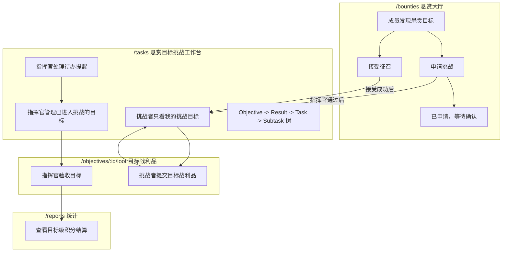
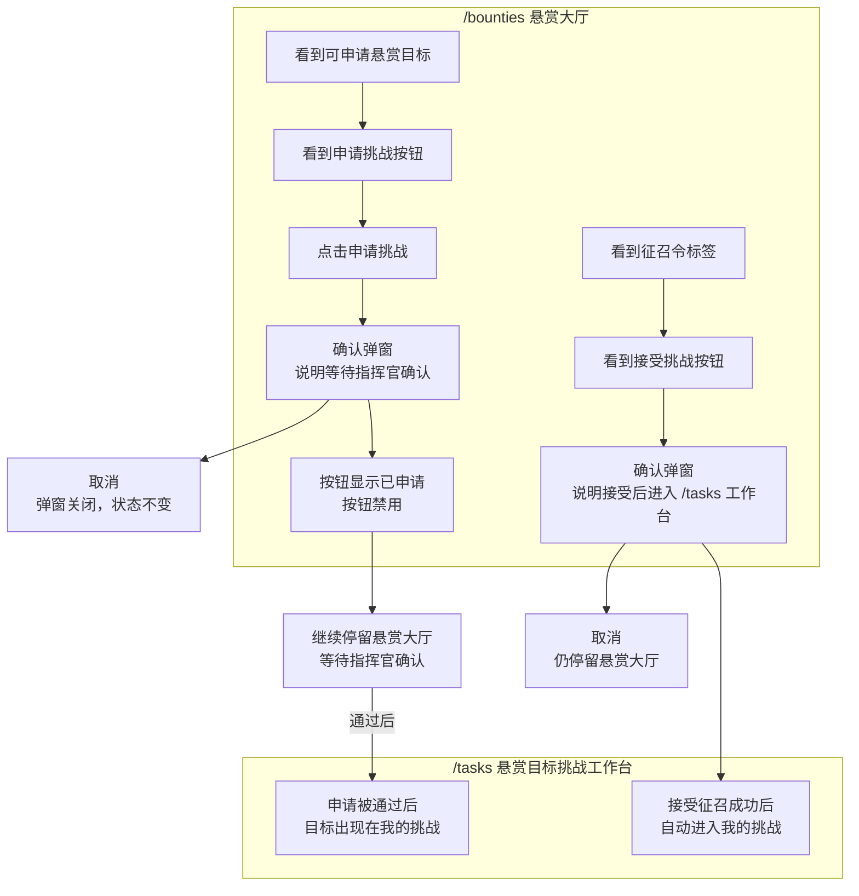
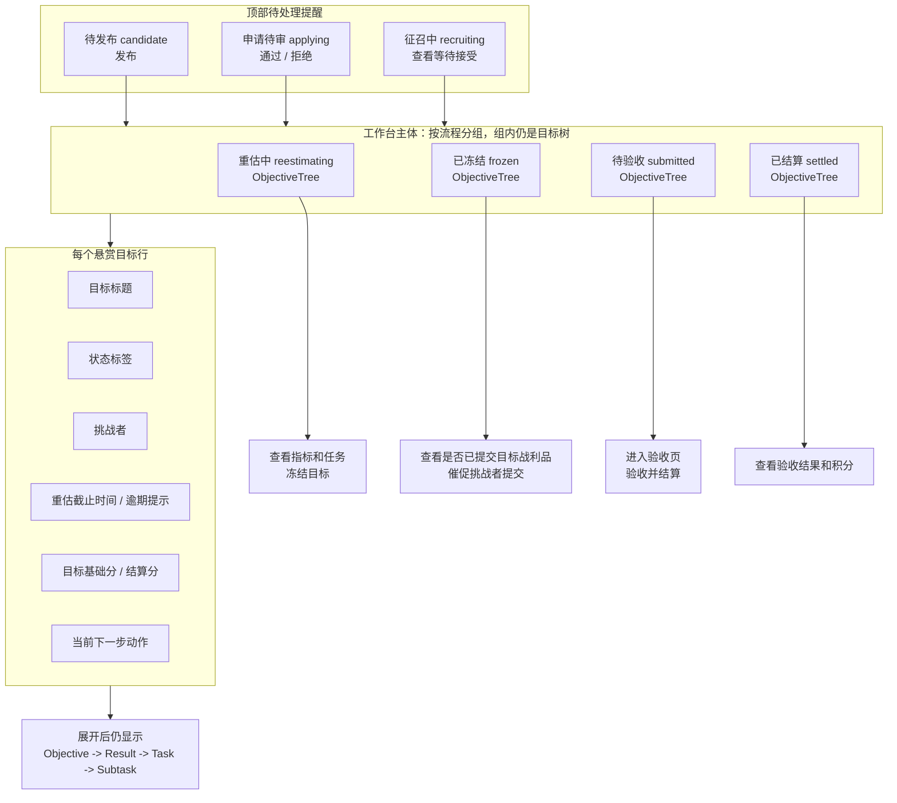
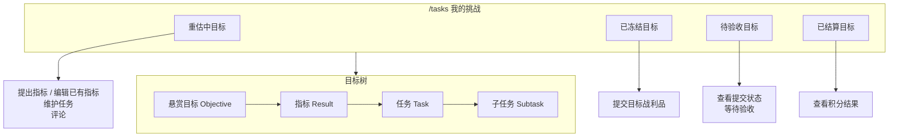
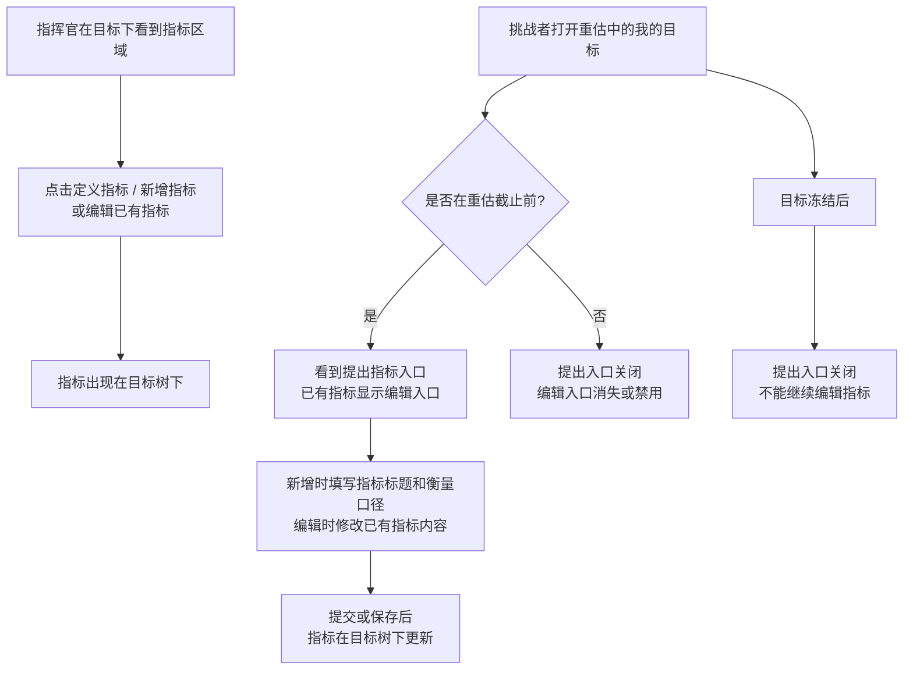
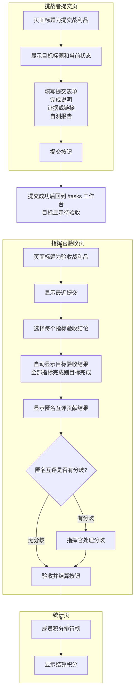

# ORF 前端流程测试

## 目标

本文档说明 ORF 前端流程测试的分层和规则清单。目标是让前端测试达到后端流程测试同等级别：不仅验证页面能渲染，还要验证用户实际看到的状态、按钮、权限边界和 API 刷新契约。

前端测试不替代后端状态机测试。后端负责证明数据流转合法；前端负责证明合法状态在界面上被正确展示，非法入口不暴露，API 失败或未刷新前不产生虚假状态。

## 测试分层

| 层级 | 文件 | 覆盖重点 |
| --- | --- | --- |
| Model 单测 | `tests/challengeModel.test.ts` | 挑战树构建、状态文案、状态色、拖拽权限、评论映射等纯前端规则 |
| API 优先契约 | `e2e/state-source/api-first-state.spec.ts` | 页面必须以 API 返回为准，不能回退到旧 localStorage 或乐观写入 |
| 悬赏大厅 E2E | `e2e/bounties/bounty-hall-skin.spec.ts` / `e2e/challenges/orf-frontend-flow.spec.ts` | 悬赏大厅列表、征召置顶、申请后刷新和禁用重复申请 |
| 挑战工作台 E2E | `e2e/challenges/orf-frontend-flow.spec.ts` | `/tasks` 悬赏目标挑战工作台中的流程按钮、审核条、范围过滤、目标树和冻结后入口 |
| 评论 E2E | `e2e/comments/comment-persistence.spec.ts` | 评论提交后在当前页面保持可见 |

## 角色视角

| 角色 | 前端必须验证 |
| --- | --- |
| 指挥官 | 在 `/tasks` 悬赏目标挑战工作台看到全部正式挑战目标，并看到候选发布、申请审核、征召等待等轻量待办提醒；可新增和编辑未冻结目标下的指标；不能看到退回重估入口 |
| 挑战者 | 在 `/tasks` 只看到自己已经正式参与的悬赏目标；接受征召或申请通过后进入重估；重估截止前可提出指标、编辑已有指标；冻结后可提交目标战利品；不能看到指挥官流程按钮 |
| 旁观成员 | 在 `/bounties` 悬赏大厅能申请公开悬赏目标；申请成功后需要刷新为已申请并禁用重复申请；申请未通过前不进入 `/tasks` |

## 前端流程框图

读图方式：

- 主图只写用户界面能看到的页面、状态文案、按钮、弹窗、跳转和提示。
- 技术契约单独放在“技术契约补充”里，说明 API、刷新和禁止乐观更新的要求。
- 测试优先断言用户可见结果；只有当用户界面不足以表达规则时，才补充 API payload 或请求次数断言。
- 术语固定：`Objective` 是“悬赏目标”，`Result` 只叫“指标”。不要把指标叫成悬赏。

### 页面边界总览



页面边界：

| 页面 | 定位 | 主体内容 | 不应该承担 |
| --- | --- | --- | --- |
| `/bounties` | 悬赏大厅 | `open/applying/recruiting` 悬赏目标，申请挑战，接受征召，已申请状态 | 不编辑目标、不编辑指标、不维护任务、不提交战利品 |
| `/tasks` | 悬赏目标挑战工作台 | 已进入挑战流程的目标；指挥官看到全局工作台，挑战者只看自己的目标；主体仍是 `Objective -> Result -> Task -> Subtask` 树 | 不替代悬赏大厅，不把未通过申请当成“我的挑战” |
| `/objectives/:id/loot` | 目标战利品页 | 挑战者提交目标战利品；指挥官验收目标 | 不编辑指标，不管理申请 |
| `/reports` | 结算结果页 | 目标级积分流水和排行榜 | 不承载流程操作 |

### 悬赏大厅 UI 流程



悬赏大厅断言重点：

- `open` 悬赏目标显示“申请挑战”。
- 已申请但未通过时，成员只在悬赏大厅看到“已申请 / 等待确认”，不进入 `/tasks`。
- `recruiting` 且当前成员被征召时，显示“征召令”和“接受挑战”。
- 悬赏大厅不出现指标编辑、任务树、目标战利品提交入口。

### 悬赏目标挑战工作台：指挥官视角



指挥官视角断言重点：

- `/tasks` 可以提醒 `candidate/applying/recruiting`，但这些是待处理提醒，不是工作台主体。
- 工作台主体是 `reestimating/frozen/submitted/settled`。
- 不能把 `/bounties` 的完整大厅功能搬进 `/tasks`。
- `frozen` 阶段表达为“查看目标是否已提交战利品 / 催促挑战者提交”，不写成“谁还没提交”。
- 每个目标行必须能看到目标基础分和目标结算分。

### 悬赏目标挑战工作台：挑战者视角



挑战者视角断言重点：

- `/tasks` 只展示当前用户已经正式参与的悬赏目标。
- “已申请但待确认”不进入 `/tasks`，只在 `/bounties` 显示。
- 挑战者不看到发布、审核、冻结、验收等指挥官动作。
- 挑战者在 `reestimating` 提出指标、编辑指标并维护任务；在 `frozen` 提交目标战利品；在 `submitted` 查看等待验收；在 `settled` 查看积分结果。

### 指标 UI 流程



指标断言重点：

- 目标才叫“悬赏目标”，`Result` 统一叫“指标”。
- 指挥官动作可以叫“定义指标 / 新增指标”，也可以编辑未冻结目标下已有指标。
- 挑战者动作分为“提出指标”和“编辑指标”：提出是新增指标，编辑是修改已有指标。
- 挑战者在重估截止后不能提出或编辑指标；目标冻结后，指挥官和挑战者都不能继续编辑指标。
- 不再使用“新增悬赏”，也不把指标称为悬赏。
- 技术层面新增指标时仍用 `source=memberProposed` 区分挑战者提出的指标；编辑已有指标应走保存 / 更新流程，不能误走指挥官定义指标流程。

### 目标战利品提交与验收 UI 流程



目标战利品断言重点：

- 战利品是目标级 `objectiveLoot`，不是每个挑战者强制单独提交一份。
- `frozen` 目标允许目标挑战者提交目标战利品。
- `submitted` 目标允许指挥官验收每个指标；目标验收结果由指标结论汇总，不单独选择目标结论。
- 挑战者贡献来自匿名互评结果，不由指挥官填写贡献权重；指挥官只处理互评分歧。
- 结算结果是目标级积分结算，写入排行榜。

### 失败和异常 UI 流程


### 技术契约补充

| 用户动作 | 主要 UI 断言 | 技术契约 |
| --- | --- | --- |
| 指挥官点击发布 | 目标从“候选中”变成“可申请”，发布按钮消失；成员能在悬赏大厅看到申请入口 | 调用发布 mutation；成功后必须刷新业务数据；页面只能按刷新数据展示 |
| 成员申请挑战 | 弹窗说明等待确认；成功后按钮变“已申请”且禁用 | 调用申请 mutation；成功后刷新悬赏大厅数据；失败时不能显示已申请 |
| 成员接受征召 | 成功后跳转 `/tasks` 工作台，目标显示“重估中”，当前用户成为挑战者 | 调用接受 mutation；成功后刷新悬赏大厅和我的挑战数据 |
| 指挥官通过申请 | 申请审核条消失，目标显示“重估中”，冻结按钮出现 | 调用通过申请 mutation；成功后刷新 `/tasks` 工作台数据 |
| 指挥官拒绝申请 | 被拒绝申请人从审核条消失；已接受挑战者不能被误退回悬赏大厅状态 | 调用拒绝申请 mutation；成功后按刷新数据展示 |
| 挑战者提出或编辑指标 | 重估截止前显示“提出指标”入口，已有指标显示编辑入口；提交或保存后目标树更新 | 创建 Result 时必须是 `source=memberProposed`；编辑已有 Result 时走更新流程；只允许正式挑战者在重估截止前提交或保存 |
| 指挥官冻结 | 目标显示“已冻结”，冻结按钮消失，不出现退回重估入口 | 调用冻结 mutation；成功后刷新 `/tasks` 工作台数据；失败时保持“重估中” |
| 挑战者提交战利品 | 成功后回到 `/tasks` 工作台，目标显示“待验收”，提交入口消失 | 调用提交战利品 mutation；成功后刷新 `/tasks` 工作台数据 |
| 指挥官验收结算 | 选择每个指标验收结论；目标结果由指标结论汇总；使用匿名互评贡献结果，有分歧时先处理分歧；成功后跳转统计页，排行榜显示积分变化 | 调用验收 mutation；成功后刷新 point ledger 和统计页数据 |
| 任意 mutation 失败 | 原页面、原状态、原按钮保持可见，显示错误提示 | 禁止乐观更新；失败后不能本地伪造新状态 |

## 上线式联动主流程

前端流程测试不维护静态覆盖数字。当前有效性以测试文件和 CI 结果为准，本文只定义真实用户链路、守卫场景和风险边界，避免文档用静态数字伪造确定性。

主链路分两层：

- `real user launch flow links commander and challengers from publish to settlement`：浏览器多页面 + route mock，快速审计前端状态机、显隐规则和截图。
- `ORF real system multi-user flow`：浏览器多上下文 + 真实 Fastify API + 真实数据库。测试只把 `/api` 请求转发到测试启动的真实后端，不 `fulfill` 业务数据；认证使用测试 Ory 适配器返回真实 Cookie 会话。

上线后的用户行为必须按一个指挥官、多个成员、多个挑战者来验证：指挥官发布目标，多个挑战者申请或接受征召，挑战者在重估窗口内校准指标，目标冻结后提交战利品和匿名互评，指挥官验收后积分进入排行榜。

| 阶段 | 指挥官行为 | 挑战者行为 | 必须看到的用户结果 |
| --- | --- | --- | --- |
| 待发布 | 在 `/tasks` 看到候选目标并点击发布 | 暂无入口 | 目标从“候选中”变成“可申请” |
| 申请 | 在 `/tasks` 等待申请进入审核条 | 两个挑战者分别在 `/bounties` 点击申请并确认 | 申请者看到“已申请”且按钮禁用；指挥官看到两名申请人 |
| 审核 | 依次通过两个申请 | 刷新 `/tasks` 进入我的挑战 | 目标显示“重估中”，挑战者列表包含两人 |
| 重估 | 等待挑战者校准指标 | 挑战者点击“提出指标”，提交 `memberProposed` 指标 | 指标出现在目标树；另一名挑战者刷新后也能看到 |
| 冻结 | 点击“冻结” | 在我的挑战看到提交入口 | 目标显示“已冻结”，冻结入口消失 |
| 提交 | 等待战利品 | 挑战者提交目标级战利品 | 提交者回到 `/tasks`，目标显示“待验收” |
| 匿名互评 | 等待双方互评完成 | 两个挑战者分别进入战利品页提交贡献比例 | 验收页显示匿名互评贡献结果，不展示手填贡献权重 |
| 验收结算 | 验收指标并结算 | 查看积分结果 | 跳转 `/reports`，排行榜显示按贡献比例写入的积分 |

测试里的时间不等真实分钟。每次流程 mutation 都推进一段业务时间戳；重估窗口使用固定未来 `confirmationDueAt` 保持开放，截止前 / 截止后 / 冻结后的边界由专门守卫测试用固定过去或未来时间验证。

## 真实系统上线仿真套件

真实系统测试拆分为独立的上线仿真套件，文件在 `e2e/challenges/orf-real-*.spec.ts`，公共测试能力只放在 `e2e/challenges/helpers/`。运行时需要显式打开：

```bash
ORF_REAL_E2E=1 npx playwright test e2e/challenges/orf-real-*.spec.ts --reporter=line --output="test-results/manual-real-system-suite-$(date +%Y%m%d-%H%M%S)"
```

测试数据使用唯一 `real-e2e-*` 前缀写入真实数据库，默认保留，便于在悬赏大厅、挑战页、统计页面直接查看；只有设置 `ORF_REAL_E2E_CLEANUP=1` 时才清理本次 run 的数据。

| 文件 | 场景 | 必须验证 |
| --- | --- | --- |
| `orf-real-golden-flow.spec.ts` | 两个周期、两轮目标、两个挑战者，从发布、申请、审批、重估、冻结、战利品、匿名互评到验收结算 | 已结算目标从 `/bounties` 下架；观察成员 `/tasks` 看不到非本人挑战；`/reports` 累计积分正确 |
| `orf-real-multi-state-dashboard.spec.ts` | 同时制造 candidate / open / applying / recruiting / reestimating / frozen / submitted / settled | 指挥官 `/tasks` 可总控；挑战者 `/tasks` 只看自己的目标；`/bounties` 只展示普通可申请目标和当前用户自己的征召令 |
| `orf-real-recruitment.spec.ts` | 指挥官征召 A/B/C，A 和 B 连续接受，C 拒绝，观察者越权接受 | A 接受后 B 仍能看到征召令；最终 challengers 只包含 A/B；越权接受返回 403 |
| `orf-real-reestimate-window.spec.ts` | 多挑战者在重估窗口内提出 / 编辑指标、加任务、加子任务，然后时间加速到窗口过期并冻结 | 窗口内可操作；过期后按钮不可见且 API 403；冻结后仍不可编辑指标 |
| `orf-real-time-acceleration.spec.ts` | 不等待真实时间，直接推进重估截止和最终截止 | 准时、逾期、超额、放弃的 multiplier 与积分一致 |
| `orf-real-settlement-ledger.spec.ts` | 三挑战者匿名互评、缺评时指挥官汇总确认、结算入账 | `objectiveBasePoints`、`objectiveSettlementPoints`、`pointLedger`、`/reports` 展示一致 |
| `orf-real-race-and-stale-ui.spec.ts` | 旧页面、重复点击、重复提交、重复结算 | 旧页面按钮不能越过后端状态机；重复战利品和重复 ledger 不产生脏数据 |

测试分层必须保持正交：

- `realSystemHarness.ts` 只负责启动真实 Fastify API、Fake Ory、真实数据库种子和多浏览器上下文。
- `realScenarioDsl.ts` 只封装用户动作，不写业务判定。
- `realClock.ts` 只推进测试业务时间，不等待真实时间。
- `realAssertions.ts` 只做页面和数据库不变量断言。
- 产品代码不能 import 或依赖任何 `e2e/challenges/helpers/*`，也不能为了测试新增生产运行路径。

## 守卫场景索引

| 场景 | 测试重点 |
| --- | --- |
| 主流程 | 多页面、多角色、同一后端状态，从发布、申请、审核、重估、冻结、提交、匿名互评到结算 |
| 单步成功 | 发布、申请、接受征召、审批、拒绝、冻结、提交战利品、验收结算都必须等待 API 成功和刷新数据 |
| 失败回退 | mutation 失败时保持原页面、原状态、原按钮，并展示后端错误 |
| 权限边界 | 成员不能看到指挥官动作；非挑战者不能提交；非指挥官不能验收；深链页面也必须守住边界 |
| 时间边界 | 只有正式挑战者能在重估截止前提出 / 编辑指标；截止后和冻结后入口关闭 |
| 表单交互 | 空战利品、无指标、无 latest loot、取消弹窗、关闭 modal、重复点击都不能产生伪状态 |
| 多人挑战 | 多挑战者共享目标级战利品，匿名互评只包含目标挑战者，结算按贡献比例写入排行榜 |
| 深链入口 | `/objectives/:id/loot`、Objective detail、Result detail 的入口必须和 `/tasks` 规则一致 |
| UI 状态 | loading、empty、API error、processing disabled、toast dismiss 都要有可见断言 |
| 数据一致性 | mutation 成功但刷新旧数据或刷新失败时，前端不能靠本地推断制造成功状态 |
| 本地回退状态 | 本地 store 生成 Objective、Result、Feedback、子任务和决策 ID 时必须带单调计数和随机后缀；同一毫秒内连续操作不能产生重复 ID，即使伪随机数重复也不能撞 ID |

## 风险边界

- route mock E2E 验证浏览器用户路径、刷新契约、权限显隐和页面跳转；真实系统 E2E 验证真实 API、真实数据库和 Cookie 会话。
- 真实系统 E2E 的 Ory 是测试适配器，目的是稳定地产生多个真实登录会话；ORF 业务 API 和数据库不是 mock。
- 当前主流程用手动刷新 / 页面跳转模拟用户查看最新状态；如果后续引入 websocket 或轮询，需要新增实时同步断言。
- 当前主流程覆盖目标级战利品和无分歧匿名互评；互评分歧处理、异常提交和越权访问由守卫测试分开验证。

## 测试数据原则

- route mock E2E 使用 Playwright `route.fulfill` 构造 Objective / Result，避免依赖外部状态。
- real-system E2E 不 `fulfill` 业务 API；它写入真实数据库，并且默认不清理数据。
- real-system E2E helper 只允许存在于 `e2e/challenges/helpers/`；测试可以调用真实 API、真实 repository 和测试数据库，产品代码不能依赖测试 helper。
- 用例内显式构造 Objective / Result，只保留当前断言需要的字段和状态。
- 页面断言优先基于用户可见文案、按钮和链接，少量使用稳定 class 定位目标面板。
- 每个测试开始清空 localStorage，避免 legacy 本地状态污染 API 优先契约。
- 已登录应用内的命令菜单只放业务页面和业务对象；`/auth` 仍是公共路由，但不能作为“注册登录”入口出现在命令菜单里。
- `/dashboard` 只能展示从当前 ORF state 汇总出的目标、指标、反馈和个人任务；不能混入演示偏移、硬编码待办或会在空数据下产生 `NaN` 的指标。
- `/ai-evaluation` 和目标详情页的评估页签只能展示从 `EvalRun` 汇总出的指标；没有评估运行、评估场景或失败样本时必须显示空态，不能展示演示准确率、幻觉率、时延或成本。
- 目标详情页的“相关 AI 系统”只能从当前目标关联的证据来源和评估运行配置推导；没有关联记录时显示空态，不能展示固定演示系统。
- 目标详情页的概览、指标、行动项、反馈和决策区域没有关联记录时必须显示明确空态；不能留下空白卡片或空页签。
- 新建反馈入口必须同时满足“存在可见指标”和“当前用户是指挥官或该目标挑战者”；不能只因为页面拿到了指标数据就向观察者展示反馈创建入口。
- `/feedback` 的原因筛选、图表和洞察面板必须从当前 API 返回的 `Feedback` 集合推导；不能展示演示原因分类、固定最高频问题或固定响应时间。
- 反馈详情页的证据、原因分类、建议调整、活动时间线和关联目标 / 指标都必须有真实数据或明确空态；不能留下空白详情区。
- `/strategy-map` 必须从当前 API 返回的 Objective / Result / Task 生成目标组合、周期、目标、指标和行动项节点；空数据时展示空态，不能显示演示北极星、战略支柱或固定行动项进度。
- `/objectives` 的周期筛选必须从当前 API 返回的 `Objective.cycle` 推导并真正参与过滤；不能显示固定演示周期。
- 指标详情页的趋势、关联行动项、反馈历史、指标口径和 ORF 质量检查必须从当前 API 关系推导；没有真实记录或口径字段时显示空态 / 待补充，不能推断出默认验收口径。
- `/dashboard` 的周期标记必须从当前 Objective 集合推导；没有目标时显示空周期，不能显示固定演示周期或无行为按钮。
- `/tasks` 工具栏中的周期和状态筛选必须是可操作控件，并从当前挑战数据推导；不能保留无行为的“全部周期 / 筛选”按钮。
- `/tasks` 筛选后无匹配项时必须说明是筛选无结果；不能误报为工作台没有挑战内容。
- `/tasks` 中没有 Result 的 Objective 必须显示“待定义指标”；不能留下空白目标体，也不能写成“悬赏指标”。
- 新建目标、指标、反馈、行动项和指标更新弹窗不能预填演示业务文案；只能保留周期、截止日期、当前处理人等真实上下文默认值。
- 新建类弹窗提交前必须对必填文本做 trim 后校验；全空格输入不能关闭弹窗，也不能发出 API 写请求。
- 详情页不能保留无行为占位按钮；反馈详情的推荐动作必须触发现有产品命令，目标详情不能展示没有菜单实现的 More 按钮。
- `/ai-evaluation` 失败样本里的反馈创建入口必须复用目标参与权限；没有失败样本时要显示空态，不能展示空白卡片。
- `/bounties` 的当前周期概览必须从大厅 API 返回的目标周期推导；空数据时显示暂无周期，多周期时不能只取第一条目标。
- `/bounties` 中没有 Result 的 Objective 必须显示“待定义指标”；不能把普通待定义状态描述成已进入重估。
- `/reports` 没有 `pointLedger` 时必须显示明确的排行榜空态；不能只渲染一个空表。
- `/reports` 排行榜必须可见展示成员姓名；不能只把成员名放在头像 `title` 或 `aria-label` 中。
- `/reports` 没有历史排名变化数据时，“变化”列显示 `-`；不能显示 `0-` 这类组合文本。

## 修改测试时机

当以下前端规则变化时，应同步修改本文件和相关测试：

- `Objective.flowStatus` 文案或按钮显隐变化。
- 指挥官和成员的 `/tasks` 工作台权限边界变化。
- 接受征召、审批申请、拒绝申请、冻结、提交战利品、验收结算等流程入口变化。
- 成员重估阶段提出指标、编辑指标流程或 `source=memberProposed` 契约变化。
- 悬赏大厅申请 / 接受挑战后的刷新策略变化。
- API 失败时是否允许乐观更新的策略变化。
- 挑战树是否展示无 Result Objective 的规则变化。
- 深链页面、失败路径、表单校验、多人挑战或排行榜结算规则变化。

## 验证命令

```bash
npm test
npx playwright test e2e/challenges/orf-frontend-flow.spec.ts
ORF_REAL_E2E=1 npx playwright test e2e/challenges/orf-real-*.spec.ts --reporter=line --output="test-results/manual-real-system-suite-$(date +%Y%m%d-%H%M%S)"
npm run test:e2e
npm run build
```
