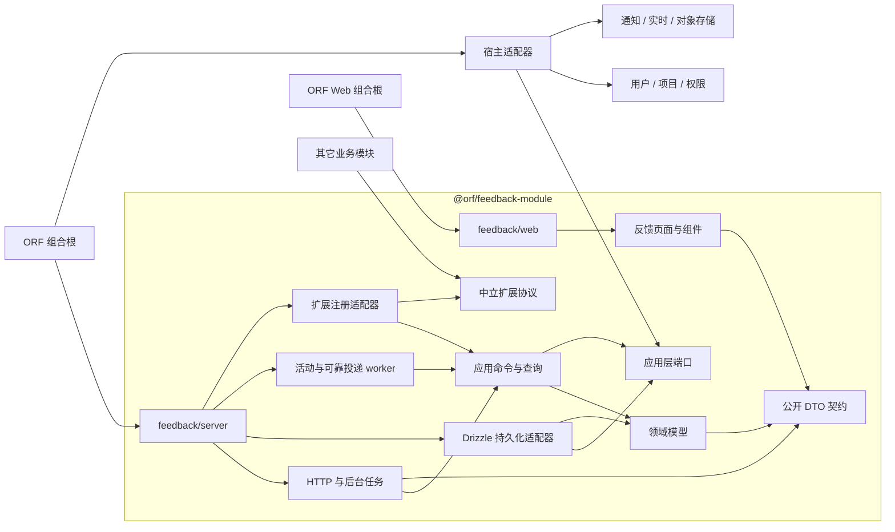
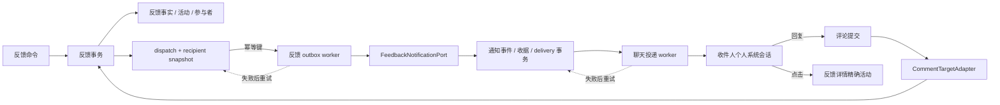
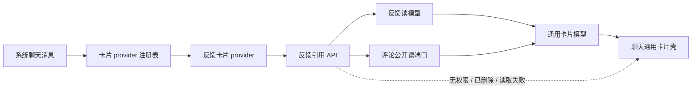

# ORF 反馈中心系统性重建设计

> 状态：产品决策已确认的目标方案，待按本文实施。
>
> 本文是反馈中心重建的目标契约。实施完成后，反馈生命周期、权限、数据模型、接口和 UI 只能以本文及代码中的同一领域模型为事实源；旧的 `Open/Closed` 说明、前端局部判断和正文关系推导必须删除，不能继续作为兼容路径。

## 1. 目标

把当前“能创建、评论和关闭的轻量 issue 页面”重建为一个完整的内部反馈处理闭环：

1. 反馈从打开、处理、提交验证到发起人确认关闭，状态含义明确；管理员可在反馈模块内显式接管任何操作。
2. 用户能持续看到与自己有关的反馈、新回复和待处理事项，不依赖一次性通知找回上下文。
3. 影响、优先级、处理人、项目、分类和反馈关系各自拥有独立事实，不互相冒充。
4. 原始反馈报告及其附件由反馈模块拥有；后续评论、通知、云盘、项目和用户继续由原模块拥有，只通过公开协议组合。
5. 导入导出使用稳定的反馈契约，不直接序列化数据库表，也不触发逐条通知副作用。
6. 前端使用反馈专用读模型，不再从全局 `OrfState` 拉取全部反馈和评论后自行拼装业务规则。
7. 一次迁移完成新旧切换；不保留双状态、双写、旧接口转发或前端兜底判断。

## 2. 当前事实与根因

### 2.1 用户反馈的完整范围

反馈 `fb-1785987100680-1-d6a97ecb-56d5-4695-9e4f-72689142c94d` 不只是导入导出需求，还明确提出：

- 新回复只在第一次提醒时容易看到，之后缺少反馈中心内的持续入口。
- 状态需要覆盖打开、处理中、待验证、已解决、无需解决、无法解决。
- 最终关闭默认由反馈发起人确认，普通问题处理人不能自行完成；管理员可通过受审计的管理接管执行。
- 优先级必须和影响分开。
- 反馈之间需要正式的关联和重复关系。

### 2.2 当前实现的问题

| 当前事实 | 结构问题 | 直接后果 |
| --- | --- | --- |
| 反馈代码分散在页面、feature、全局 state、路由、repository、scheduler 和共享类型中 | 没有一个可构建、可测试、可装配的模块边界 | 任一改动都容易跨前后端和其它业务目录扩散 |
| `server/app.ts`、Web 路由、导航、命令菜单和面包屑分别硬编码反馈入口 | 装配声明存在多个事实源 | 删除或改名入口时容易留下死路由和死菜单 |
| 评论 repository、target enum 和通知分支直接识别 `feedback` | 评论模块反向依赖反馈业务 | 两个模块互相污染，无法独立演进和测试 |
| 全局 `NotificationKind`、通知 policy、聊天动作文案和 attention 列表分别硬编码 `feedback.*` | 反馈通知语义散落在通知、聊天和前端注意力模块 | 反馈包移走后仍会在其它模块留下第二套事件规则 |
| 创建、状态变化和评论会把通知额外投递到项目绑定的普通频道 | 个人相关人通知和项目频道广播混在一个调用里 | 可能在普通频道重复曝光反馈动态，不符合“按成员通知相关人员” |
| `feedback.status` 只有 `Open/Closed` | 处理阶段和关闭结果被压在一个字段里 | 无法表达处理中、待验证和不同关闭原因 |
| 前后端各有一套状态和权限判断 | 同一规则存在多个事实源 | 页面按钮和后端许可容易漂移 |
| `feedback_activity_events.action` 是自由文本 | 活动没有稳定类型契约 | 通知、时间线、导出和迁移只能猜文本含义 |
| 反馈列表从全局 `OrfState` 加载全部反馈和评论后在前端派生 | 反馈读模型不自我完备 | 无法可靠提供用户级未读、待办、分页和服务端筛选 |
| 通知收据负责通知已读，反馈本身没有阅读游标 | 通知阅读和反馈内容阅读没有分开 | 通知消失后，反馈列表无法指出哪里有新动态 |
| Relationships 从标题和评论正文中的链接临时扫描 | 正文链接被误当成关系事实 | 无法表达重复、阻塞、被阻塞和关系删除 |
| 影响被当作标签展示 | 业务维度混杂 | 分类、影响和未来优先级无法独立筛选与统计 |
| 里程碑页面固定显示 0 | UI 声明了不存在的业务结构 | 形成死入口、死文档和误导 |
| 原始报告正文保存在首条评论，`suggested_adjustment` 又保留旧字段 | 反馈主体事实寄存在评论模块 | 创建必须跨模块写入，评论编辑/删除语义会间接影响反馈主体 |
| `owner` 文本与 `owner_user_id` 并存 | 用户姓名存在重复事实 | 用户改名和导入映射容易出现不一致 |
| 状态写入后再单独创建通知事件 | 业务提交和通知事件之间存在失败窗口 | 状态成功但通知事件可能缺失 |

### 2.3 只读数据核查快照

2026-08-07 对当前连接数据库的只读核查结果：

- 共 222 条反馈，其中 Open 121 条、Closed 101 条。
- 222 条反馈都有创建人和原始报告评论。
- `suggested_adjustment` 没有非空历史正文，可以在迁移后删除。
- 当前标题和评论正文中没有可迁移为正式关系的 `/feedback/...` 链接。
- 活动自由文本只有 7 种已知值，可以在迁移中完整映射为具名事件。
- 原始报告评论目前有 102 个附件；有 5 条后续消息直接回复原始报告，迁移时必须保留其回复语义。
- 该反馈目前已有 5 个通知事件：1 个创建、1 个改派、3 个新评论；共生成 60 个个人聊天投递，全部已成功物化为系统消息。现有“通知事实 -> 收据 -> 投递 -> 聊天消息”链路可保留。

这些数量只是迁移设计时的核查快照。正式迁移必须重新执行同一组前置检查，不能把数量写成永久假设。

## 3. 完整业务状态链

### 3.1 唯一生命周期事实

反馈生命周期只由两个正交字段表达：

```text
stage       当前处理阶段
resolution  待验证时的建议结论，或关闭后的最终结论
```

`stage` 允许：

| 值 | 中文 | 含义 |
| --- | --- | --- |
| `open` | 打开 | 已提交，尚未正式开始处理 |
| `in_progress` | 处理中 | 当前处理人正在处理 |
| `pending_verification` | 待验证 | 处理人已给出结论，等待发起人确认或管理员接管 |
| `closed` | 已关闭 | 发起人已确认最终结论，或管理员已完成受审计的管理接管 |

`resolution` 允许：

| 值 | 中文 | 使用范围 |
| --- | --- | --- |
| `resolved` | 已解决 | 问题已完成处理 |
| `not_needed` | 无需解决 | 需求撤回、行为符合预期或确认无需处理 |
| `cannot_resolve` | 无法解决 | 已确认当前条件下无法解决 |
| `duplicate` | 重复反馈 | 已有另一条反馈拥有同一问题事实 |
| `unspecified` | 历史关闭，原因未记录 | 只用于迁移或可信导入，用户不能主动选择 |

页面展示由这两个事实确定：

| `stage` | `resolution` | 展示状态 |
| --- | --- | --- |
| `open` | `null` | 打开 |
| `in_progress` | `null` | 处理中 |
| `pending_verification` | 非空 | 待验证，并展示建议结论 |
| `closed` | `resolved` | 已解决 |
| `closed` | `not_needed` | 无需解决 |
| `closed` | `cannot_resolve` | 无法解决 |
| `closed` | `duplicate` | 重复反馈 |
| `closed` | `unspecified` | 历史关闭，原因未记录 |

### 3.2 状态不变量

1. `open` 和 `in_progress` 的 `resolution` 必须为 `null`。
2. `pending_verification` 和 `closed` 的 `resolution` 必须非空。
3. 新业务动作不能写入 `unspecified`。
4. `duplicate` 必须同时存在一条 `duplicates` 关系，指向保留处理的目标反馈。
5. 关闭动作必须记录 `closed_at` 和 `closed_by_user_id`；未关闭时二者必须为空。
6. 每次核心字段、处理人、关系或生命周期变化都递增 `version`，并写入具名活动事件。
7. 评论不会隐式改变生命周期；提交验证、退回和重新打开必须通过显式转换命令完成。

### 3.3 合法转换

```text
创建
  -> 打开
  -> 处理中
  -> 待验证 + 建议结论
       -> 发起人确认 / 管理员接管确认 -> 已关闭 + 最终结论
       -> 发起人退回 / 管理员接管退回 -> 处理中

发起人撤回
  打开/处理中 -> 无需解决

重新打开
  已关闭 -> 打开
```

| 动作 | 来源 | 目标 | 执行人 | 必填信息 |
| --- | --- | --- | --- | --- |
| `start` | 打开 | 处理中 | 当前处理人 | 无 |
| `submit_verification` | 打开、处理中 | 待验证 | 当前处理人 | 建议结论、处理说明 |
| `accept_verification` | 待验证 | 已关闭 | 发起人 | 无 |
| `reject_verification` | 待验证 | 处理中 | 发起人 | 退回原因 |
| `withdraw` | 打开、处理中 | 已关闭/无需解决 | 发起人 | 撤回原因 |
| `reopen` | 已关闭 | 打开 | 发起人 | 重新打开原因 |

表中“执行人”先表达普通成员规则。同一团队作用域内的 active 管理员是反馈模块的最高授权主体，可执行全部反馈命令，包括创建、编辑、改派、关系、导入导出、确认、退回、撤回和重新打开。这一规则只覆盖 actor 授权，不能绕过团队隔离、合法状态组合、必填输入、`expectedVersion`、幂等和审计不变量。

普通处理人不能从“待验证”直接关闭自己处理的反馈。管理员执行原本属于发起人的验证动作时，必须显式选择“管理接管”并填写原因；具名活动保存原发起人、管理员、原因和转换结果。系统不用超时器猜测“长期”，也不把管理员伪装成发起人。前端只渲染后端 capabilities，后端领域策略是唯一授权事实源。

### 3.4 小团队权限边界

反馈中心不为优先级、原始报告编辑和导入导出再建细碎的角色矩阵。当前团队作用域内，对该反馈可见的 active 成员均可设置优先级、编辑原始报告和使用导入导出。这只简化操作人限制，不取消以下边界：

- 所有读写仍限于当前团队和调用者可见范围。
- 原始报告和优先级修改必须携带 `expectedVersion`，并写入 actor、差异和时间的具名活动。
- 导入仍必须经过 schema、用户/项目映射、附件哈希、差异预览和显式确认，不能因权限简化而跳过数据安全。
- 生命周期转换、收件人和通知强度仍遵守各自的显式领域规则，不从这条简化权限派生。

## 4. 正交业务事实

### 4.1 影响与优先级

| 字段 | 回答的问题 | 可选值 | 默认值 | 建议维护人 |
| --- | --- | --- | --- | --- |
| `impact` | 这个问题造成多大影响 | Low / Medium / High / Critical | Medium | 发起人、处理人、管理员 |
| `priority` | 团队准备按什么顺序处理 | P0 / P1 / P2 / P3 | `null`，表示未分诊 | 当前团队内对反馈可见的 active 成员 |

旧数据的优先级全部迁移为 `null`。不能从 impact 自动推算 priority，因为这会把两个不同业务事实重新绑定。

“未分诊”是由 `priority = null` 派生的工作队列，不是新的生命周期阶段。

### 4.2 反馈关系

正式关系表只保存三种基础关系：

| 类型 | 方向 | 展示 |
| --- | --- | --- |
| `related` | 对称 | 相关 / 相关 |
| `duplicates` | 有向 | 重复于 / 被重复 |
| `blocks` | 有向 | 阻塞 / 被阻塞 |

约束：

- 关系两端必须属于同一团队作用域。
- 不能关联自身。
- `related` 使用规范化后的 ID 顺序保存，避免 A-B 和 B-A 两条重复记录。
- `duplicates` 和 `blocks` 保存方向，反向文案由读模型派生。
- 正文里的反馈链接继续作为可点击内容，但不再自动创建或删除关系。
- `pending_verification/duplicate` 或 `closed/duplicate` 使用中的目标关系不能单独删除；必须先退回或重新打开，再修改关系。

### 4.3 阅读状态与通知状态

必须严格区分：

| 状态 | 唯一事实源 | 含义 |
| --- | --- | --- |
| 反馈有新动态 | `feedback_user_views.last_seen_sequence` | 用户是否读到这条反馈的最新活动 |
| 通知是否已读 | `notification_receipts.read_at` | 用户是否处理了某条通知入口 |
| 是否关注或静音 | `feedback_subscriptions` | 用户是否希望接收普通反馈通知 |
| 是否待我处理 | 反馈阶段、角色和处理人派生 | 当前业务动作是否轮到该用户 |

每条反馈活动拥有数据库生成的全局单调递增 `sequence`。详情接口返回本次观察到的最大序号；页面内容成功渲染且窗口可见后调用：

```http
PUT /api/feedback/:feedbackId/view
{ "seenThroughSequence": 12345 }
```

后端只执行 `max(当前值, seenThroughSequence)`，旧请求和网络重试不能把阅读位置写回更早状态。未读的准确条件是“游标之后存在由其他用户产生的可见活动”；用户自己的评论或属性修改不会给自己制造新未读，但也不能清除游标之后由其他人产生的旧未读。新活动若在详情加载后到达，因为序号更大，仍保持未读。

通知点击可以把通知本身标为已读，但必须等反馈详情真正加载后才能推进反馈阅读游标。静音只影响通知投递，不隐藏反馈中心里的真实更新。

### 4.4 用户工作队列

以下视图全部是读模型派生，不新增可写状态：

| 视图 | 派生条件 |
| --- | --- |
| 待我处理 | 当前用户是处理人，阶段为打开或处理中 |
| 待我验证 | 当前用户是发起人，阶段为待验证 |
| 有新动态 | 已读序号之后存在由其他用户产生的可见活动 |
| 我的反馈 | 当前用户是发起人、处理人、评论参与者或显式关注者 |
| 待分诊 | 优先级为空，且当前用户有分诊权限 |
| 全部反馈 | 当前团队作用域内可见反馈 |

## 5. 目标数据模型

### 5.1 核心表

`feedback` 只保存反馈自身事实：

| 字段 | 说明 |
| --- | --- |
| `id` / `team_id` | 稳定 ID 和团队作用域 |
| `project_id` | 可空项目归属 |
| `title` | 反馈标题；替代 `phenomenon` 命名 |
| `description` | 原始反馈报告正文；不再寄存在首条评论 |
| `stage` / `resolution` | 唯一生命周期事实 |
| `impact` / `priority` | 独立的影响与处理优先级 |
| `assignee_user_id` | 当前处理人 ID；替代含义不清的 `owner_user_id` |
| `created_by` / `updated_by` | 发起人与最后修改人 ID |
| `version` | 乐观并发版本 |
| `created_at` / `updated_at` / `closed_at` | 带时区时间戳 |
| `closed_by_user_id` | 最终关闭人 |

必须删除：

- `status`：由 `stage/resolution` 替代。
- `suggested_adjustment`：由 `description` 取代，不再从首条评论兜底读取。
- `owner`：姓名只能从 `assignee_user_id -> users` 派生。
- `owner_user_id`：一次迁移重命名为 `assignee_user_id`，不保留两个同义字段。

### 5.2 附属事实

| 表 | 所有权 | 说明 |
| --- | --- | --- |
| `feedback_report_attachments` | 反馈报告 | 原始报告附件及对象存储引用，不与讨论附件混用 |
| `feedback_cause_categories` | 反馈 | 原因分类，多值、有序 |
| `feedback_relations` | 反馈关系 | 有类型、有方向的正式关系 |
| `feedback_activity_events` | 反馈审计 | 具名事件、actor、payload、sequence、时间 |
| `feedback_user_views` | 反馈阅读 | 每个用户对每条反馈的已读活动序号 |
| `feedback_participants` | 反馈参与投影 | 由评论提交事件维护的参与用户 ID、首次/最后参与时间；不复制评论正文 |
| `feedback_subscriptions` | 通知偏好 | 显式关注或静音；保持现有语义 |
| `feedback_event_dispatches` | 通知 outbox | 活动、通知类型、版本化展示 payload、幂等键和交接状态 |
| `feedback_event_dispatch_recipients` | 通知 outbox | 收件人快照、收件原因、强度和静音判定结果 |
| `feedback_import_batches` | 导入导出 | 上传、校验、提交和失败报告 |
| `feedback_import_origins` | 导入导出 | 外部来源 ID 到 ORF 反馈 ID 的稳定映射 |

### 5.3 活动事件

活动事件使用稳定类型，不保存最终展示文案：

```text
feedback.created
feedback.metadata.changed
feedback.assignee.changed
feedback.lifecycle.changed
feedback.relation.added
feedback.relation.removed
feedback.comment.created
feedback.comment.edited
feedback.report.changed
feedback.imported
```

事件 `payload` 只保存结构化差异和引用 ID。反馈时间线格式化器只生成反馈页面文案；通知策略消费同一具名活动，先转换成版本化 notification payload；聊天文案再由反馈注册的 presentation provider 生成。三者共享业务事实，但不共享最终文案字符串，也不解析自由文本 `action`。

后续评论正文和讨论附件仍属于评论模块。反馈活动中的评论事件只保存 `comment_message_id` 引用和活动序号，不复制评论正文。原始报告正文及其附件属于反馈模块，不再创建一条伪装成评论的首消息。

## 6. 独立反馈模块与协议装配

### 6.1 架构结论

反馈不能继续散落在 `src/pages`、`src/features`、`src/state`、`server/routes`、`server/repositories` 和全局类型中。目标结构是一个顶层私有工作区包：

```text
@orf/feedback-module
```

它是一个进程内的完整业务模块，不是微服务，也不是把旧文件套进一个目录：

- 独立拥有反馈领域模型、应用命令、读模型、数据表、HTTP 适配器、后台任务、导入导出和前端页面。
- 独立类型检查、构建和测试；前端与服务端使用不同公开入口，避免把数据库代码打进浏览器包。
- 宿主只在组合根注册模块和外部适配器，不接管反馈内部状态，不逐个导入反馈页面或仓库函数。
- 其它业务模块不能导入反馈内部文件；反馈核心也不能导入其它业务模块的内部实现。
- 评论、通知、云盘、项目和用户只通过小而明确的协议连接，不共享仓库、页面状态或数据库查询片段。

“独立大模块”指一个边界完整的纵向业务包。包内仍按职责分层，不能重新造出一个包含所有方法的 `FeedbackService`、`Manager` 或 Facade。

### 6.2 包结构与唯一公开入口

```text
modules/feedback/
  package.json
  tsconfig.json
  src/
    contracts/              # HTTP schema、DTO、事件契约和错误码
    domain/                 # 聚合、值对象、状态转换、权限策略
    application/
      commands/             # 写用例
      queries/              # 读用例
      notifications/        # 通知触发、收件人和 outbox 策略
      ports/                # 模块所需的外部协议
    infrastructure/
      database/             # Drizzle schema、repository、migration mapping
      http/                 # Fastify 路由与请求适配
      outbox/               # 可靠事件投递
      transfer/             # CSV 与 ZIP 导入导出
      schedulers/           # 摘要、清理和重试任务
    integrations/           # 对评论、引用、云盘等扩展点的注册贡献
    web/
      pages/
      components/
      data/                 # query client 与 mutation hooks
      model/                # 纯展示模型
      styles/               # 仅作用于反馈根节点
    public/
      contracts.ts
      server.ts
      web.ts
      testing.ts
  tests/
```

`package.json` 只导出以下四个子路径，不提供默认 `.` 导出：

```text
@orf/feedback-module/contracts
@orf/feedback-module/server
@orf/feedback-module/web
@orf/feedback-module/testing
```

约束：

1. `contracts` 只包含可序列化类型、Zod schema、错误码和纯函数，不依赖 React、Fastify、数据库或 Node API。
2. `server` 只导出模块注册函数、运行句柄和面向宿主的只读查询协议，不导出 repository、表对象或领域内部类型。
3. `web` 只导出一个声明式页面贡献，不导出页面内部组件；页面代码不能导入 `server`。
4. `testing` 只提供 fixture builder、协议契约测试和受控测试驱动，生产代码不得导入它。
5. 包外禁止使用 `modules/feedback/src/...` 相对路径绕过 exports；CI 必须扫描并拒绝这种导入。
6. 根 `package.json` 将 `modules/*` 和必要的 `packages/*` 声明为 workspace，根 TypeScript 工程引用反馈工程；根构建先执行反馈包检查，再构建 ORF 宿主。
7. 反馈表定义由该包拥有。Drizzle 配置显式收集宿主 schema 和反馈 schema，宿主 `server/db/schema.ts` 不再复制反馈表定义。

只新增两个无业务含义的基础公开包：

- `@orf/module-protocol`：定义 HTTP、生命周期、Web 贡献和中立注册表接口；不包含任何反馈类型。
- `@orf/rich-text`：承接现有富文本编辑、展示和草稿契约；反馈与评论都只消费其公开入口。

这两个包只提取已经存在且确实跨模块使用的能力。迁移后删除原内部路径并一次更新现有调用方，不保留转发文件；不能借此把用户、项目、通知或所有 UI 组件继续塞进一个“公共包”。

### 6.3 依赖方向



上图只表示编译期依赖。运行时中立注册表会回调已经注册的反馈适配器，但注册表实现和其它业务模块都不 import 反馈包，因此不构成代码依赖环。

必须保持以下单向规则：

- `domain -> contracts` 中的值对象和判别联合；不依赖任何运行时框架或适配器。
- `application -> domain + contracts + application/ports`，其中持久化接口也由应用层定义。
- `infrastructure -> application + contracts`。
- `web -> contracts + ORF 公共 UI 基础包`。
- 宿主组合根可以依赖反馈公开入口；评论、通知、云盘等业务模块不能依赖反馈包。
- 反馈的集成适配器可以依赖对方公开协议，但不能依赖对方 repository、路由或组件。

### 6.4 服务端注册协议

反馈服务端只暴露一个装配入口：

```ts
export interface FeedbackServerHost {
  readonly protocolVersion: 1;
  readonly http: HttpRouteRegistry;
  readonly lifecycle: RuntimeLifecycleRegistry;
  readonly commentTargets: CommentTargetRegistry;
  readonly notificationKinds: NotificationKindRegistry;
  readonly references: ReferenceProviderRegistry;
  readonly driveContexts: DriveContextRegistry;
  readonly ports: FeedbackRequiredPorts;
}

export interface FeedbackModuleHandle {
  readonly id: "feedback";
  readonly queries: FeedbackPublicQueries;
  health(): Promise<FeedbackModuleHealth>;
  stop(): Promise<void>;
}

export function registerFeedbackServerModule(host: FeedbackServerHost): FeedbackModuleHandle;
```

注册只发生在启动期，流程固定为：

```text
校验协议版本和必需端口
  -> 构造反馈内部模块
  -> 注册 /api/feedback 路由
  -> 注册反馈评论目标适配器
  -> 注册反馈通知类型与聊天展示 provider
  -> 注册反馈引用与云盘上下文提供器
  -> 注册 outbox、摘要和清理任务
  -> 冻结注册表
  -> 返回只读运行句柄
```

注册机制必须遵守：

1. 同一模块 ID、路由、评论目标类型或引用 provider 重复注册时立即失败，不采用“后注册覆盖前注册”。
2. 注册表只保存能力声明和生命周期回调，不保存反馈、用户、权限或页面状态。
3. 禁止 `resolve("some-service")` 形式的服务定位器。所有依赖都在 `FeedbackRequiredPorts` 中具名、强类型、构造时注入。
4. 注册完成后不可在运行中增删适配器；只有测试隔离和应用关闭可以释放句柄。
5. 协议版本不兼容或必需端口缺失时，在暴露路由前失败；后台任务启动失败不能留下半注册模块。
6. `stop()` 必须幂等，停止定时器和 worker，但不能关闭由宿主拥有的数据库、HTTP 服务或对象存储客户端。

这不是全局插件市场。注册表由能力所有者分别维护：评论模块拥有评论目标注册表，云盘拥有上下文注册表，宿主拥有 HTTP 和生命周期注册表。反馈只贡献自己的适配器，不能建立包罗所有业务的中央 Registry。

### 6.5 外部端口

反馈应用只能通过以下最小端口使用外部能力：

| 端口 | 所需能力 | 明确禁止 |
| --- | --- | --- |
| `FeedbackActorPort` | 从请求得到用户、团队、角色和权限快照 | 读取 `OrfProvider` 或自行解析全局权限表 |
| `FeedbackUserDirectoryPort` | 按 ID 批量读取 active 用户摘要、列出可指派用户 | 直接查询用户表或保存用户名副本 |
| `FeedbackProjectDirectoryPort` | 校验项目并批量读取项目摘要 | 修改项目或复制项目名称 |
| `FeedbackDiscussionPort` | 批量读取、导出后续评论及附件，返回稳定讨论 DTO | 修改反馈、读取原始报告或返回评论内部表结构 |
| `FeedbackObjectStoragePort` | 暂存、提交、读取和删除报告/导入附件 | 访问评论附件 repository |
| `FeedbackNotificationPort` | 按稳定幂等键接收已提交的通知请求，返回通知事件 ID | 直接写聊天消息、决定收件人或解析活动中文文案 |
| `FeedbackRealtimePort` | 发布反馈读模型失效和轻量更新事件 | 发布全局状态快照 |
| `FeedbackClockPort` / `FeedbackIdPort` | 提供可测试时间和 ID | 在领域代码调用 `Date.now()` 或模块级计数器 |
| `FeedbackDatabasePort` | 构造反馈持久化适配器，并把中立事务令牌绑定到反馈应用端口 | 把 Drizzle/SQL 句柄暴露给应用层或其它模块 |

端口由使用方，也就是反馈模块定义；适配器由 ORF 组合层实现。每个端口必须有契约测试，验证作用域、批量语义、幂等键、错误码和事务行为。

端口不是概念名称，必须落实为窄接口。以下是约束形态，实施时字段可以随最终 DTO 命名调整，但不能扩大职责：

```ts
export interface FeedbackUserDirectoryPort {
  listAssignable(scope: FeedbackScope): Promise<readonly UserSummary[]>;
  getActiveByIds(scope: FeedbackScope, ids: readonly string[]): Promise<ReadonlyMap<string, UserSummary>>;
}

export interface FeedbackProjectDirectoryPort {
  getByIds(scope: FeedbackScope, ids: readonly string[]): Promise<ReadonlyMap<string, ProjectSummary>>;
}

export interface FeedbackDiscussionPort {
  list(scope: FeedbackScope, feedbackId: string): Promise<DiscussionSnapshot>;
  export(scope: FeedbackScope, feedbackIds: readonly string[]): AsyncIterable<DiscussionExportRecord>;
}

export interface FeedbackNotificationRequest {
  readonly namespace: "feedback";
  readonly occurredAt: string;
  readonly payload: FeedbackNotificationPayload;
  readonly recipients: readonly FeedbackNotificationRecipient[];
}

export interface FeedbackNotificationRecipient {
  readonly userId: string;
  readonly reasons: readonly FeedbackRecipientReason[];
  readonly deliveryClass: "mandatory" | "direct" | "ordinary";
  readonly attentionLevel: "normal" | "action_required";
}

export interface FeedbackNotificationPort {
  publish(request: FeedbackNotificationRequest, idempotencyKey: string): Promise<{ eventId: string }>;
}

export interface FeedbackRealtimePort {
  publish(event: FeedbackReadModelChanged): Promise<void>;
}
```

所有批量读取必须保持输入作用域，返回缺失 ID 而不是自动跨团队补查。端口传输 DTO 不复用对方数据库 row 类型。可重试基础设施错误与业务上的 not-found/forbidden 必须使用不同错误码，HTTP 适配器才能稳定映射为 503 与 4xx。

`FeedbackDatabasePort` 可以提供团队、用户和项目主键的只读外键描述，使反馈表继续保留数据库完整性约束；这只是 schema 级协议。反馈查询仍不得 import 宿主表对象或 join 外部表，名称、头像、项目标题和 active 状态必须经批量端口读取。

### 6.6 中立扩展协议

有些调用方向来自其它模块，不能通过让对方 import 反馈来实现。应由能力所有者提供中立扩展协议，反馈在启动期注册：

| 协议所有者 | 反馈注册内容 | 其它模块看到的内容 |
| --- | --- | --- |
| 评论 | `CommentTargetAdapter(type="feedback")` | 目标是否存在、可否评论、目标标题/链接、评论提交后的结构化事件 |
| 通知 | `NotificationPresentationProvider(namespace="feedback")` | 事件 schema、stream、聊天展示、动作、回复目标和 attention 级别 |
| 聊天 Web | `ChatReferenceCardProvider(namespace="feedback")` | 系统消息匹配、授权加载和通用引用卡片模型 |
| 引用搜索 | `ReferenceProvider(namespace="feedback")` | ID、标题、状态摘要、目标链接 |
| 云盘 | `DriveContextProvider(type="feedback")` | 上下文存在性、展示标题、访问许可 |
| Web 宿主 | `FeedbackWebContribution` | 路由、导航、命令、面包屑和预加载声明 |

能力所有者只需公开这一层协议入口，不需要为了反馈重写自己的业务模块。组合根负责把现有评论、通知、云盘和引用能力适配到协议；适配器不能放回反馈核心，也不能让能力所有者新增反馈专用分支。通知和 attention 模块不再维护 `feedback.*` switch 或全局联合类型，只根据已注册 provider 和事件中的通用 `attentionLevel` 工作。

评论目标协议必须支持“回复目标原文”，而不是要求目标原文也伪装成一条评论。评论写入成功时，在同一数据库事务上下文中调用反馈适配器记录 `feedback.comment.created`；任一步失败则评论事务回滚。评论模块只理解 `CommentTargetAdapter`，不理解反馈状态、处理人、订阅或通知收件人。

```ts
export interface CommentTargetAdapter {
  readonly protocolVersion: 1;
  readonly type: string;
  resolve(context: CommentActorContext, targetId: string): Promise<CommentTargetSnapshot | null>;
  onMessageCommitted(event: CommentMessageCommitted, unitOfWork: UnitOfWorkToken): Promise<void>;
}
```

`UnitOfWorkToken` 由数据库平台协议拥有，是只能在当前回调中使用的不透明事务令牌；评论模块不能得到反馈 repository，反馈适配器也不能借令牌查询评论、用户或项目表。

事件 payload 必须使用具名判别联合和版本号。禁止共享 `Record<string, unknown>`、自由文本 action、任意 callback 列表或一个全局万能事件总线。

### 6.7 前端注册协议

反馈 Web 包只暴露一个声明式贡献工厂：

```ts
export interface FeedbackWebContribution extends OrfWebModuleContribution {
  readonly id: "feedback";
  readonly routes: readonly RouteContribution[];
  readonly navigation: readonly NavigationContribution[];
  readonly commands: readonly CommandContribution[];
  readonly breadcrumbs: readonly BreadcrumbContribution[];
  readonly chatReferenceCards: readonly ChatReferenceCardProvider[];
  preload(): Promise<void>;
}

export interface FeedbackWebHost {
  readonly discussions: DiscussionWebPort;
}

export function createFeedbackWebContribution(host: FeedbackWebHost): FeedbackWebContribution;
```

ORF Web 组合根调用 `registerWebModule(createFeedbackWebContribution(host))`。`DiscussionWebPort` 只提供后续讨论的数据 hook、时间线项和评论输入面，不暴露评论页面内部状态。反馈页面、路由懒加载、导航、命令菜单和面包屑从同一份贡献声明产生，不能继续在 `App.tsx`、`routeModules.ts`、`navigation.ts`、`CommandMenu.tsx` 和 `appShellBreadcrumb.ts` 分别硬编码一次。

`chatReferenceCards` 是宣言式 provider 贡献，由聊天 Web 注册表统一装配。注册表只以唯一 namespace 精确查找 provider，不保存用户、消息、反馈或缓存状态，也不提供服务定位、优先级覆盖或动态插件能力。反馈 provider 只校验自己的版本化引用、调用反馈/评论公开 API，并返回通用 `ChatReferenceCardModel`；聊天模块继续拥有卡片壳、加载/缺失/失败状态、缓存和布局。双方不互相 import React 组件或内部 state。

Web 注册表仍只保存静态贡献，不保存当前用户或反馈数据。反馈 UI：

- 只调用反馈专用 API，不读取 `useOrf().state.feedback`、`state.comments`、`state.users` 或 `state.projects`。
- 处理人和项目选项由反馈 API 使用外部端口生成作用域安全 DTO。
- 权限只渲染服务端 `capabilities`，不能复制领域规则。
- 只依赖 `@orf/rich-text`、React、Lucide 和宿主公开的 CSS 设计 token；反馈控件留在反馈包内，不借用悬赏页面 class 或其它功能组件。
- 所有 CSS 以反馈模块根节点或 CSS Module 隔离；不得新增影响 `body`、通用 `.card`、按钮或其它页面的全局选择器。

### 6.8 模块内部职责

| 内部单元 | 唯一职责 | 失败行为 |
| --- | --- | --- |
| 领域模型 | 生命周期、resolution、角色能力、优先级和关系不变量 | 返回具名领域错误，不自动纠正非法命令 |
| 应用命令 | 编排单个反馈写用例和事务 | 404/403/409/422 明确区分，不留下半写入 |
| 反馈读模型 | 列表、详情、工作队列、统计、引用与导出查询 | 作用域外按不存在；无效筛选 400 |
| 通知策略 | 判断是否通知、收件人原因、静音等级、展示 payload 和 outbox | 不创建聊天消息；依赖不可用时不丢失已提交 dispatch |
| 持久化适配器 | 只读写反馈拥有的表 | 不连接评论、通知、用户或项目表做隐藏 join |
| Outbox worker | 把已提交活动可靠交给通知端口 | 幂等重试；失败不回滚业务事实 |
| 导入导出 | 版本化转换、预检、映射、提交和报告 | 确认前不写；失败定位到文件、记录和字段 |
| Web UI | 页面编排、交互临时状态和响应式展示 | 冲突刷新并提示；失败不展示旧快照冒充成功 |

列表 DTO 直接返回 `capabilities`、`unread`、`requiresAction` 和显示摘要。前端不下载全部评论后计算这些字段。

### 6.9 原始报告与后续评论的所有权

原始报告是反馈主体，不是评论：

- `feedback.description` 保存原始报告正文。
- `feedback_report_attachments` 保存报告附件引用。
- 创建反馈只进入反馈应用事务，不再创建 `comment_threads/comment_messages` 首消息。
- 编辑原始报告通过反馈命令执行，递增反馈版本并写 `feedback.report.changed` 活动。
- 生命周期转换说明保存在不可变的结构化活动事件中，不伪装成评论。
- 用户主动发表的后续讨论才进入评论模块；反馈详情通过评论目标协议组合时间线。

这样评论模块不可用时不会损坏反馈主体，删除或编辑评论也不能改写原始报告。评论和反馈仍可在同一页面连续展示，但 UI 合并不改变二者的数据所有权。

### 6.10 模块自我完备审计

按“原则、边界、公开接口、失败行为”重新检查后，目标模块必须同时满足下表，才能称为自我完备：

| 检查项 | 反馈模块内部必须拥有 | 只能通过协议使用的外部能力 |
| --- | --- | --- |
| 业务主体 | 报告、生命周期、处理人、影响、优先级、关系、版本和不变量 | 用户、项目的有效性和展示摘要 |
| 活动与阅读 | 具名活动、全局序号、用户阅读游标、参与者投影 | 后续评论正文和讨论附件 |
| 通知决策 | 哪些活动要通知、收件人及原因、静音规则、展示 payload、跳转和幂等 outbox | 通知事件、收据、投递和聊天系统消息 |
| UI | 列表、详情、工作队列、筛选、导入导出、反馈卡片模型映射和响应式样式 | 富文本基础能力、讨论输入面和聊天通用卡片壳 |
| 装配 | server/web 公开入口、端口、注册贡献和健康状态 | HTTP、生命周期、评论、通知、云盘和引用注册表 |
| 失败 | 领域错误、版本冲突、端口不可用、outbox 重试和模块健康 | 宿主进程、数据库连接、聊天通道和通知 worker 的生命周期 |

审计结论：把原始报告收回反馈、增加 `feedback_participants`、让反馈模块拥有通知决策并向通知模块注册展示 provider 后，目标结构是自我完备的。反馈模块仍有外部依赖，但依赖都只提供外部事实或基础能力，不接管反馈内部状态。缺少任一端口时模块在注册期失败，不能退回全局 `OrfState`、跨表 join 或旧 repository 兜底。

### 6.11 反馈通知与聊天的所有权

| 模块 | 唯一所有权 | 明确不拥有 |
| --- | --- | --- |
| 反馈 | 通知触发规则、收件人快照、收件原因、静音与强通知判定、事件 payload、深链和 dispatch outbox | 通知已读、聊天频道、聊天消息和投递重试 |
| 评论 | 评论、`@` 提及、直接回复和讨论附件；在提交事件中给出提及/回复收件人 | 反馈参与者集合、反馈订阅和生命周期通知 |
| 通知 | `notification_events`、recipient receipts、通用 attention 字段和 delivery outbox | 反馈收件人规则、反馈状态文案和反馈权限 |
| 聊天 | 个人系统会话、`source=system` 消息、频道未读和消息展示 | 通知事实、反馈事实和收件人计算 |

反馈通知一律按成员投递到收件人的个人系统通知会话。不能使用 `@所有人`，不能把反馈动态广播到团队公告频道，也不能再通过 `destinationChannelIds` 额外写入项目绑定的普通聊天频道。项目只作为消息上下文展示，不决定聊天目的地。



### 6.12 收件人协议

反馈模块在业务活动发生时生成收件人快照，每个收件人同时记录一个或多个具名原因：

```text
administrator
creator
assignee
previous_assignee
participant
follower
action_required
```

收件人集合规则：

1. 当前团队 active 管理员/指挥官属于强制相关人；除触发人本人外，接收所有需要产生聊天通知的反馈事件。
2. 创建者、当前处理人、评论参与者和显式关注者属于普通相关人。
3. 评论成功后，反馈适配器在同一事务更新 `feedback_participants`；参与者视为隐式关注者，可以用 `muted` 退出 ordinary 通知。通知计算只读取该投影，不临时扫描评论表。
4. 改派时旧处理人和新处理人都在收件人集合中；新处理人属于 `action_required`。
5. 提交验证时创建者属于 `action_required`；退回处理中时处理人属于 `action_required`；重新打开时当前处理人属于 `action_required`。
6. 触发人不接收自己的聊天通知，但业务活动仍正常写入时间线。
7. 非 active、跨团队或已失去反馈可见性的用户在通知模块接收请求时被安全过滤。
8. 同一用户命中多个原因只生成一个 receipt 和一条聊天消息，所有原因保存在 recipient snapshot 中。

静音优先级：

| 通知等级 | 示例 | `muted` 是否抑制 |
| --- | --- | --- |
| `mandatory` | active 管理员应知的反馈事件 | 否；触发人本人仍排除 |
| `direct` | 新处理人、待创建者验证、被退回处理、评论中被 `@` 或直接回复 | 否 |
| `ordinary` | 创建者、处理人、参与者、关注者收到的一般反馈变化 | 是 |

`comment.mention.created` 和 `comment.reply.created` 仍由评论模块生成 direct 通知。反馈模块处理 `feedback.comment.created` 时必须排除已经被提及或直接回复的人，避免一条评论产生两条系统消息；direct 通知失败时由评论模块自己的 outbox 重试，不能通过取消排除来碰运气兜底。

评论事务必须先持久评论本体以及 mention/reply direct dispatch，再通过 `CommentTargetAdapter.onMessageCommitted` 写入反馈活动、参与者投影和 ordinary dispatch；任一写入失败都回滚同一事务。已提及/直接回复的收件人 ID 由已校验的提交事件传给反馈适配器，反馈模块不再读评论表或重新解析正文。

### 6.13 哪些活动进入聊天

不是每条审计活动都应制造聊天消息。反馈模块使用下表作为唯一通知决策：

| 反馈活动 | 是否立即通知 | 收件人 | 精确跳转 |
| --- | --- | --- | --- |
| `feedback.created` | 是 | 管理员、处理人；创建者通常是触发人而排除 | 反馈顶部 |
| `feedback.assignee.changed` | 是 | 管理员、创建者、旧/新处理人、参与者、关注者；新处理人为 direct | 处理人变化活动 |
| `feedback.lifecycle.changed` | 是 | 全部相关人；待验证创建者、退回/重开处理人为 direct | 对应生命周期活动 |
| `feedback.comment.created` | 是 | 全部相关人，排除触发人、提及和直接回复收件人 | 具体评论 |
| `comment.mention.created` / `comment.reply.created` | 是，由评论模块负责 | 被提及人或被回复人 | 具体评论 |
| `feedback.comment.edited` | 否 | 只更新反馈未读和时间线；编辑不会重新触发提及 | 具体评论 |
| `feedback.report.changed` | 否 | 只形成反馈未读和时间线活动 | 对应报告活动 |
| `feedback.metadata.changed` / `feedback.relation.*` | 否 | 只形成反馈未读和时间线活动 | 对应活动 |
| `feedback.assignee.digest` | 每日一次，有待处理项才发送 | 当前处理人 | “待我处理”列表 |
| `feedback.imported` | 否 | 无 | 无 |

同一业务命令修改多个元数据字段只写一个审计活动，不按字段拆消息。导入、迁移和读模型修复永远不重放历史通知。

### 6.14 个人系统聊天消息

反馈向通知模块注册 `NotificationPresentationProvider(namespace="feedback")`。provider 使用版本化 payload 生成聊天展示，通知和聊天模块不能增加 `switch (kind.startsWith("feedback."))`：

```ts
export interface NotificationPresentationProvider<TPayload, TRecipientContext> {
  readonly namespace: string;
  readonly payloadSchema: ZodType<TPayload>;
  present(payload: TPayload, recipient: TRecipientContext): NotificationPresentation;
}

type FeedbackNotificationPayloadV1 =
  | {
      version: 1;
      type: "created";
      activityId: string;
      actor: ActorSnapshot;
      feedback: FeedbackSnapshot;
      assignee: UserSnapshot;
    }
  | {
      version: 1;
      type: "assignee_changed";
      activityId: string;
      actor: ActorSnapshot;
      feedback: FeedbackSnapshot;
      previousAssignee: UserSnapshot;
      nextAssignee: UserSnapshot;
    }
  | {
      version: 1;
      type: "lifecycle_changed";
      activityId: string;
      actor: ActorSnapshot;
      feedback: FeedbackSnapshot;
      transition: FeedbackTransitionType;
      resolution: FeedbackResolution | null;
      noteExcerpt: string | null;
    }
  | {
      version: 1;
      type: "comment_created";
      activityId: string;
      actor: ActorSnapshot;
      feedback: FeedbackSnapshot;
      commentMessageId: string;
      commentExcerpt: string;
      attachmentCount: number;
    }
  | {
      version: 1;
      type: "assignee_digest";
      assignee: UserSnapshot;
      pendingCount: number;
    };
```

`NotificationPresentation` 只能返回通用字段：stream、title、body、action、reply target、attention level 和 system metadata。`FeedbackRecipientContext` 只包含该收件人的 reasons、delivery class 和 action required 状态。通知模块先用 provider schema 校验 payload，再生成 event/receipt；未知版本进入失败队列，不能按旧模板猜测。

payload 中的 actor、反馈标题、处理人、变更差异和摘要都是业务事务当时的快照，与 dispatch 一起持久化。provider 是无副作用的确定性投影：不查询反馈、用户、项目或评论表，不根据投递时的最新状态重算历史文案。实时状态只由消息下方的反馈引用 provider 展示，不改写已投递的通知事实。

聊天 Web 使用工作日志已在使用的通用卡片壳，但通过 provider 注册装配，不在 `chatSystemReferenceCards.tsx` 继续增加业务 `if/switch`：

```ts
export interface ChatReferenceCardProvider<TReference> {
  readonly namespace: string;
  readonly referenceSchema: ZodType<TReference>;
  load(reference: TReference, signal: AbortSignal): Promise<ChatReferenceCardModel>;
}
```

`ChatReferenceCardModel` 是聊天 Web 拥有的通用展示模型，只包含 eyebrow、title、subtitle、badge、meta、Markdown sections、附件预览和 action。系统消息保存 `referenceNamespace` 和对应 provider 定义的版本化 `reference`；聊天用 namespace 查找 provider，用 schema 校验引用，并使用标准化后的引用作为缓存键。反馈 provider 调用授权的反馈引用接口；聊天负责缓存、取消请求、状态和最终渲染。工作日志现有卡片也迁入同一注册协议，保留原行为。



每条投影消息必须满足：

- `source="system"`，`systemMetadata.notificationEventId` 回链通知事实。
- `systemMetadata` 保存 feedback ID、activity ID、comment ID、recipient reason、attention level、目标链接、payload 版本、`referenceNamespace="feedback"` 和版本化 card reference。
- 标题说明动作和待办，例如“反馈待你验证”“反馈处理人已更新”“反馈有新回复”。
- 消息正文只保存“谁做了什么”的短提示；不复制完整报告、完整评论、附件或图片到 `notification_events` 和 `chat_messages`。
- 消息下方复用工作日志的通用卡片壳。新反馈卡片按 feedback ID 加载完整原始报告与附件；新评论卡片按 comment ID 加载完整评论与附件；生命周期和改派卡片展示对应活动说明及当前反馈摘要。
- 富文本由通用 Markdown viewer 展示，图片使用对象存储的短时授权预览 URL；卡片不持久化 URL，不绕过当前用户的反馈/评论可见性。
- 卡片为当前源数据的读投影。原文已删除或当前用户失去权限时，显示“已删除或当前不可见”；网络失败显示可重试状态，不用通知快照冒充最新原文。
- 普通活动跳转 `/feedback/:id?activity=:activityId`，评论跳转 `/feedback/:id?comment=:commentMessageId`，摘要跳转 `/feedback?view=assigned`。
- 除每日摘要外，反馈通知都设置 `replyTargetType="feedback"` 和反馈 ID；用户在系统消息中回复时，通过评论目标协议写入反馈讨论。
- 系统消息不可编辑、删除或改写为用户消息；允许的聊天 reaction 不改变通知或反馈状态。

推荐文案：

| 场景 | 标题 | 正文摘要 |
| --- | --- | --- |
| 新反馈 | 新的反馈 | `{actor} 创建了「{title}」，处理人：{assignee}` |
| 待验证 | 反馈待你验证 | `{assignee} 提交了「{title}」的处理结论：{resolution}` |
| 退回 | 反馈已退回处理中 | `{creator} 退回了「{title}」：{noteExcerpt}` |
| 改派 | 反馈处理人已更新 | `{actor} 将「{title}」从 {previous} 改派给 {next}` |
| 新评论 | 反馈有新回复 | `{actor} 回复了「{title}」：{commentExcerpt}` |

### 6.15 可靠性、幂等和已读

可靠交接分两级：

1. 反馈业务事务同时写入事实、活动、`feedback_event_dispatches` 和 recipient snapshot；事务失败时全部回滚。
2. 反馈 worker 使用稳定 `dispatch_id` 调用 `FeedbackNotificationPort`。通知模块以该值作为 `source_event_key` 幂等创建 event、receipts 和 chat deliveries。
3. 如果通知模块已提交、反馈 worker 在确认前崩溃，重试返回同一个 event ID，不产生第二个通知事件。
4. 聊天 delivery 使用 `(notification_event_id, recipient_user_id, channel)` 唯一键，并在发送前按 `notificationEventId` 查找已有系统消息。
5. 投递失败记录 attempts、last error 和 next attempt；指数退避重试。超过告警阈值后模块 health 进入 degraded，但反馈业务事实不回滚、不伪报通知成功。
6. 通知事件创建后再次校验收件人仍为同团队 active 用户；不能按消费时变化后的处理人、参与者或关注关系重算历史收件人。

通知模块只增加通用契约字段：`notification_events.source_event_key` 用于来源幂等，receipt 保存 `recipient_reasons`、`delivery_class` 和 `attention_level`。这些字段不包含反馈阶段或处理人规则，现有其它通知事件可以继续使用自己的 provider 或默认 policy，不需要依赖反馈包。

三个已读状态必须分开：

- 读到个人系统聊天消息，只推进聊天频道阅读位置并写 `notification_receipts.read_at`。
- 点击通知并成功渲染反馈详情后，才推进 `feedback_user_views.last_seen_sequence`。
- 关注/静音只决定未来普通通知，不修改历史 receipt，也不清除反馈未读。

因此用户即使在聊天里把通知读掉，反馈中心仍能保留尚未真正查看的“有新动态”；反过来，从反馈中心直接读过活动也不会删除聊天历史消息。

## 7. API 契约

### 7.1 查询

| 方法 | 路径 | 用途 |
| --- | --- | --- |
| `GET` | `/api/feedback` | 服务端筛选、排序、游标分页、工作队列和分面计数 |
| `GET` | `/api/feedback/:id` | 详情、原始报告、时间线、关系、订阅和 capabilities |
| `GET` | `/api/feedback/:id/reference?activity=&comment=` | 聊天卡片、引用预览使用的授权读投影；按引用返回报告、活动或具体评论 |
| `GET` | `/api/feedback/references?q=...` | 聊天、命令菜单、云盘等模块的轻量引用搜索 |
| `GET` | `/api/feedback/summary` | 仪表盘使用的轻量统计，不返回评论正文 |

列表查询支持：

```text
view=assigned|verification|unread|mine|triage|all
stage=open|in_progress|pending_verification|closed
resolution=resolved|not_needed|cannot_resolve|duplicate|unspecified
priority=P0|P1|P2|P3|untriaged
impact=Low|Medium|High|Critical
project=...
assignee=...
author=...
category=...
q=...
sort=updated-desc|created-desc|priority
cursor=...
```

URL 继续是可分享筛选视图，个人默认筛选只保存 URL 参数集合，不写反馈业务表。

### 7.2 写入

| 方法 | 路径 | 用途 |
| --- | --- | --- |
| `POST` | `/api/feedback` | 创建反馈主体、原始报告和报告附件 |
| `PATCH` | `/api/feedback/:id/report` | 编辑原始报告正文和报告附件 |
| `PATCH` | `/api/feedback/:id/metadata` | 标题、影响、优先级、项目和分类 |
| `PUT` | `/api/feedback/:id/assignee` | 改派处理人 |
| `POST` | `/api/feedback/:id/transitions` | 执行具名生命周期转换 |
| `POST` | `/api/feedback/:id/relations` | 新增正式关系 |
| `DELETE` | `/api/feedback/:id/relations/:relationId` | 删除正式关系 |
| `PUT` | `/api/feedback/:id/view` | 推进当前用户阅读游标 |
| `GET/PUT` | `/api/feedback/:id/subscription` | 读取或更新关注/静音偏好 |

转换请求使用判别联合，不接受任意目标状态：

```json
{
  "type": "submit_verification",
  "expectedVersion": 7,
  "resolution": "resolved",
  "note": "已修复并完成回归验证。"
}
```

管理员执行普通 actor 规则不允许的生命周期动作时，使用具名结构表达管理接管，不增加 `force=true` 之类绕过校验的开关：

```json
{
  "type": "accept_verification",
  "expectedVersion": 8,
  "administrativeTakeover": {
    "reason": "发起人账号已停用，回归证据已核对。"
  }
}
```

`administrativeTakeover` 只对当前团队 active 管理员有效，原因为空或 actor 不是管理员时返回 403/422。它只改变授权分支，状态、结论、关系、版本和必填说明仍由原命令 schema 和领域不变量校验。

所有核心 mutation 携带 `expectedVersion`。409 响应返回最新版本和冲突码，前端刷新后由用户重新确认，不能静默覆盖他人修改。

必须删除 `PATCH /api/feedback/:feedbackId/status`。不能保留转发到新 transitions 接口的兼容路由。

## 8. 导入导出方案

### 8.1 两种导出

| 导出 | 用途 | 内容 |
| --- | --- | --- |
| 当前视图 CSV | 分析、审计、轻量迁移 | 当前筛选下的核心字段、状态、结论、影响、优先级、处理人、项目、分类、时间和关系摘要 |
| 完整备份 ZIP | ORF 迁移和恢复 | `manifest.json`、版本化 JSONL、原始报告、讨论评论、两类附件及哈希、活动、关系、用户/项目引用映射 |

CSV 采用 [GitLab Issues CSV](https://docs.gitlab.com/user/project/issues/csv_export/) 的轻量边界；完整包采用 [Quackback Import & Export](https://quackback.io/features/import-export) 的多对象迁移思路。外部方案只作为交互和边界参考，ORF 的事实、权限和通知规则仍由本方案决定。

### 8.2 导入流程

```text
选择文件
  -> 解析和 schema 版本校验
  -> 用户、项目、分类和字段映射
  -> 预览新增/更新/跳过/错误
  -> 用户明确确认
  -> 暂存并校验附件哈希
  -> 单批事务提交业务数据
  -> 一次读模型失效
  -> 生成可下载结果报告
```

可靠性规则：

1. 使用 `source_system + external_id` 做幂等映射，不能按标题模糊匹配。
2. 导入只能显式映射到当前作用域 active 用户，不能按文本自动创建用户。
3. 项目缺失时必须在预检中选择映射、置空或取消，不能静默建立第二个项目事实。
4. 原生 ORF 完整包校验 manifest 版本、文件清单、数量和 SHA-256。
5. 导入不创建普通反馈通知，不恢复通知收据、阅读游标或订阅偏好。
6. 导入不会逐条调用普通创建接口；使用专用批量应用命令，避免 222 条历史反馈产生 222 次通知和刷新。
7. 更新已存在记录必须展示字段差异并再次确认；默认只新增，不覆盖。
8. 附件先进入批次暂存区，数据库事务失败后由批次清理器删除；成功后只有数据库已引用的对象可以保留。
9. 当前团队中对反馈可见的 active 成员均可导出可见数据并向当前团队导入；不再区分管理员和普通成员，但不得跨团队或跳过预检。

### 8.3 UI

- 顶部更多菜单提供“导出当前视图 CSV”“导出完整备份”“导入反馈”。
- 原生 ORF ZIP 可以自动识别并直接进入确认页；普通 CSV 必须经过字段映射和预览，不能为了“一键”跳过安全检查。
- 桌面端使用宽模态向导；移动端使用全屏流程。
- 预览必须显示总数、新增、更新、跳过、错误和附件大小，错误可下载。

## 9. UI 设计

### 9.1 设计原则

1. 反馈中心是高频工作台，采用安静、紧凑、可扫描的运营工具布局。
2. 不再沿用大面积米黄渐变、厚重阴影和装饰性浮动卡片。
3. 页面结构使用白色或中性浅灰底、1px 边界和不超过 8px 圆角；重复反馈项可以是行或轻卡片，页面大区块不套卡片。
4. 状态颜色只做语义辅助：打开用绿色、处理中用蓝色、待验证用琥珀色、关闭结论使用绿色/灰色/红色的克制组合。
5. 优先级和影响分栏显示。P0/P1 使用醒目但小面积的红/橙标识，不能把整个页面染成警告色。
6. 操作按钮使用 Lucide 图标；状态、筛选和模式使用分段控件、菜单、复选框和抽屉，不堆文字按钮。
7. 继续支持现有密度、对比度和主题 token；新增颜色进入反馈语义 token，不在组件里散落十六进制值。

### 9.2 列表页

桌面布局：

```text
反馈中心                                      [导入/导出 ▾] [＋ 新建反馈]

[待我处理 7] [待我验证 2] [有新动态 5] [我的反馈] [全部]

[搜索标题、ID、正文]  [筛选]  [排序：最近更新]       23 条
────────────────────────────────────────────────────────────
● 处理中  P1  登录后页面滚动位置异常                    薛雨
  张三回复：恢复后仍会跳到顶部 · 技术问题 · 客户端       10 分钟前
────────────────────────────────────────────────────────────
○ 待验证  P2  GitLab 频道未读定位错误                   李四
  建议结论：已解决 · 影响：高                            1 小时前
```

具体规则：

- 第一行工作队列直接回答“现在我应该看什么”，替代仅有 Open/Closed 的入口。
- 搜索常驻；项目、阶段、结论、处理人、分类、影响和优先级收进筛选弹层，已选条件以可移除筛选 chip 展示。
- 未读反馈在最左侧显示实心小点，最新动态摘要加粗；打开详情后按活动序号清除。
- 每行固定展示状态、优先级、标题、最新活动、分类/项目、处理人和更新时间；影响在宽屏独立列，窄屏进入次级元数据行。
- 列表使用服务端游标分页，加载更多不会拉取评论正文。
- 删除固定为 0 的里程碑入口。标签索引只保留真实原因分类，不再把影响伪装成标签。

### 9.3 详情页

桌面布局：

```text
← 反馈中心   #17859871   [待验证 · 建议已解决]
GitLab 频道打开后未定位到第一条未读消息
发起人 邓滨虎 · 处理人 薛雨 · 更新于 10 分钟前

┌ 待发起人验证 ───────────────────────────────────────────┐
│ 处理说明：已修复未读锚点，并完成桌面/移动端验证。        │
│                                      [退回处理中] [确认关闭] │
└──────────────────────────────────────────────────────────┘

原始反馈与讨论                                  属性
邓滨虎  原始描述                                状态  待验证
...                                             结论  建议已解决
                                                优先级 P1
薛雨  回复...                                   影响  高
                                                处理人 薛雨
[评论输入区]                                    项目  客户端
                                                关系  重复于 #...
```

具体规则：

- 顶部只显示当前上下文动作。打开态显示“开始处理”，处理中显示“提交验证”，待验证时发起人看到“确认关闭/退回处理中”；管理员拥有所有反馈动作的 capabilities，执行发起人专属的验证动作时打开“管理接管”并填写原因。
- 不再提供通用“关闭 issue”按钮，也不通过下一个状态函数猜动作。
- 待验证使用全宽状态带展示建议结论和处理说明，避免关键动作藏在侧栏。
- 主区按真实时间顺序合并原始报告、具名活动和评论；活动格式化器统一生成文案。
- 属性区为无外层大卡片的分组面板，通过细分隔线组织；字段使用弹层或原位控件保存，不再设置独立的“Metadata 保存卡片”。
- 关系区显示类型和方向，支持搜索反馈后新增；“标记为重复”要求选择目标反馈。
- 关注/静音归入属性区的通知设置，不使用英文 `Notifications` 标题。
- 相关云盘资源是独立折叠分组，不能成为侧栏卡片里的嵌套卡片。

### 9.4 移动端

- 列表保持单列，工作队列横向滚动，搜索常驻，筛选使用底部抽屉。
- 每条反馈是全宽触控行，状态、标题和未读是首要信息；处理人、优先级和更新时间在第二行。
- 详情改为单列：标题、验证状态带、原始反馈、时间线、评论输入区依次排列。
- 属性通过“属性”抽屉查看和编辑；当前生命周期主动作固定在底部安全区上方。
- 所有主要触控目标至少 44px，不依赖 hover；长标题和长分类必须换行，不得遮挡动作。
- 导入流程在移动端全屏展示，完整 ZIP 导出仍可一键下载。

## 10. 不破坏其它模块的边界

| 其它模块 | 保持不变的事实 | 反馈重建后的接入方式 |
| --- | --- | --- |
| 评论 | 后续评论、回复、mention、讨论附件和评论权限 | 评论模块提供中立目标注册表；反馈注册 target adapter，评论内部不再硬编码 feedback |
| 对象存储 | 文件对象、哈希、临时上传和清理能力 | 报告附件由反馈表拥有对象引用；只通过对象存储端口操作，不复用评论附件表 |
| 通知与聊天 | 通知事件、收据、个人系统会话、聊天投影、通用引用卡片壳和投递重试 | 接收带幂等键的反馈通知请求；调用反馈注册的 notification/card provider，不内置反馈规则 |
| 项目 | `projects` 是项目名称和存在性的事实源 | 反馈只保存可空 `project_id` |
| 云盘 | 云盘节点和上下文链接 | 反馈向云盘上下文注册表贡献 provider；云盘不查询反馈表 |
| 用户与权限 | 用户 ID、状态、角色和团队成员关系 | 反馈只保存用户 ID；名称和头像由用户读模型派生 |
| 仪表盘 | 仪表盘布局和其它业务摘要 | 改读 `/api/feedback/summary`，不依赖反馈详情集合 |
| Web 壳层 | 路由容器、导航位置、命令菜单和面包屑 | 注册一份 `FeedbackWebContribution`，壳层不导入反馈页面内部文件 |
| 命令菜单 | 全局搜索入口 | 使用反馈 Web 贡献和引用搜索，不加载全部反馈 |
| 聊天引用卡片 | 正文中的反馈链接可点击和预览 | 调用 `/api/feedback/references`；正文链接不等于关系 |
| 注意力系统 | Toast、角标和待我处理的展示策略 | 消费通知通用 `attentionLevel` 和反馈工作队列摘要，不维护 `feedback.*` kind 清单 |

迁移完成后，`TaskManagementData` 和 `OrfState` 不再携带完整反馈与反馈评论。挑战、任务、结算等模块不需要理解反馈生命周期，因此不会被新状态枚举污染。其它模块只能消费注册贡献、HTTP DTO 或具名公开查询协议，不能 import 反馈 domain、repository、数据库 schema、页面组件或 CSS。

## 11. 必须删除的旧路径

实现不能以“先保留以后再清理”收尾。切换完成后必须删除：

### 数据与接口

- `feedback_status` 的 `Open/Closed` 枚举和 `feedback.status`。
- `feedback.suggested_adjustment`、`feedback.owner`；`owner_user_id` 重命名后旧列名也必须消失。
- 创建反馈时生成的伪首评论，以及从首评论回填反馈正文的读取路径。
- 自由文本 `feedback_activity_events.action` 契约。
- `PATCH /api/feedback/:feedbackId/status`。
- 旧 `FeedbackStatus`、`nextFeedbackIssueStatus` 和只判断 Open/Closed 的辅助函数。
- `src/types/orf.ts` 中反馈领域类型及 `OrfState.feedback`；反馈契约迁入 `@orf/feedback-module/contracts`。

### 前端状态与业务判断

- `OrfState.feedback` 和 `TaskManagementData.feedback` 的完整反馈集合。
- 反馈页面从全局 `state.comments` 读取反馈评论的路径。
- 前端本地模型中与后端重复的反馈权限规则。
- 前端全量 `buildFeedbackIssueListItems` 后再过滤、计数和排序的业务路径。
- `feedbackIssueLinkedFeedback` 从正文扫描关系的路径。
- 影响作为标签的派生规则。
- 固定为 0 的里程碑入口、路由、页面、样式和文档。
- 详情页通用关闭/重新打开按钮及 Metadata 集中保存块。
- 旧页面组件、旧前端 feature 包和旧状态转发文件的散布实现；代码迁入模块后不能保留转发组件。
- `App.tsx`、`routeModules.ts`、`navigation.ts`、`CommandMenu.tsx` 和 `appShellBreadcrumb.ts` 中逐处硬编码反馈入口的路径。
- 反馈借用悬赏页面 class、全局反馈 CSS 选择器和不再被模块 UI 使用的样式。

### 服务端职责混杂

- `orfFeedbackRepository` 同时承担 ID 生成、领域权限、持久化、通知、读模型回读的单文件结构。
- `server/routes/feedbackRoutes.ts`、`server/feedback/*`、`feedbackSubscriptionRepository.ts` 中散落的反馈实现；迁入模块后不得保留包装转发文件。
- 创建反馈后读取整个 `getOrfStateSnapshot` 再查找新反馈的写后回读。
- 评论写入路径直接拼接反馈通知文案和收件人的实现。
- 评论 target enum、target 查询和通知分支中硬编码 `feedback` 的实现，改由 `CommentTargetAdapter` 注册。
- 全局 `NotificationKind` 中的反馈联合、通知 policy registry、聊天动作 switch 和 attention 模型里的 `feedback.*` 清单，改由反馈 notification provider 注册。
- `src/features/chat/chatSystemReferenceCards.tsx` 中按工作日志或反馈种类扩展 `if/switch` 的路径；改为聊天卡片 provider 注册表，工作日志与反馈分别贡献 provider。
- 反馈调用 `getProjectChatNotificationChannelIds` 并写入 `destinationChannelIds` 的路径；反馈只投递个人系统通知。
- 反馈业务提交后同步调用 `publishNotificationEvent` 的路径；通知请求只能从已提交的 feedback outbox 发出。
- `feedbackSubscriptionRepository` 扫描评论表计算参与者的路径，改为反馈模块自己的 `feedback_participants` 投影。
- `server/app.ts` 逐个注册反馈路由和摘要 scheduler 的代码，改为一次 `registerFeedbackServerModule`。
- 宿主 `server/db/schema.ts` 中反馈表定义；Drizzle 只通过模块 schema 入口收集一次。

### 模块边界绕行

- 包外任何 `modules/feedback/src/...` 深层导入。
- 反馈包对 `server/repositories`、`src/state`、`src/pages`、其它业务 `features` 内部文件的导入。
- 通过字符串服务定位器、全局万能事件总线、共享可变 singleton 或数据库跨模块 join 绕过端口的实现。
- 为迁就旧调用方而增加的 `FeedbackService`、Facade、兼容 DTO、旧 API 转发和双写适配器。

### 文档

实施完成后必须同步清理：

- 旧反馈收件箱前端文档中 Open/Closed、里程碑、正文关系推导、全局快照等旧说明。
- `docs/project/ORF 模块化与事实源架构.md` 中旧反馈事实源和仓库职责说明。
- `docs/project/消息系统开发.md` 与 `docs/project/ORF 注意力系统方案.md` 中旧状态名称、项目频道投递、硬编码 feedback kind 和待办派生规则。
- `docs/backend/评论组件 - 后端.md` 中评论直接生成反馈通知的旧组合方式。

本文是反馈中心目标设计的权威说明。实施后，`@orf/feedback-module/contracts` 唯一拥有可传输的字段、枚举和 schema，`modules/feedback/src/domain/` 唯一拥有状态转换和权限不变量；二者职责不同，不重复定义同一规则。其它文档只链接到对应章节并说明各自实现边界，不能复制一份状态表继续演化。

## 12. 一次性迁移与发布

### 12.1 迁移前置检查

1. 备份 PostgreSQL 和评论附件对象清单。
2. 核对反馈数量、状态分布、创建人、处理人、原始报告评论、报告附件、直接回复和活动类型。
3. 确认不存在未知 activity action；存在时停止迁移并补明确映射。
4. 核对正文关系链接；若新增了历史链接，只生成迁移报告，不自动猜关系类型。
5. 确认所有处理人和创建人都能映射到同团队用户 ID。

### 12.2 数据转换

在一次受控迁移中完成：

1. `Open -> stage=open, resolution=null`。
2. `Closed -> stage=closed, resolution=unspecified`，如实保留“历史未记录关闭原因”。
3. 所有旧反馈 `priority=null`，进入待分诊视图。
4. `phenomenon` 重命名为 `title`。
5. `owner_user_id` 重命名为 `assignee_user_id`，保留 ID，不复制姓名。
6. 每条反馈最早的评论正文迁入 `feedback.description`；逐条比对反馈 ID、作者、正文哈希和时间。
7. 原始报告评论的附件迁入 `feedback_report_attachments`，保留对象 key、文件名、类型、大小、尺寸和哈希，不重复上传对象。
8. 直接回复原始报告的消息转为评论协议的“回复目标原文”，保留作者、正文、时间、附件和回复语义；当前快照为 5 条，正式迁移必须重新计数。
9. 报告正文、附件和回复校验全部通过后，删除评论模块中的伪首消息及其空线程；不能保留隐藏首评论作为兜底。
10. `created_at/updated_at` 转为带时区时间戳；优先从原始报告和最后活动恢复准确时间。
11. 7 种已知自由文本活动完整映射为具名事件。
12. 为迁移后保留的讨论评论回填 `feedback.comment.created` 活动引用和顺序。
13. 为当前 active 用户把历史反馈阅读游标初始化到迁移时最大活动序号，避免上线后 222 条历史反馈全部显示未读。
14. 保留现有分类、项目、处理人、订阅、讨论评论、两类附件、通知历史和云盘上下文链接。
15. 一次性为可识别的历史工作日志和反馈系统消息回填 `referenceNamespace` 与版本化 card reference；无法确定稳定目标的消息保留原文但不渲染卡片，输出迁移报告，不在运行时按旧 kind 猜测。
16. 核对每条反馈都有唯一报告、对象引用数量一致、讨论消息无悬空回复后，删除旧列、旧枚举和旧活动文本字段。

### 12.3 切换方式

- 迁移和代码在同一发布窗口切换，短暂停止反馈写入。
- 不做新旧状态双写，不在运行时代码里检查“新列不存在则读旧列”。
- 数据库迁移成功后启动只认识新契约的后端，再启动前端。
- 基础登录、主导航、任务、聊天和健康检查恢复后，再开放反馈写入。
- 回滚必须同时恢复数据库快照和上一版本代码；删除旧列后不能只回滚代码。

实现可以分多个提交，但不能把半成品状态机或兼容路径发布给用户。

## 13. 验证与验收

### 13.1 领域与权限

- 对所有 stage/resolution 组合验证不变量。
- 对每个转换验证来源状态、执行人、必填说明和目标状态。
- 发起人可以确认或退回；管理员可执行全部反馈命令，不受普通成员角色限制。
- 普通处理人不能关闭自己处理的反馈；管理员执行发起人专属动作时必须提交具名 `administrativeTakeover.reason`，不能伪装成发起人。
- 管理员最高授权不能绕过团队隔离、状态不变量、必填输入、乐观锁、幂等和审计。
- 当前团队中对反馈可见的 active 成员可设置优先级、编辑原始报告和使用导入导出；非 active、跨团队或不可见请求被拒绝。
- `expectedVersion` 冲突不会覆盖另一人的修改。
- `duplicate` 没有目标关系时无法提交验证或关闭。

### 13.2 阅读与通知

- 新评论后相关用户列表显示未读，评论作者本人不产生自己的未读。
- 详情真正渲染后推进已读序号；旧请求不能覆盖新游标。
- 页面打开期间到达的新评论仍保持未读提示，直到用户看到新的活动序号。
- 静音抑制普通通知，但反馈列表仍能显示真实更新。
- 生命周期变化、改派和评论都生成一次通知事件；通知适配失败后能重试且不重复投递。
- active 管理员始终进入反馈聊天通知收件人集合，触发人本人除外。
- 创建者、处理人、参与者和关注者的 ordinary 通知会被 `muted` 抑制；管理员 mandatory、任务接收人 direct、`@` 和直接回复不受影响。
- 同一评论里被 `@` 或直接回复的人不会再收到 `feedback.comment.created` 的第二条消息。
- 只有创建、改派、生命周期变化和新评论生成即时聊天通知；报告、元数据和关系变化只推进反馈未读。
- 反馈事件不写团队公告或项目普通频道，不产生 `@所有人`。
- 通知消息能分别定位 activity 或 comment；从系统消息回复会写入反馈讨论。
- 反馈系统消息通过注册 provider 复用通用卡片壳；聊天渲染器不新增反馈 `if/switch`。
- 卡片按引用显示完整报告或具体评论和授权图片；通知/聊天数据库不复制原文和附件。
- 卡片覆盖 loading、ready、missing 和 error；失去可见性时不泄露历史正文，工作日志现有卡片行为保持不变。
- 聊天已读、通知已读和反馈阅读游标按三套事实分别推进。
- 在反馈 outbox 已提交后模拟进程中断，重试只创建一个 notification event；在聊天发送成功但 delivery 未确认时重试只保留一条系统消息。

### 13.3 导入导出

- CSV 当前筛选、字段编码、中文和换行可正确往返。
- ZIP manifest、JSONL、附件数量和哈希一致。
- 重复导入同一 `source_system + external_id` 不产生重复反馈。
- 用户和项目映射错误在确认前被拦截。
- 导入失败不留下半批记录、孤立附件、通知或阅读状态。

### 13.4 UI

- 桌面 1440x900 和移动 390x844 检查列表、详情、筛选、关系、验证动作和导入向导。
- 检查所有长标题、长分类、多人名称、空项目和多关系场景无重叠、无横向溢出。
- 检查键盘焦点、触控目标、对比度、高对比模式、紧凑/舒适密度和无 hover 场景。
- 用真实用户动作截图验证：处理人提交验证、发起人确认关闭、发起人退回、管理员接管确认/退回/重开、列表未读清除、重复关系、CSV/ZIP 导出和导入预检。

### 13.5 其它模块回归

- 仪表盘反馈数量和入口正确。
- 命令菜单能搜索并打开反馈。
- 聊天里的反馈链接和引用卡片正常。
- 云盘可继续关联反馈并打开详情。
- 评论、回复、mention、附件预览和下载不受影响。
- 通知 deep link 能定位到具体评论。
- 任务、悬赏、结算、工作日志和项目页面不依赖新反馈状态类型。

### 13.6 模块边界与装配

- `@orf/feedback-module/contracts`、`server`、`web`、`testing` 四个入口分别独立类型检查和构建。
- 浏览器产物不包含数据库、Fastify、对象存储密钥读取或服务端环境代码。
- 服务端产物不依赖 React 页面和 DOM API。
- 缺少必需端口、协议版本不匹配、重复 route/provider/target 注册时在启动检查中明确失败。
- `stop()` 重复调用安全，worker 和 scheduler 全部停止，不关闭宿主资源。
- CI 的模块边界检查确认不存在深层导入、反向依赖、循环依赖和跨模块数据库 join。
- 只启动反馈包的契约测试时，不需要构造 `OrfState`、任务、悬赏或结算数据。

## 14. 实施顺序

以下是依赖顺序，不是允许长期并存的分阶段产品：

1. 把本文已确认产品决策固化为领域类型、schema 和契约测试。
2. 建立 `modules/feedback` workspace、四个公开入口、端口契约和模块边界检查。
3. 建立纯反馈领域模型、转换表和权限策略。
4. 完成模块自有 schema、持久化、具名活动和可靠通知交接。
5. 完成反馈专用列表/详情读模型和 API。
6. 完成评论目标、通知、项目、云盘、引用、Web 壳层和全局摘要适配。
7. 完成桌面端和移动端 UI 重建。
8. 完成 CSV、ZIP、导入预检和幂等批次。
9. 在发布窗口执行报告正文/附件迁移和数据库切换。
10. 删除旧状态、伪首评论、旧 DTO、散布目录、旧路由、旧前端判断、死页面和冲突文档。
11. 执行独立包验证、截图检查、数据回读和其它模块回归。
12. 只发布完整新模块，不发布双路径中间态。

## 15. 已确认的产品决策

以下规则已确认，实施时直接进入领域契约，不再保留备选路径或权限兼容分支：

| 决策 | 已确认规则 | 实现边界 |
| --- | --- | --- |
| 管理员权限 | 同一团队的 active 管理员在反馈模块内可执行全部操作，包括确认、退回和重新打开 | 最高授权只覆盖 actor 权限，不绕过作用域、领域不变量、乐观锁和审计；执行发起人专属动作时必填管理接管原因 |
| 优先级 | 当前团队内对反馈可见的 active 成员均可设置 | 不建细碎角色矩阵；保留团队作用域、乐观锁和审计 |
| 导入导出 | 当前团队内对反馈可见的 active 成员均可使用 | 只处理当前作用域；导入仍必须预检、差异预览和显式确认 |
| 原始报告编辑 | 当前团队内对反馈可见的 active 成员均可编辑 | 每次编辑写具名活动和差异；不改写历史活动或评论 |
| 即时聊天通知 | 只通知创建、改派、生命周期变化和新评论 | 报告、元数据和关系变化只进入反馈未读，不制造聊天噪声 |
| 聊天内容展示 | 复用工作日志已在使用的通用卡片壳，按引用加载完整正文和图片 | 聊天消息只保存短提示和稳定 ID；卡片 provider 重新校验可见性，不复制业务事实 |

本方案不再存在阻止实施的产品待决项。如实施时发现现有数据或安全边界与上述规则冲突，必须停止写入并单独说明，不增加兼容分支。

## 16. 方案完成标准

只有同时满足以下条件，才能认为反馈中心重建完成：

- 生命周期、权限、活动和关系只有一套领域事实。
- 用户可以在反馈中心持续找到新回复、待处理和待验证事项。
- 最终关闭默认遵守发起人确认规则；管理员可通过留痕的管理接管执行任何反馈动作。
- 影响和优先级完全独立。
- 导入导出不绕过权限、通知和数据完整性边界。
- 前端不再从全局任务快照拼装反馈业务。
- 反馈以 `@orf/feedback-module` 独立构建、测试和注册，包外只能访问四个公开入口。
- 评论、通知、云盘、项目、用户和 Web 壳层都通过端口或中立注册协议连接，没有直接反向依赖。
- 反馈通知的触发、收件人、静音和展示 payload 只有反馈模块一个事实源；通知与聊天模块只做通用投递。
- 每个相关成员只收到一条个人系统消息，反馈不会广播到团队或项目普通频道。
- 反馈和工作日志通过独立 provider 复用同一聊天卡片壳；聊天模块不硬编码业务类型，卡片不复制反馈或评论事实。
- feedback outbox 和 chat delivery 两级幂等重试通过故障注入验证。
- 所有列出的旧路径、死页面、重复规则和冲突文档已经删除。
- 桌面端和移动端都通过真实用户流程、截图和其它模块回归验证。
