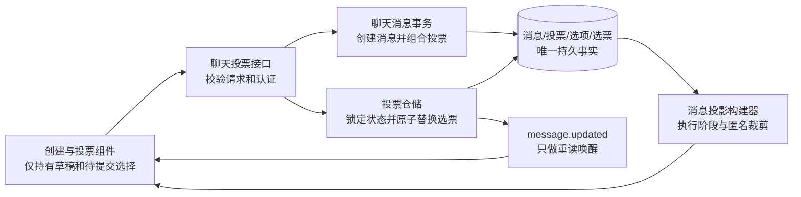

# 聊天投票规则

## 定位

聊天投票是普通聊天消息的结构化子事实，不是独立频道、通知或仅存在于前端的卡片。创建投票必须在同一数据库事务中创建消息、投票配置和选项；投票、改票和结束投票必须回到持久事实接口，realtime 只负责唤醒客户端重新读取，不能携带或充当投票结果。

本规则是聊天投票业务语义、匿名边界和展示阶段的上游契约。数据库、服务端投影、接口、前端组件、测试和发布验收必须同时遵守。

## 状态链

```text
草稿（仅当前浏览器临时状态）
  -> 创建中
  -> 进行中（可投票、可改票、禁止查看任何汇总结果）
  -> 已结束（禁止投票和改票、允许查看结果）
```

唯一合法的持久状态转换是 `进行中 -> 已结束`。`chat_polls.closed_at IS NULL` 表示进行中，非空表示已结束；不再保存第二份 `status`。已结束投票不能恢复、重开或再次写票。

必须保持的不变量：

1. 投票阶段和结果阶段严格分离。进行中时，任何成员都只能看到自己的选择，不能看到票数、比例、参与人数或人员明细。
2. 投票结束后才公开汇总结果。非匿名投票同时公开人员明细；匿名投票永远不公开投票人身份。
3. 单选投票每个参与者恰好选择一个选项；多选投票每个参与者选择一个或多个不同选项。
4. 进行中允许参与者覆盖式修改自己的选择；新选择原子替换旧选择，不追加第二份当前选择。
5. 只有投票消息的发起人可以结束投票；普通频道成员可以投票，非频道成员和无聊天写权限用户不能投票。
6. 投票只允许创建在普通聊天主消息中，不允许作为话题回复、系统消息、带附件消息或要求回执消息创建。
7. 每个投票最少 2 个、最多 100 个选项；前端、接口和服务端必须共同读取同一份输入契约，不得分别维护数量或文本长度限制。

## 唯一事实源

| 事实 | 唯一来源 | 说明 |
| --- | --- | --- |
| 投票问题、作者、频道和消息时间 | `chat_messages` | 问题只保存为消息正文，投票表不得重复保存 |
| 单选/多选、匿名性、结束时间和结束人 | `chat_polls` | `closed_at` 唯一决定阶段 |
| 选项内容和顺序 | `chat_poll_options` | 创建后作为持久选项集合读取 |
| 当前选票 | `chat_poll_votes` | 同一用户的提交采用覆盖式替换 |
| 票数、比例、参与人数和人员明细 | 服务端从选项与选票派生 | 不是新的持久事实 |
| 创建面板、待提交选择、明细面板开关 | 前端组件本地状态 | 不能反向修改或冒充业务事实 |
| 在线刷新与断线恢复 | `message.updated` 唤醒和 `chat_sync_events` 游标 | 只触发重读，不保存结果正文 |

`ChatMessage.poll` 是按当前用户、当前阶段和匿名性生成的服务端投影。前端不能自行从其他用户数据计算投票结果，也不能用假数据、预览数据或 realtime 载荷补齐结果。

## 匿名与阶段投影

服务端输出必须按下表收口，前端隐藏不构成安全边界：

| 阶段 | 非匿名投票 | 匿名投票 |
| --- | --- | --- |
| 进行中 | 返回选项和当前用户自己的选择；结果、参与人数、人员明细均不返回 | 返回选项和当前用户自己的选择；结果、参与人数、人员明细均不返回 |
| 已结束 | 返回汇总结果、参与人数及投票人明细 | 只返回汇总结果和参与人数，人员明细恒为 `null` |

匿名投票的投票 mutation realtime 事件必须把 `actorUserId` 置空；持久同步事件同样不得通过操作者字段、metadata 或自定义事件 ID 暴露投票人。匿名身份不得进入日志正文、通知正文、推送正文或客户端缓存投影。

## 模块边界



- 创建组件只负责草稿编辑、校验提示和提交入口，不保存投票结果。
- 消息事务负责把投票组合成一条真实聊天消息，不接管投票后的状态转换。
- 投票仓储负责成员校验、行锁、选项归属校验、覆盖式改票和结束状态写入。
- 消息投影构建器负责一次性批量装配投票，并在服务端执行阶段和匿名裁剪。
- 消息卡片只展示投影并发起 mutation；成功后使用服务端返回消息或实时重读结果更新。

## 接口与失败行为

| 操作 | 接口 | 成功行为 | 主要失败 |
| --- | --- | --- | --- |
| 创建投票 | `POST /api/chat/channels/:channelId/polls` | 原子创建消息、投票和选项 | 无写权限、系统/归档频道、问题或选项无效 |
| 投票或改票 | `PUT /api/chat/channels/:channelId/messages/:messageId/poll/vote` | 原子替换当前用户选择 | 非成员、无写权限、投票已结束、选项不属于该投票 |
| 结束投票 | `POST /api/chat/channels/:channelId/messages/:messageId/poll/close` | 写入唯一结束事实并公开结果阶段 | 非发起人、非成员、无写权限或投票不存在 |

请求失败不得留下半条消息、部分选项或部分新选票。已经提交的数据库事务不能因为 realtime 广播失败而改成接口失败；客户端依靠后续消息重读和同步游标恢复。

## 界面原则

1. 投票入口与附件、回执同属消息编辑器工具栏，但只在可写的主消息编辑器出现。
2. 创建面板必须清楚显示问题、选项、单选/多选和匿名/非匿名四组信息；匿名说明必须明确“结束后也不显示人员明细”。
3. 进行中卡片不能出现进度条、百分比、票数、参与人数或“查看明细”入口；已投状态只说明当前用户自己的选择已保存。
4. 单选点击后提交当前唯一选择；多选先维护待提交选择，再由明确按钮统一提交。提交期间禁用重复操作并显示进行状态。
5. 已结束卡片才展示结果条和参与人数；非匿名投票提供按选项、按参与人两种明细视图，匿名投票不渲染明细入口。
6. 发起人的“结束投票”必须二次确认，因为结束不可恢复。
7. 桌面端和移动端共用同一组件、事实投影和权限判断；移动端面板、按钮和选项命中区不得小于可触控尺寸，不能另建简化业务状态。

## 验证矩阵

发布前至少覆盖：

1. 模型校验：问题为空/过长、选项少于 2、多于 100、为空、重复、过长均拒绝；恰好 100 个有效选项可以创建和提交。
2. 单选：首次投票、覆盖改票、非法多选、结束后改票拒绝。
3. 多选：首次提交、增减选项、去重、空选择、越权选项拒绝。
4. 权限：频道成员可投；非成员、只读用户不能投；只有发起人可结束。
5. 阶段隔离：进行中不同用户读取均无票数、比例、参与人数和他人身份；结束后才出现结果。
6. 匿名隔离：结束后的 API、realtime、同步事件和浏览器界面均不包含投票人身份。
7. 非匿名明细：结束后按选项和按参与人得到同一组选票事实。
8. 原子性：创建失败无残留消息，改票失败保留旧选择，结束与并发投票不能产生结束后的新选票。
9. 实时与恢复：另一成员投票、改票、结束后在线客户端自动重读；断线重连后与数据库一致。
10. 界面：桌面和移动端分别验证单选、多选、匿名、非匿名、空状态、提交中、失败和已结束状态。

任何新增的定时结束、允许重开、选项编辑、投票撤回、结果提前可见或特殊管理员权限，都属于新的产品规则，必须先修改本文档和状态不变量，再修改代码。
