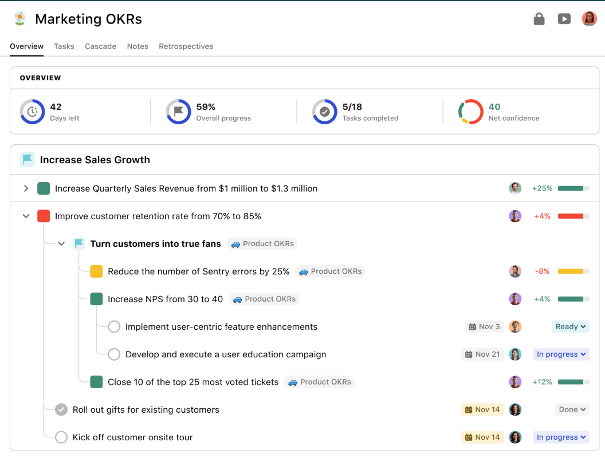

## 任务管理界面：

UI参考上面的界面，目标做成一个大的框，把指标和任务放在目标框里。指标下面挂任务，任务下面可以挂子任务。
前端界面要完全仿照这个界面，尽可能做成一样的，但是标题，还有字段的顺序都要按照我说的来，不能随意调整。也不能把内容都完全抄了，界面的壳子要完全抄下来，包括线条是直角还是圆角

目标完成后，目标标题左边打一个勾的图标
指标完成后，指标标题左边打一个勾的图标
任务完成后，任务标题左边打一个勾的图标

目标不可以折叠
指标可以折叠，默认展开
任务可以折叠，默认展开

### 标签页：
任务分为团队和个人的两个标签页，团队的放在第一个标签页，个人的放在第二个

### 团队仪表盘：
团队的才应该有仪表盘，上面有几个饼状图：
饼1：展示整个团队目前完成了目标中所有指标的百分比，用分数表示
饼2：待定
饼3：待定
饼4：待定

### 目标：
目标标题 | 目标状态 | 负责任务的成员的头像 | 目标截止日期 | 评估窗口截止日期 

### 指标：
指标标题 | 完成状态 | 更新时间

### 任务：
任务标题 | 完成状态 | 任务状态 | 更新时间

## 流程界面：
我想在一个界面搞，在目标冻结之前，界面的颜色是不一样的，比如目标框部分的界面整体偏灰色一点。也就是页面是复用的，只是可以根据流程，切换到不同的状态。一共有以下几种状态，上一个状态完成才能到下一个状态，每个状态的完成都需要主管确认，才可以进入下一个状态：

1. 目标设定
2. 指标领取
3. ORF重估
4. 目标冻结

## 复盘界面

## 权限
主管拥有全部界面的全部权限
1. 目标设定界面：成员能查看
2. 指标领取界面：成员可以查看
3. ORF重估界面：成员都可以查看和编辑
4. 目标冻结界面：成员可以查看

## todo
1. 任务和子任务可以分类：
2. 目标完成后谁来打勾，指标也是一样。不确定