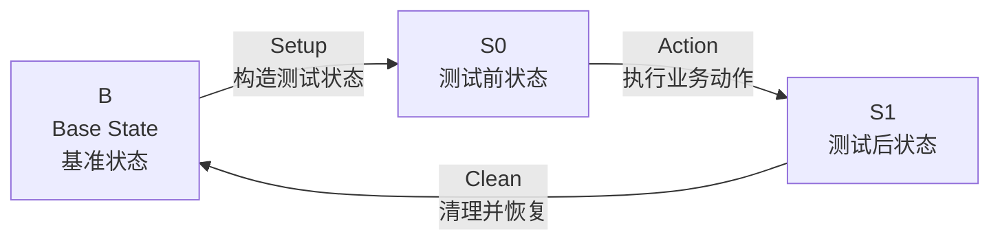

# 测试方法论：状态变化模型

## 1. 核心思想

### 1.1 核心模型

所有测试都可以抽象为一个状态变化闭环：

```text
B --Setup--> S0 --Action--> S1 --Clean--> B
```

可简写为：

```text
B -> S0 -> S1 -> B
```

其中：

- B：Base State，系统的基准状态
- Setup：将系统从 B 构造成 S0
- S0：Action 发生前，已经准备好的可测试状态
- Action：本次测试真正要验证的业务动作
- S1：Action 发生后，系统应该达到的目标状态
- Clean：清理本次测试产生的影响，使系统回到 B

如下图所示：



---

### 1.2 测试的本质

测试的本质不是“执行了一些操作”，而是验证：

> 系统是否从一个明确的业务状态，经过一个明确的业务动作，变化到了另一个符合预期的业务状态。

也就是说，测试关注的不是：

```text
点了哪个按钮
调用了哪个接口
页面跳到了哪个地址
执行了哪几行代码
```

而是：

```text
Action 发生前，系统是什么状态？
Action 是什么业务动作？
Action 发生后，系统应该变成什么状态？
测试结束后，系统如何恢复？
```

因此，测试前永远先问：

```text
我需要什么 B？
我要如何构造 S0？
我要执行什么 Action？
我期望观察到什么 S1？
我如何 Clean 回到 B？
```

---

## 2. 状态变化模型

### 2.1 B：基准状态

B 是测试开始前和测试结束后，系统应该回到的稳定状态。

B 不一定是“空系统”。

例如登录测试中：

```text
B 不是：数据库里没有用户
B 是：系统中存在一个可登录用户，但当前浏览器未登录
```

注册测试中：

```text
B 是：目标注册邮箱尚未被使用，当前浏览器未登录
```

所以 B 的定义要根据业务决定。

---

### 2.2 S0：Action 前状态

S0 是 Action 发生前必须满足的状态。

S0 是 Setup 的结果。

例如登录测试中：

```text
S0 是：
- 登录页可见
- 邮箱输入框可见
- 密码输入框可见
- 登录按钮可见
- 当前浏览器未登录
- 数据库中存在一个状态正常、密码可验证的用户
```

S0 的作用是保证：

> 接下来执行 Action 时，测试前提是正确的。

如果 S0 没有被确认，后面的 S1 断言就不可靠。

---

### 2.3 S1：Action 后状态

S1 是 Action 执行后，系统进入的新状态。

例如登录测试中，期望观察到的 S1 是：

```text
S1 是：
- 页面进入已登录状态
- 用户可以看到登录后的页面元素
- 浏览器存在登录态
- 后端存在有效 session，或等价的登录状态
```

---

### 2.4 Setup：构造测试前状态

Setup 的职责是把系统从 B 构造成 S0。

Setup 不是本测试真正要验证的业务。

Setup 可以使用多种手段：

```text
数据库操作
API 调用
seed 脚本
Playwright 页面操作
Mock
测试 helper
```

只要这些手段能稳定、准确地构造 S0，就可以使用。

例如登录测试中，Setup 可以做：

```text
upsert 测试用户
确保用户状态为 active
清理该用户已有 session
清空浏览器 cookies/localStorage/sessionStorage
打开登录页
```

---

### 2.5 Action：本次测试真正要验证的业务动作

Action 是当前测试唯一真正要验证的业务动作。

一个测试用例应该尽量只验证一个完整的业务语义。

例如登录测试中，Action 是：

```text
输入邮箱
输入密码
点击登录按钮
```

Action 中不应该混入：

```text
创建用户
修改用户状态
清理 session
手动写 cookie
删除测试数据
```

这些属于 Setup 或 Clean，不属于 Action。

---

### 2.6 Clean：清理并恢复到 B

Clean 的职责是清理本次测试产生的影响，使系统回到 B。

Clean 是测试的一部分，不是可选项。

例如登录测试中，Clean 应该做：

```text
清空浏览器登录态
删除本次测试产生的 session
保留测试用户
恢复到“用户存在，但当前浏览器未登录”的 B 状态
```

注意：

```text
登录测试的 Clean 不应该删除测试用户
```

因为测试用户是登录测试 B 的一部分。

---

## 3. 数据化表达

本方法论强调：

> 测试状态应尽可能被数据化表达。

这里的“数据”不只指数据库，也包括所有可以准确表达状态的信息。

例如：

```text
页面上的可见元素
浏览器中的 cookie
localStorage
sessionStorage
数据库记录
后端 session
用户状态
用户角色
密码是否可验证
URL
接口返回
日志记录
```

只要它能准确表达业务状态，就可以作为测试数据的一部分。

---

### 3.1 数据化的范围

在前后端测试中，状态可以从多个层面表达。

#### 3.1.1 UI 状态

例如：

```text
登录表单是否可见
注册按钮是否可见
用户邮箱是否显示
退出登录按钮是否出现
错误提示是否出现
```

#### 3.1.2 浏览器状态

例如：

```text
cookie 中是否存在登录态
localStorage 中是否存在 token
sessionStorage 中是否存在临时状态
当前浏览器是否处于已登录状态
```

#### 3.1.3 数据库状态

例如：

```text
用户是否存在
用户状态是否为 active
密码是否已加密
角色是否正确
session 是否存在
订单是否创建
数据是否被清理
```

#### 3.1.4 业务状态

例如：

```text
用户是否已登录
用户是否已注册
订单是否已提交
商品是否已加入购物车
权限是否生效
```

测试时可以结合使用 UI、浏览器状态、数据库状态和业务状态。

Playwright、API、数据库查询、Mock、脚本都只是手段，核心都是为了表达：

```text
B -> S0 -> S1 -> B
```

---

### 3.2 稳定性原则

测试数据应该尽可能：

```text
少
稳定
接近业务语义
不容易因为代码实现变化而失效
```

测试应该优先依赖稳定的业务语义，而不是易变的实现细节。

例如 Playwright 中，应该优先使用：

```ts
await page.getByRole("button", { name: "登录" }).click();
await page.getByLabel("邮箱").fill(email);
await page.getByLabel("密码").fill(password);
```

不应该优先使用：

```ts
await page.locator(".btn-primary:nth-child(2)").click();
await page.locator("form > div:nth-child(1) input").fill(email);
```

因为前者表达的是业务语义：

```text
点击名为“登录”的按钮
填写邮箱
填写密码
```

后者表达的是页面结构：

```text
点击第二个 .btn-primary
填写 form 下面第一个 div 里的 input
```

页面结构很容易变化，业务语义相对稳定。

---

### 3.3 执行手段标签

测试用例中的 Setup、Action、Clean，以及 B、S0、S1 这些状态观测中的具体动作，可以使用标签标明该步骤的执行手段。

标签只标注具体动作或具体观测方式：

```text
B：标注如何观测基准状态是否成立
Setup：标注如何构造 S0
S0：标注如何观测 Action 前状态是否成立
Action：标注如何执行业务动作
S1：标注如何观测 Action 后状态是否成立
Clean：标注如何清理测试影响
```

目前允许使用的标签仅有以下 4 个：

```text
[playwright]
[prisma]
[api]
[mock]
```

---

## 4. 给 Codex 的实现原则

Codex 在实现测试时，不应该只是把测试用例翻译成 Playwright 操作步骤，而应该先理解这个测试背后的状态变化。

也就是说，Codex 在写代码前，应该先想清楚：

```text
B 是什么？
Setup 如何构造 S0？
S0 应该如何确认？
Action 到底验证哪个业务动作？
S1 应该如何确认？
Clean 如何恢复到 B？
```

具体模板示例请参考:
[数据化测试用例模板](./数据化测试用例模板.md)

生成最终测试代码时，还必须参考:
[数据化测试代码生成约束](./数据化测试代码生成约束.md)

也就是说，测试用例文档负责描述测试意图和状态模型；
测试代码生成约束负责规定最终代码如何按 B、Setup、S0、Action、S1、Clean 拆分文件、命名和组织实现。
