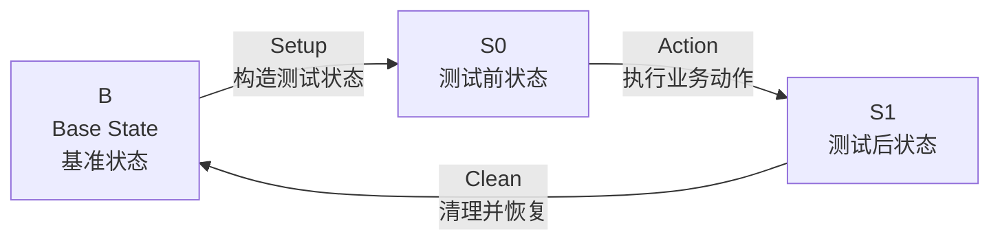

# 测试方法论：状态变化模型

## 1. 核心思想

所有测试都可以抽象为一个状态变化闭环：

```text
B --Setup--> S0 --Action--> S1 --Clean--> B
```

可简写为：

```text
B -> S0 -> S1 -> B
```

其中：

- B：Base State，系统的基准状态
- Setup：将系统从 B 构造成 S0
- S0：Action 发生前，已经准备好的可测试状态
- Action：本次测试真正要验证的业务动作
- S1：Action 发生后，系统应该达到的目标状态
- Clean：清理本次测试产生的影响，使系统回到 B

如下图所示：



---

## 2. 测试的本质

测试的本质不是“执行了一些操作”，而是验证：

> 系统是否从一个明确的业务状态，经过一个明确的业务动作，变化到了另一个符合预期的业务状态。

也就是说，测试关注的不是：

```text
点了哪个按钮
调用了哪个接口
页面跳到了哪个地址
执行了哪几行代码
```

而是：

```text
Action 发生前，系统是什么状态？
Action 是什么业务动作？
Action 发生后，系统应该变成什么状态？
测试结束后，系统如何恢复？
```

因此，测试前永远先问：

```text
我需要什么 B？
我要如何构造 S0？
我要执行什么 Action？
我期望观察到什么 S1？
我如何 Clean 回到 B？
```

---

## 3. B、S0、S1 的含义

## 3.1 B：基准状态

B 是测试开始前和测试结束后，系统应该回到的稳定状态。

B 不一定是“空系统”。

例如登录测试中：

```text
B 不是：数据库里没有用户
B 是：系统中存在一个可登录用户，但当前浏览器未登录
```

注册测试中：

```text
B 是：目标注册邮箱尚未被使用，当前浏览器未登录
```

所以 B 的定义要根据业务决定。

---

## 3.2 S0：Action 前状态

S0 是 Action 发生前必须满足的状态。

S0 是 Setup 的结果。

例如登录测试中：

```text
S0 是：
- 登录页可见
- 邮箱输入框可见
- 密码输入框可见
- 登录按钮可见
- 当前浏览器未登录
- 数据库中存在一个状态正常、密码可验证的用户
```

S0 的作用是保证：

> 接下来执行 Action 时，测试前提是正确的。

如果 S0 没有被确认，后面的 S1 断言就不可靠。

---

## 3.3 S1：Action 后状态

S1 是 Action 执行后，系统应该达到的目标状态。

例如登录测试中：

```text
S1 是：
- 页面进入已登录状态
- 用户可以看到登录后的页面元素
- 浏览器存在登录态
- 后端存在有效 session，或等价的登录状态
```

S1 的作用是验证：

> 本次业务动作确实产生了预期的状态变化。

---

## 4. Setup、Action、Clean 的含义

## 4.1 Setup：构造测试前状态

Setup 的职责是把系统从 B 构造成 S0。

Setup 不是本测试真正要验证的业务。

Setup 可以使用多种手段：

```text
数据库操作
API 调用
seed 脚本
Playwright 页面操作
Mock
测试 helper
```

只要这些手段能稳定、准确地构造 S0，就可以使用。

例如登录测试中，Setup 可以做：

```text
upsert 测试用户
确保用户状态为 active
清理该用户已有 session
清空浏览器 cookies/localStorage/sessionStorage
打开登录页
```

---

## 4.2 Action：本次测试真正要验证的业务动作

Action 是当前测试唯一真正要验证的业务动作。

一个测试用例应该尽量只验证一个完整的业务语义。

例如登录测试中，Action 是：

```text
输入邮箱
输入密码
点击登录按钮
```

Action 中不应该混入：

```text
创建用户
修改用户状态
清理 session
手动写 cookie
删除测试数据
```

这些属于 Setup 或 Clean，不属于 Action。

---

## 4.3 Clean：清理并恢复到 B

Clean 的职责是清理本次测试产生的影响，使系统回到 B。

Clean 是测试的一部分，不是可选项。

例如登录测试中，Clean 应该做：

```text
清空浏览器登录态
删除本次测试产生的 session
保留测试用户
恢复到“用户存在，但当前浏览器未登录”的 B 状态
```

注意：

```text
登录测试的 Clean 不应该删除测试用户
```

因为测试用户是登录测试 B 的一部分。

---

## 5. 数据化表达

本方法论强调：

> 测试状态应尽可能被数据化表达。

这里的“数据”不只指数据库，也包括所有可以准确表达状态的信息。

例如：

```text
页面上的可见元素
浏览器中的 cookie
localStorage
sessionStorage
数据库记录
后端 session
用户状态
用户角色
密码是否可验证
URL
接口返回
日志记录
```

只要它能准确表达业务状态，就可以作为测试数据的一部分。

---

## 6. 数据化的范围

在前后端测试中，状态可以从多个层面表达。

## 6.1 UI 状态

例如：

```text
登录表单是否可见
注册按钮是否可见
用户邮箱是否显示
退出登录按钮是否出现
错误提示是否出现
```

## 6.2 浏览器状态

例如：

```text
cookie 中是否存在登录态
localStorage 中是否存在 token
sessionStorage 中是否存在临时状态
当前浏览器是否处于已登录状态
```

## 6.3 数据库状态

例如：

```text
用户是否存在
用户状态是否为 active
密码是否已加密
角色是否正确
session 是否存在
订单是否创建
数据是否被清理
```

## 6.4 业务状态

例如：

```text
用户是否已登录
用户是否已注册
订单是否已提交
商品是否已加入购物车
权限是否生效
```

测试时可以结合使用 UI、浏览器状态、数据库状态和业务状态。

Playwright、API、数据库查询、Mock、脚本都只是手段，核心都是为了表达：

```text
B -> S0 -> S1 -> B
```

---

## 7. 稳定性原则

测试数据应该尽可能：

```text
少
稳定
接近业务语义
不容易因为代码实现变化而失效
```

测试应该优先依赖稳定的业务语义，而不是易变的实现细节。

例如 Playwright 中，应该优先使用：

```ts
await page.getByRole("button", { name: "登录" }).click();
await page.getByLabel("邮箱").fill(email);
await page.getByLabel("密码").fill(password);
```

不应该优先使用：

```ts
await page.locator(".btn-primary:nth-child(2)").click();
await page.locator("form > div:nth-child(1) input").fill(email);
```

因为前者表达的是业务语义：

```text
点击名为“登录”的按钮
填写邮箱
填写密码
```

后者表达的是页面结构：

```text
点击第二个 .btn-primary
填写 form 下面第一个 div 里的 input
```

页面结构很容易变化，业务语义相对稳定。

---


## 8. 断言原则

每个测试至少应该包含三类断言。

## 8.1 S0 断言

S0 断言用于确认 Setup 成功。

它回答：

```text
Action 发生前，系统是否真的处于可测试状态？
```

例如登录测试中：

```text
登录表单可见
测试用户存在
用户状态正常
密码可验证
当前浏览器未登录
```

---

## 8.2 S1 断言

S1 断言用于确认 Action 正确。

它回答：

```text
Action 发生后，系统是否进入了预期状态？
```

例如登录测试中：

```text
页面进入已登录状态
浏览器存在登录态
后端存在有效登录状态
```

---

## 8.3 Clean 后断言

Clean 后断言用于确认测试没有污染环境。

它回答：

```text
测试结束后，系统是否回到了 B？
```

例如登录测试中：

```text
浏览器登录态已清除
测试用户 session 已删除
测试用户仍然存在
系统回到“用户存在，但当前浏览器未登录”的状态
```

---

## 10. 给 Codex 的执行要求

当 Codex 根据本方法论实现测试时，必须遵守以下要求。

## 10.1 先理解状态模型，再写测试代码

不要一开始就直接写 Playwright 操作步骤。

必须先明确：

```text
B 是什么
Setup 做什么
S0 是什么
Action 是什么
S1 是什么
Clean 做什么
```

---

## 10.2 结合工程代码实现，不要凭空假设

Codex 在实现测试时，必须先阅读当前工程代码，确认：

```text
测试框架
测试目录结构
登录页路径
页面元素的稳定选择器
数据库访问方式
用户模型字段
密码 hash / verify 工具
认证状态存储方式
session/token 存储方式
已有 test helper
已有 seed / cleanup 工具
```

不要凭空发明：

```text
不存在的路由
不存在的字段
不存在的 helper
不存在的数据库模型
不存在的认证机制
```

如果工程中已经有现成工具，应优先复用。

---

## 10.3 保持业务语义不变

如果测试用例文档和工程实现细节存在差异，应该优先保持业务语义不变。

例如登录测试的业务语义是：

```text
已存在的正常用户，使用正确账号密码，可以从未登录状态进入已登录状态。
```

不管工程中使用的是：

```text
cookie session
JWT
localStorage token
数据库 session
Redis session
```

测试都应该围绕这个业务语义实现。

实现细节可以适配工程，业务语义不能随意改变。

---

## 10.4 不要扩大测试范围

一个测试只验证一个业务动作。

例如登录成功测试，不应该同时验证：

```text
注册
退出登录
修改密码
权限控制
刷新保持登录
多端登录
账号禁用
密码错误
```

这些应该拆成单独测试。

---

## 10.5 不要削弱核心断言

不要为了让测试更容易通过，而把核心断言删掉。

例如登录测试至少应该确认：

```text
登录前未登录
登录后已登录
测试结束后恢复未登录
```

如果只写：

```text
点击登录按钮后 URL 发生变化
```

通常是不够的。

---

## 11. 测试用例文档的作用

具体测试用例文档只需要简单描述：

```text
测试目标
状态模型
断言
```

具体实现时，Codex 应根据：

```text
测试方法论
测试用例文档
当前工程代码
```

三者共同完成测试。

测试用例文档不需要写得过度复杂，因为它需要给人做最终业务确认。

方法论负责约束思想，测试用例负责表达业务，工程代码负责决定具体实现方式。 